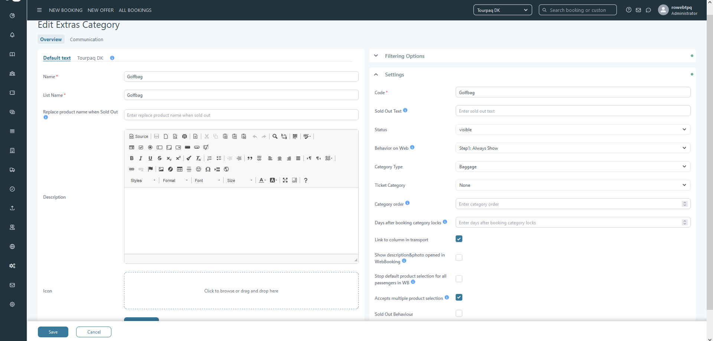
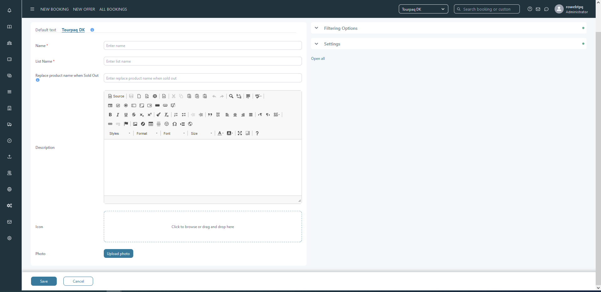

# Extra Category Overview

## Overview setup   

### Default text 

* **Name**: text field; mandatory; product category name to be displayed in Tourpaq office, WebBooking and ticket.
* **List name**: text field; mandatory; product category name for export lists.
* **Replace product name when Sold Out**: text field: when product is sold out, this text will be displayed.
* **Description**: rich text editor to set the description of the category to be displayed in WebBooking.
* **Icon**: box where to upload an icon.
* **Photo**: button that opens the upload photo pop-up; photo set is displayed on WebBooking.

<figure><figcaption></figcaption></figure>

\*All texts can be set custom for each active brand.

<figure><figcaption></figcaption></figure>

### Filtering Options 

* **Display In Remember Extras**: multiple selection field; displays all brands; no selection behaves as select all.
* **Use For Extras Statistic**: multiple selection field; displays all brands; no selection behaves as select all.
* **Display In Hotel List**: multiple selection field; displays all brands; no selection behaves as select all; sets for which brands, the extras in this category, to be displayed in ALL [<mark style="color:blue;background-color:red;">**hotel lists**</mark>](../export-1/lists.md#report-types-explained) <mark style="background-color:$primary;">(click on this link to see the full list)</mark> that support extras.
* **Hide as filter in list**: checkbox; if enabled, hides the category in all lists throughout the system.

<figure><figcaption></figcaption></figure>

### Settings 

* **Code**: text field; mandatory; the code used for the category
* **Sold Out Text**: text field; text used for pop-up in WebBooking and Customer Center
* **Status**: drop-down list: visible or hidden
* **Behaviour on Web**: drop-down list; how and on which step to be displayed the category in WebBooking. This setting affect all agencies of the company.
* **Category Type**: drop-down list; the existing values are hard-coded and are used to be able to use them on different export lists.
* **Ticket Category**: drop-down list; displays all defined categories under "Ticket Categories" and it works like a meta-category for one or more extra categories. This ticket category is displayed only on ticket, grouping the extras under the same ticket category.
* **Hide on Ticket:** checkbox; If checked, this will hide the extras on the e-ticket. This is often combined with " Include in Basic Price". All extras in the category are hidden from the e-ticket when checked.
* **Category order**: numeric field; sets the order of the extra categories in WebBooking
* **Days after booking category locks**: numeric field; sets how many days after creating the booking can pass before locking the category on WebBooking. After this number of days have passed, no modification can be done in Customer Center.
* **Link to column in transport**: checkbox; if enabled, the extras set as "linked to transport" in this category will have the allotment displayed in the transport selection pop-up in the booking creation process.
* **Show description & photo opened in WebBooking**: checkbox; if set will apply on all brands.
* **Stop default product selection for all passengers in WB**: checkbox; if set, will apply to all brands.
* **Accepts multiple product selection**: checkbox; if set, will apply to all brands; This allows the category to display multiple selection for the products defined. If unchecked, bookings with multiple products selected will appear to have only one selected.
* **Sold Out Behaviour**: checkbox; this will enable the sold-out behaviour for the products in the category.
* **Out/Home**: checkbox; used for individual transports, to distinguish between out and home products.
