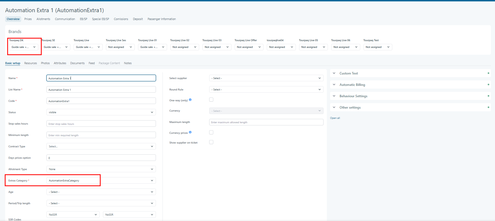
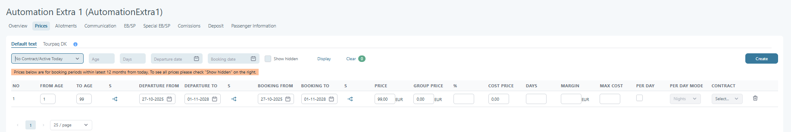
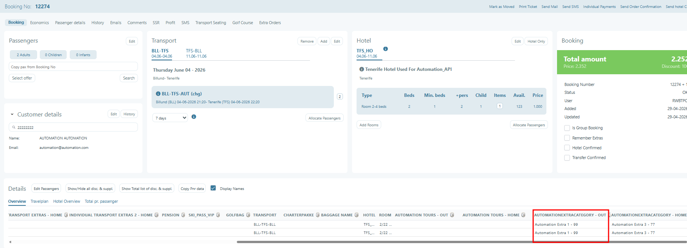

# One product must be selected

Applies to Administrator

### Overview

Some extras, such as pension or board options, require that **exactly one option is always selected** during the booking process.

Allowing users to deselect all options can result in invalid selections, incorrect tickets, or blocked bookings during allotment confirmation.

This feature ensures that a valid extra option is always selected when required.

See also: [Extra Category Overview](extra-category-overview/).

### Purpose

The purpose of the **One product must be selected** option is to:

* Prevent users from selecting an empty or invalid extra option
* Ensure tickets and booking data remain correct
* Support extras where one option is mandatory, such as pension or board options
* Provide consistent behavior across Tourpaq Office booking and WebBooking

### Configuration

Enable this setting on the **extras category**.



**Open the extras category**

Go to `Extras Setup > Extras Category`, then open the relevant category.



**Enable the option**

Enable **One product must be selected**.



**Save and test**

Create a test booking and verify you can only switch between options.



**Field: One product must be selected**

* Type: Checkbox
* Location:\
  `Extras Setup > Extras Category`

### Booking Behavior

#### General Rules

When **One product must be selected** is enabled for an extras category:

* The user cannot deselect all options
* An empty choice (for example `---`) is never shown
* The user may only switch between available extras in the category

#### Auto-select Logic

* If one or more extras are marked **Auto-select**, one of them is automatically selected
* If no extra is marked **Auto-select**, the system automatically selects the **first listed extra**

This ensures that a valid selection always exists.

#### Booking flow

* When the extra category has the option enabled:

<figure><figcaption></figcaption></figure>

* And an extra in that category is available for booking:

<figure><figcaption></figcaption></figure>

<figure><figcaption></figcaption></figure>

* The system ensures that the user is never presented with an empty selection.

<figure><figcaption></figcaption></figure>

* If no Extra is marked as **Auto-select**, the system will automatically select the **first Extra in the list**.
* While understanding this option is enabled, the user cannot remove the selected Extra. The selection can only be changed by choosing a different Extra from the list.


These rules apply consistently in both the **Booking flow** and the **Webbooking**

