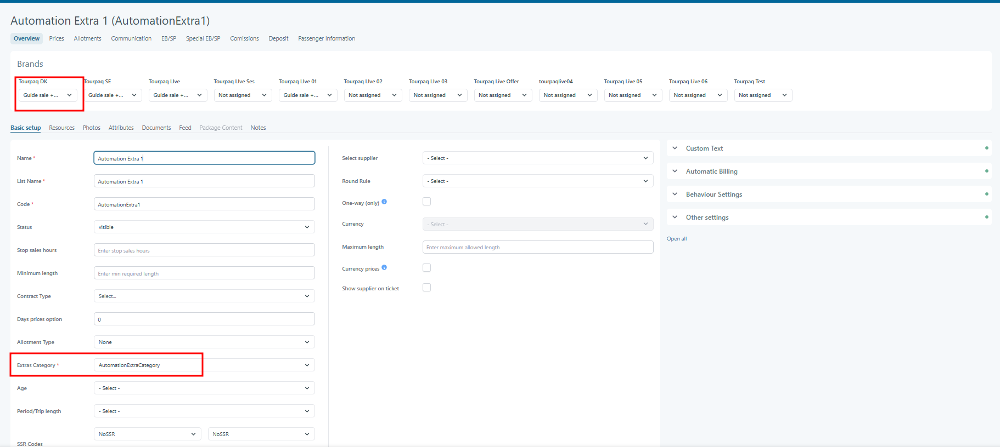
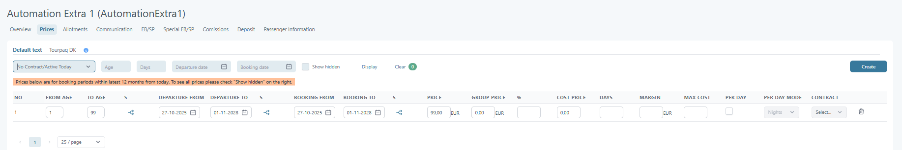
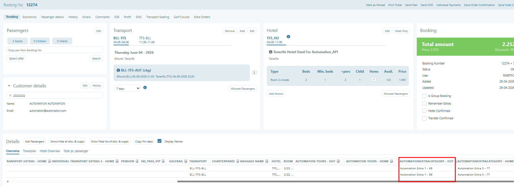

# One product must be selected

## One product must be selected

### Overview

Some extras, such as pension or board options, require that **exactly one option is always selected** during the booking process.

Allowing users to deselect all options can result in invalid selections, incorrect tickets, or blocked bookings during allotment confirmation.

This feature ensures that a valid extra option is always selected when required.

See [Extra Category Overview](extra-category-overview/) for category-level configuration.

### Purpose

The purpose of the **One product must be selected** option is to:

* Prevent users from selecting an empty or invalid extra option
* Ensure tickets and booking data remain correct
* Support extras where one option is mandatory, such as pension or board options
* Provide consistent behavior across Tourpaq Office booking and WebBooking

### Requirements

* Administrator access.
* An Extras Category containing available Extras.

### Configuration

Enable this setting on the Extras Category.



**Open the extras category**

In **Extras Setup → Extras Category**, open the relevant category.



**Enable the option**

Enable **One product must be selected**.



**Save and test**

Create a test booking. Verify that the selection only switches between available options.



#### Field description

**One product must be selected** is a checkbox in **Extras Setup → Extras Category**. Enabling it requires one available Extra from the category.

### System behavior

#### General rules

When **One product must be selected** is enabled for an extras category:

* The booking flow does not allow an empty selection.
* An empty choice (for example `---`) is never shown.
* Staff can switch only between available Extras in the category.

#### Auto-select logic

* If one or more Extras use **Auto-select**, the system automatically selects one.
* If no Extra uses **Auto-select**, the system automatically selects the first listed Extra.

This ensures that a valid selection always exists.

#### Booking flow

The following screenshots show the required selection behavior:

<figure><figcaption></figcaption></figure>

When an Extra in the category is available for booking, the booking flow presents an available selection:

<figure><figcaption></figcaption></figure>

<figure><figcaption></figcaption></figure>

The system prevents an empty selection:

<figure><figcaption></figcaption></figure>

If no Extra uses **Auto-select**, the system selects the first Extra in the list. Staff cannot remove the selected Extra. Staff can select a different available Extra.


These rules apply consistently in the **Booking flow** and **WebBooking**.

