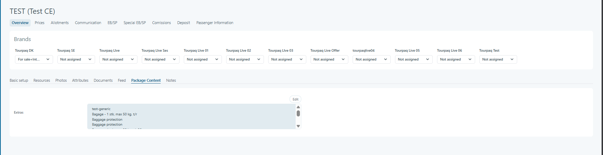
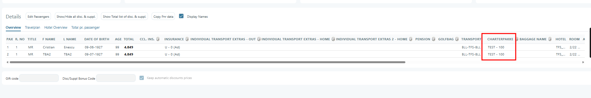
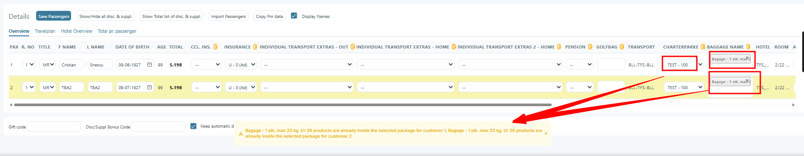
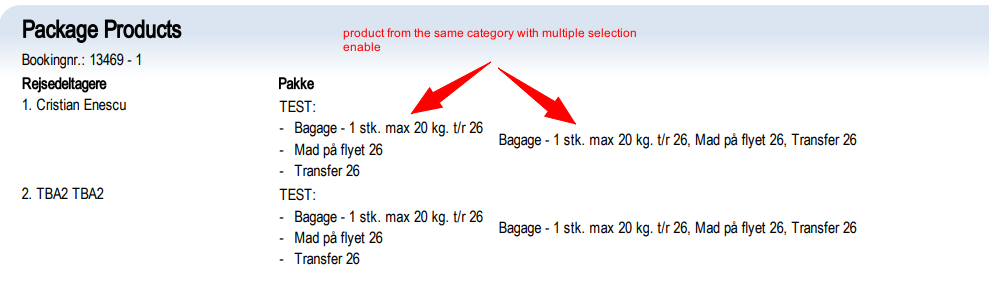

# Package Content

### Overview

The **Package Content** tab defines which extras are automatically included in a package product.

It allows you to bundle services (such as meals, activities, transfers, equipment rental, etc.) together with an accommodation or main product so they are:

* Automatically attached to the booking
* Clearly defined as part of the package
* Managed centrally
* Displayed correctly in Web Booking

This functionality ensures consistent package composition across brands and sales channels.

### Purpose

The purpose of the **Package Content** section is to:

* Define what is included in a package
* Control included extras at product level
* Ensure automatic inclusion during booking
* Avoid manual addition of standard services
* Maintain package consistency across brands

### **Package products**

When selecting a product that is flagged as a **package** for a passenger, all products that are inside the package are selected (after saving the passenger) with a price of `0`. Only the package itself has the price set.

For a product to be set as **package**, you need to check the option inside **Edit Product Page → Basic Setup → Other Settings → Package Type**.

<figure><figcaption></figcaption></figure>

You can modify the products that are inside the package in **Edit Product Page → Package Content** tab.&#x20;

<figure><figcaption></figcaption></figure>

*   At least one product in the package must be eligible for it to be selected.&#x20;

    <figure><figcaption></figcaption></figure>
*   If you select the **package**, you cannot select the products inside the package as well. You will get a warning message like this:&#x20;

    <figure><figcaption></figcaption></figure>
*   if there are two products from the same category, and the category has multiple select enabled, both products will be applied&#x20;

    <figure><figcaption></figcaption></figure>

## Allow Multiple Extras of the Same Category

### Overview

An Extra Package can contain multiple extras from the same extra category. This makes it possible to configure a single package that supports multiple booking scenarios, instead of creating separate packages for every possible combination.

Only eligible extras are added to the booking.

This is especially useful when eligibility depends on conditions such as:

* Transport supplier
* Hotel
* Destination
* Departure
* Booking conditions

A package may contain:

* Multiple Flight Meal extras, where each extra is linked to a different transport supplier
* Multiple Flight Baggage extras, where each extra is linked to a different transport supplier
* Multiple Transfer extras, where each extra is linked to a different hotel

Without this functionality, separate packages would need to be created for every possible combination.

Using multiple extras in the same category allows all of these scenarios to be handled by a single package configuration.

***

## Eligibility Logic

### Package Eligibility

A package is considered eligible for a booking if at least one extra in the package is eligible.

If none of the extras in the package are eligible, the package is not applied.

***

## Extra Selection Logic

### When Multiple Extras of the Same Category Are Eligible

If more than one extra from the same category is eligible for the booking, the following logic is applied:

#### Accepts Multiple Product Selection = Disabled

If the extra category does not allow multiple product selection:

* Only one extra from the category is added
* The cheapest eligible extra is selected automatically

#### Accepts Multiple Product Selection = Enabled

If the extra category allows multiple product selection:

* Multiple eligible extras from the same category may be added to the booking 
