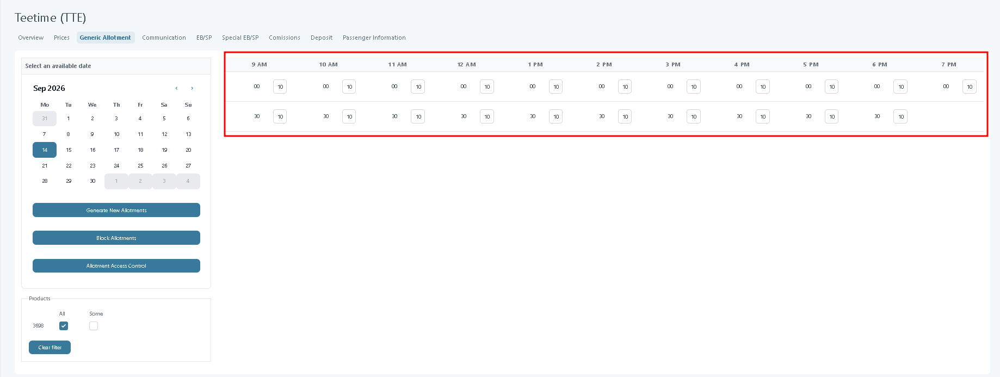

# Teetime

## Teetime

### Overview

The **TeeTime** functionality is used to set up availability for products that are booked at specific times or time slots, such as golf tee times, spa appointments, or guided tours. TeeTimes are created as regular products under **Extras Setup → Extras**, but they use the **Generic Allotment Type**, which allows you to manage the available time slots and scheduling.

### Purpose

TeeTime helps agencies manage products that depend on time availability by:

* Defining exact booking intervals and durations.
* Controlling the number of guests or bookings per slot.
* Managing allotments dynamically (daily or weekly).

This ensures that availability is accurately reflected for both back-office users and customers booking through the web or mobile app.

#### Preconditions

* The Extras product exists and its **Extras Category** is set to `Teetime`.
* You know the golf course's own booking limits and cut-off times, so the values you enter match its policy.

#### How to use

**1. Create a TeeTime Product**

1. The Extra Category must be set as **TeeTime Category Type** for the product to function correctly.
2. Go to **Extras Setup → Extras**.
3. Create a new extra as usual.
4. In the **Allotment Type** field, select **Generic Allotment Type**.\
   This enables the TeeTime-specific settings listed below.

<figure><figcaption></figcaption></figure>

<figure><figcaption></figcaption></figure>

### Tee Time rules

**Tee Time Rules** is a section on a Teetime product's **Basic setup** tab. It controls how many times the product can be booked, which weeks and hours it can be booked in, how its price is calculated, and whether it needs manual confirmation. The section only appears when the product's **Extras Category** is set to `Teetime`.

Use Tee Time Rules to:

* Limit how many times a passenger, or the allotment as a whole, can book this tee time.
* Restrict sale to the first weeks of the season, or stop sale before a fixed hour on the day of play.

<figure><figcaption></figcaption></figure>

| **Field Name**            | **Description**                                                                                                                                                                              |
| ------------------------- | -------------------------------------------------------------------------------------------------------------------------------------------------------------------------------------------- |
| **Pax limit**             | How many times this product can be booked for each passenger (per interval) (e.g., 4 players).                                                                                               |
| **Latitude**              | Geographic latitude of the golf course; used for mapping and location services.                                                                                                              |
| **Longitude**             | Geographic longitude of the golf course; used for mapping and location services.                                                                                                             |
| **Product Parent ID**     | Used to link products that share the same allotment across multiple companies.                                                                                                               |
| **TeeTime Pin**           | Unique system-generated identifier for the specific tee time slot; used self checkin module). If the product is a child of another product, the tee time pin will be changed for the parent. |
| **Only first week(s)**    | Allow to select Tee Time only on the first (n) week(s).                                                                                                                                      |
| **Limit Per Day**         | Maximum number of times this tee time can be booked per day (e.g., 1 = only once per day).                                                                                                   |
| **Limit before hour**     | Restricts booking availability: **value = number of hours before**, plus an optional **cut-off time**. For example: “2 / 11:00” means bookings close _2 hours before 11:00_.                 |
| **First available price** | When enabled, the system automatically shows the earliest available tee time price instead of the exact slot price.                                                                          |
| **Requires confirmation** | Booking requires manual confirmation from staff or supplier before becoming valid.                                                                                                           |


**TeeTime PIN** is not saved by the refresh icon alone. If you shuffle the PIN and leave the page without clicking **Save**, the product keeps its previous PIN.


### Prices 

Tourpaq takes the TeeTime price from the product's **Extras** configuration in **Product Price**. This price applies when the TeeTime product is sold.

<figure><figcaption></figcaption></figure>

Configure the applicable product price in **Extras Setup → Extras**. The TeeTime product uses that configured extra price.

TeeTimes products appear in the **Tee Time Extras Lists**.

For this to work, the product needs to have a supplier assigned. The supplier cannot block the allotment of a TeeTime if he doesn't have the rights to do so, but he also has access to the lists

### Special settings 

#### Generic Allotment

The TeeTime allotment defines when and how often the product is available.

<figure><figcaption></figcaption></figure>

#### Daily allotments

* **Frequency** – Number of days in the recurring availability pattern.
* **Daily Frequency** – Defines when during the day bookings can be made:
  * At specific fixed times, or
  * Every _X_ minutes within a defined hourly range.
* **Duration** – Total time span during which the product is available (e.g., 09:00–18:00).
* **Allotment** – Number of available items per slot (e.g., if set to 4 and frequency is 30 minutes, 4 slots open every 30 minutes).

<figure><figcaption></figcaption></figure>

**Example:**\
If the product is available every 30 minutes between 09:00–19:00 with an allotment of 4, there will be 20 available slots per day (one every 30 minutes).

<figure><figcaption></figcaption></figure>

#### Weekly allotments 

The only change from **Daily allotments** is

* Frequency - this time it is in weeks and not days, with the additional selection of days of the week in which the product is available

<figure><figcaption></figcaption></figure>

* If **All Days** is checked, allotments are created for the entire week.
  * When a guest departs midweek, the Guest App shows only the first valid allotment day.\
    _(Example: if allotment is generated for the whole week and the departure is on Tuesday → only Tuesday’s slots appear.)_

<figure><figcaption></figcaption></figure>

<figure><figcaption></figcaption></figure>

### Block allotments 

The _Block Allotments_ feature allows admins to temporarily **block or unblock** availability for a defined date and time range.\
Use this when certain days or hours should not be bookable (e.g., maintenance, private events, holidays)

<figure><figcaption></figcaption></figure>

<figure><figcaption></figcaption></figure>

**Result:**\
Once configured, TeeTime products follow the defined schedule and appear in the _TeeTime Extras Lists_. Booking availability and pricing are automatically handled by the system based on the configured rules and linked suppliers.
