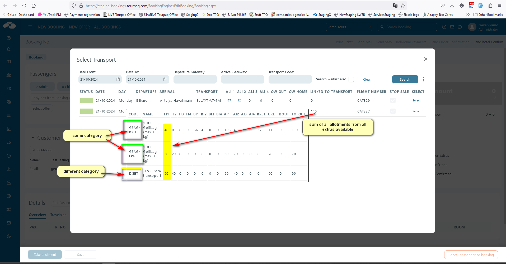

# Allotments

## **Manual Allotments**

<figure><figcaption></figcaption></figure>

### Overview

This feature is usually used for **products available at the destination** (e.g., excursions, events, or additional services). Extra allotments allow you to manage availability for these products independently from the main hotel or transport allotments.

### Functionality

* The user can generate allotments using a **simple generator**, making it easy to define when the product is available.
* In the **booking module**, the system will display the product as **available** if:
  * The booking’s arrival and departure dates fall within the extra allotment period.
  * There is still allotment left (i.e., availability has not been fully consumed).

### How to Create Extra Allotments

1. **Navigate to the Allotments Tab**
   * Go to: _Extras Setup → Extras_&#x20;
   * Select the product you want to manage.
   * Open the **Allotments** tab.
2.  **Generate New Allotments**

    * Press the **Generate New Allotments** button in the upper-right corner.
      *   Select a type (Daily or Weekly) when the product should be available.

          * If the type is set to Daily, it needs to follow the next steps:

          <figure><figcaption></figcaption></figure>

          &#x20;\- Frequency - every X days

          * Start date - date when the allotment will be generated
          * End date - date when the allotment will end
          * Allotment - how many allotments will be generated daily &#x20;
          * If the type is set to Weekly:

          <figure><figcaption></figcaption></figure>

          * Frequency - every X weeks. It requires to set at least one day or all day
          * Start date - date when the allotment will be generated
          * End date - date when the allotment will end
          * Allotment - how many allotments will be generated weekly

    After all the fields are set - click to Generate.
3. Allotments table view

*   **Change values selector -** checkbox - enable bulk editing. Allow to make changes to the following columns:

    * Allotment - change the actual allotment's value with a new value (+, -, or =) inserted in the Value field
      * **Day** – Moves all bookings from the selected day to another day. The new day can be either earlier or later in the schedule. Use this option to shift all bookings forward or backward to a different date as required.

    There are two options available:

    1. **Move to weekday (forward)** – Move bookings to the next available weekday.
    2. **Move to weekday (backward)** – Move bookings to a previous available weekday.

    &#x20;        \- The system will only enable the action if all selected bookings meet the requirements. A list of available weekdays will appear.

    &#x20;        \- Only weekdays that exist for **all selected lines** will be shown.

    * Example: If you select Tuesday, then all Tuesday lines must be followed by a Friday line for Friday to be selectable.

    &#x20;           \- Select the new weekday.

    .

    <figure><figcaption></figcaption></figure>

    &#x20;        \- The system checks if all bookings are eligible to move.

&#x20;                \- Once confirmed, bookings are reassigned to the new weekday.

&#x20;                 \- The table updates automatically, showing the new **Booked** figures

* Block - all the selected lines will block the allotments
* **Date** – Each row represents a date for which allotment is available.
* **Day** – The day of the week is displayed automatically.
* **Allotment** – Number of units available for that date.
* **BO1** – (Booked Out 1 Interval) Displays the number of units already booked.
* **Block** – Check this box if you want to block allotment for that date.

4. **Filter & Manage Allotments**

* Use **Start date / End date** filters to display specific periods.
* Use **Week Days** to filter by specific days (e.g., only Saturdays).
* Use **Show hidden** if some allotments are hidden from the list. If **“Show hidden”** is checked:
  * All dates are displayed, including normally hidden ones.
  *   This applies only when no date range filter is active.&#x20;

      <figure><figcaption></figcaption></figure>
* **Display / Clear** allows you to manage the current view.

5. **Save & Apply**

* Any changes made (e.g., adjusting allotment numbers or blocking dates) will be saved automatically and reflected in the booking system.
*   The data displayed in the list are showing in chronological order, thus avoiding the reduced risk of selecting outdated allocations.&#x20;

    * The oldest valid date appears at the top of the list.

    <figure><figcaption></figcaption></figure>

    * All dates in the past are automatically hidden. Users cannot view or select expired dates unless specific conditions apply.
*   **Date Range Overrides "Show Hidden" -** If a **date range** is specified in the filter, this overrides the “Show hidden” option.&#x20;

    <figure><figcaption></figcaption></figure>

| Scenario                         | Result                             |
| -------------------------------- | ---------------------------------- |
| No filter, Show hidden unchecked | Future dates only, ascending order |
| No filter, Show hidden checked   | All dates shown, ascending order   |
| Date range selected              | Only dates within range shown      |
| Date range selected              | “Show hidden” disabled             |

## **Linked to transport Allotments**

### Overview

**Linked to Transport Allotments** are used for **products available only on transport** (e.g., luggage, catering, onboard services). Unlike standard Extra Allotments, these are directly tied to a transport departure and can only be booked by passengers traveling on that specific transport.

This ensures that products with limited supply or availability for certain departure dates are managed correctly.

### How It Works

* Allotments are linked to transport departure dates.
* The system checks for availability based on the **departure interval** set for the transport.
* Products will be displayed as available in bookings only if:
  * The passenger is traveling on the linked transport.
  * Allotment is still available for the selected interval.

### Setup Instructions

1. **Create a New Extra**
   * Go to: _Extras → Create New Extra_.
   * Fill in the product details.
   * Under **Allotment Type**, select **Linked to Transport**.

<figure><figcaption></figcaption></figure>

2. After the general settings have been set, and the extras saved, the next step is setting the brand and establishing the prices and resources.&#x20;
3. At the **Resource** tab, a must is setting the **Transport** filter.

<figure><figcaption></figcaption></figure>

4. The next step is setting up the allotments.

* Navigate to the **Allotments Tab** for the extra.
* Press **Generate New Allotments**.
* Define the period, interval, and availability that should match the transport departure dates.

<figure><figcaption></figcaption></figure>

* Fields:

| AI1        | Allotment 1 Interval                                |
| ---------- | --------------------------------------------------- |
| AI2        | Allotment 2 Interval                                |
| AI3        | Allotment 3 Interval                                |
| AI4        | Allotment 4 Interval                                |
| AOT        | Allotment Out Total                                 |
| AHT        | Allotment Home Total                                |
| Transport  | Transport for which the allotment will be genearted |
| Fix quotas | Select the fix quota for the allotment generation   |

Note! The extra allotments are set up as the transport allotments. The allotment must be edited by a user, or overbookings may happen.

### Interface and Fields

When defining **Linked to Transport Allotments**, the system displays a table with all transport departures for the selected period.

<figure><figcaption></figcaption></figure>

**Filters (Top Section):**

* **Transport** – Select the transport to which the extra is linked.
* **Start date / End date** – Define the active period for the allotment.
* **Week Days** – Select which days of the week allotments should apply.
* **Show hidden** – Displays hidden rows if enabled.
* **Display / Clear** – Quick actions for showing or clearing generated allotments.

**Table Columns:**

* **Transport** – The transport code (e.g., _BLLAYT-D3M_).
* **Date** – Departure date of the transport.
* **Day** – Day of the week for the departure.
* **AI1, AI2, AI3, AI4** – Allotments for different categories of extras (e.g., adult items, premium items).
* **AOT (Allotment Out Total)** – Total number of allotments available.
* **AHT (Allotment Home Total)** – Total number of home allotments
* **BO1, BO2, BO3, BO4** – Booked out for interval 1-4.
* **BOT (Booking Out Total)** – Total booked allotments.
* **BHT (Booking Home Total)** – Total number of booked out allotments.
* **FO1, FO2, FO3, FO4** – Free out allotments (remaining availability for each intervals).
* **Block** – Checkbox to block allotment for a specific departure date.

#### **Calculation for Allotment:**

* Calculation for TOTAL OUT - The Total Out is calculated as a sum from the departures: TO = AI1 + AI2 + AI3 + AI4

#### **Move bookings**

The **Move Bookings** functionality allows you to transfer all bookings for an extra (e.g., excursion) from one weekday to another. This is useful when the planned day of an excursion changes and bookings must be rescheduled to a different weekday.

<figure><figcaption></figcaption></figure>

#### Purpose

* To **reschedule extras** when the weekday changes (e.g., excursion originally on Tuesday moved to Friday).
* To ensure **all affected bookings are updated consistently** in the system.
* To prevent errors by enforcing rules that guarantee eligibility and data consistency.

#### Instructions

#### Step 1: Select the Bookings

* Go to the **Extras → Allotments/Bookings view**.
* Use the **Change Value** tool to select the booking lines you want to move.
* Only bookings from the **same weekday** can be moved together.

#### Step 2: Choose Move Action

There are two options available:

1. **Move to weekday (forward)** – Move bookings to the next available weekday.
2. **Move to weekday (backward)** – Move bookings to a previous available weekday.

* Select the desired action from the menu.
* The system will only enable the action if all selected bookings meet the requirements.

#### Step 3: Select the New Weekday

* A list of available weekdays will appear.
* Only weekdays that exist for **all selected lines** will be shown.
  * Example: If you select Tuesday, then all Tuesday lines must be followed by a Friday line for Friday to be selectable.
* Select the new weekday.

#### Step 4: Confirm and Apply

* The system checks if all bookings are eligible to move.
* Once confirmed, bookings are reassigned to the new weekday.
* The table updates automatically, showing the new **Booked** figures

#### System Behavior

* **Booking History:** Each moved booking is logged in the booking history.
* **Customer Communication:** No automatic message is sent to the customer.
  * If customers need updated tickets, this must be handled manually.
* **Data Update:**
  * The system updates allotments and booking figures immediately.
  * Only eligible bookings are moved; ineligible ones remain unchanged

✅ This ensures excursions can be rescheduled without canceling and rebooking customers, while maintaining full traceability in the system.

Special case for extras that are from a category that has the **"link to column in transport"** enabled

For these extras, the allotment total and calculation are also displayed on the transport selection pop-up in the booking process. All extras linked to the transport will be taken into consideration when displaying the total, no matter if there are more from the same category or different categories.

<figure><figcaption></figcaption></figure>

<figure><figcaption></figcaption></figure>

### **One way usage**

For ONE-WAY flights, another extra is required, as extras are not available for ONE-WAYS unless a specific action is taken, an action that will invalidate the extra for CHARTER flights.

## Generic Allotment

### Overview

The **Generic allotment type** for Extras is used when availability is **not managed per specific date, departure, or resource**, but instead controlled at a more general level.

It is a flexible configuration intended for Extras that do not require strict inventory tracking per instance.

## Purpose

The purpose of Generic Allotment is to:

* Control **availability of extras**
* Prevent **overbooking**
* Manage **time-based capacity**
* Support operational planning (e.g., transport, events, guides)

### How to Create Generic Allotments

**1. Create a Product**

1. Go to **Extras Setup → Extras**.
2. Create a new extra as usual.
3.  In the **Allotment Type** field, select **Generic Allotment Type**. This enables the Generic Allotments Tab.&#x20;

    <figure><figcaption></figcaption></figure>

4.  In the **Resources** tab, add as a resource, the resorts for which you want the defined extra to be used as an extra order.&#x20;

    <figure><figcaption></figcaption></figure>

2. **Generic Allotment**

The **Generic Allotment** page allows configuration of **availability per time slot**.

Each row represents a **specific date and time**, with:

* Total available capacity
* Number of already booked units
* Ability to block availability

This ensures that bookings cannot exceed the defined capacity.

<figure><figcaption></figcaption></figure>

### **Fields Explained**

|                         |                                                                                                                                                                                                                                                                                                                                                                                                          |
| ----------------------- | -------------------------------------------------------------------------------------------------------------------------------------------------------------------------------------------------------------------------------------------------------------------------------------------------------------------------------------------------------------------------------------------------------- |
| Available months        | 
List displayed on the left side containing months for which allotments exist.

Each item represents a <strong>month with configured time slots</strong>.
                                                                                                                                                                                                                                     |
| Generate New Allotments | 
Button used to <strong>generate allotment time slots</strong> for a selected period.

This typically opens a configuration where:
<ul><li>Date range is defined</li><li>Time intervals are created</li><li>Default capacity is assigned</li></ul>
This is the primary way to initialize allotment data.
                                                                                 |
| DATE                    | 
Displays the <strong>exact date and time</strong> of the allotment slot.

Example:
<ul><li>01-09-2026 09:30</li><li>01-09-2026 10:00</li></ul>
This defines when the extra (e.g., excursion or event) takes place.
                                                                                                                                                                      |
| TOTAL ALLOTMENTS        | 
Defines the <strong>maximum capacity</strong> for that specific time slot.
<ul><li>Editable field</li><li>Represents total available units (e.g., seats, tickets)</li></ul>
Example:
<ul><li>Value: 30 → Maximum 30 allotments allowed for that time slot</li></ul>
This value directly controls <strong>availability in bookings</strong>.
                                             |
| BOOKED ALLOTMENTS       | 
Displays the <strong>number of units already booked</strong> for that time slot.
<ul><li>Automatically updated by the system</li><li>Not editable manually</li></ul>
Example:
<ul><li>Value: 0 → No bookings yet</li><li>Value: 15 → 15 units already reserved</li></ul>
This field reflects <strong>real-time consumption</strong> of the allotment.
                                   |
| Lock Icon (🔒)          | 
Indicates that the <strong>booked allotments are blocked</strong>

Meaning:
<ul><li>Existing bookings cannot be modified in a way that violates the allotment</li><li>Prevents inconsistencies between bookings and availability</li></ul>
This is a system-controlled indicator.
                                                                                                       |
| Block                   | 

Action link used to <strong>block the specific time slot</strong>.

When activated:
<ul><li>The time slot becomes <strong>unavailable for booking</strong></li><li>No new bookings can be created for that slot</li><li>Existing bookings remain unchanged</li></ul>
This is useful for:
<ul><li>Operational closures</li><li>Maintenance</li><li>Supplier restrictions</li></ul> |

**Daily Allotments**

* **Frequency** – Number of days in the recurring availability pattern.
* **Daily Frequency** – Defines when during the day bookings can be made:
  * At specific fixed times, or
  * Every _X_ minutes within a defined hourly range.
* **Duration** – Total time span during which the product is available (01.03.2026 - 30.09.2026).
* **Allotment** – Number of available items per slot (e.g., is set to 30 and frequency is 30 minutes).

<figure><figcaption></figcaption></figure>

<figure><figcaption></figcaption></figure>

#### Weekly allotments 

The only change from **Daily allotments** is

*   Frequency - this time it is in weeks and not days, with the additional selection of days of the week in which the product is available&#x20;

    <figure><figcaption></figcaption></figure>

If **All Days** is checked, allotments are created for the entire week.

* When a guest departs midweek, only the first valid day of the allotment will be shown in the Guest App. _(Example: if allotment is generated for the whole week and the departure is on Tuesday → only Tuesday’s slots appear.)_

<figure><figcaption></figcaption></figure>

<figure><figcaption></figcaption></figure>

## Behavior and Logic

### Capacity Control

* Bookings consume allotment from **TOTAL ALLOTMENTS**
* When **BOOKED ALLOTMENTS = TOTAL ALLOTMENTS**, the slot is fully booked
* No further bookings are allowed

### Editing Allotments

* Increasing **TOTAL ALLOTMENTS** increases availability
* Decreasing it below **BOOKED ALLOTMENTS** may cause conflicts and is typically restricted

### Time-Based Allocation

Each row is independent:

* Different time slots can have different capacities
* Allows fine control per departure or event time

### Interaction with Bookings

When a booking includes this extra:

* The system checks available allotment for the selected **date and time**
* If capacity exists → booking is allowed
* If full → booking is blocked or alternative slot must be selected

<figure><figcaption>
Book an Extra Order in the booking flow
</figcaption></figure>

## Example

An excursion operates multiple times per day:

* 09:30 → 30 seats
* 10:00 → 30 seats
* 10:30 → 30 seats

If there are bookings that are at the destination on 01.09.2026 and there is an excursion that operates between 09.30 - 10.00, the first 30 people who buy this excursion will use the allotment of the extra and after that:

* That slot becomes **fully booked**
* Other slots remain available for the next intervals

## Key Notes

* Generic Allotment is used when availability is **not room-based**
* It is essential for **time-slot-based services**
* It ensures **operational control and prevents overbooking**
* It works independently from hotel allotments but integrates with booking logic
