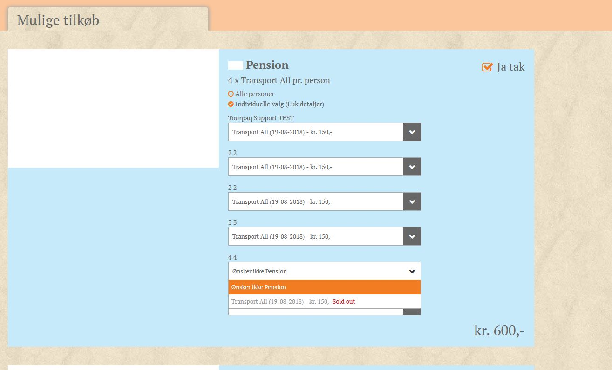

# Sold out behaviour

**Overview**\
The _Sold Out Behaviour_ setting controls how extras with limited availability (allotment-based products) are displayed when the available allotment is fully booked. This ensures that customers cannot select extras that exceed the available capacity.

**Purpose**\
This functionality helps maintain booking accuracy by preventing overbooking of extras that have a predefined allotment. It also provides clear visual feedback to users when an extra is no longer available.

<figure><figcaption></figcaption></figure>

**How to Use**

1. Go to **Extras → Extra Categories**.
2. Select or create an extra with an allotment.
3. Set the **Sold Out Behaviour** option for that extra category.
4. When the number of bookings reaches the allotment limit, the system will automatically display the extra as **“Sold Out”** in the interface.

**Example**

* **Allotments:** 4
* **Passengers:** 6\
  If all passengers attempt to book the extra, once the first 4 seats are taken, the remaining passengers will see the product **greyed out**, marked as **“Sold Out”**, and it will not be selectable.

<figure><figcaption></figcaption></figure>

<figure><figcaption></figcaption></figure>

If there are **no allotments available** from the start, a **message** will appear in the category description along with other product warnings, indicating that the product cannot be booked.

<figure><figcaption></figcaption></figure>
