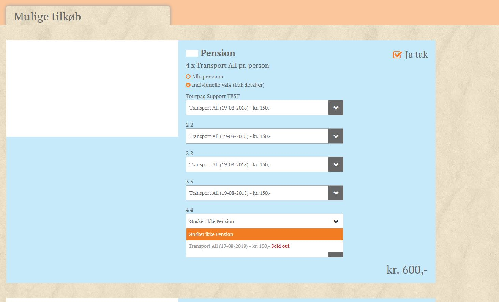
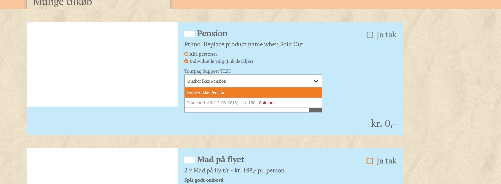

# Sold out behaviour

**Sold out** behaviour for extras can be set from the Extra category and is available only for products with allotment.

<figure><figcaption></figcaption></figure>

To better exemplify this, we have the next case:

Allotmets: 4

Passengers : 6

In this case, if all passengers what to book the allotment the fifth passenger will see product greyed out, unable to be selected and with "Sold out" in it description.

<figure><figcaption></figcaption></figure>

<figure><figcaption></figcaption></figure>

If there is no allotment available from the start, a message appears in the category description, along with the other warnings on the product.

<figure><figcaption></figcaption></figure>
