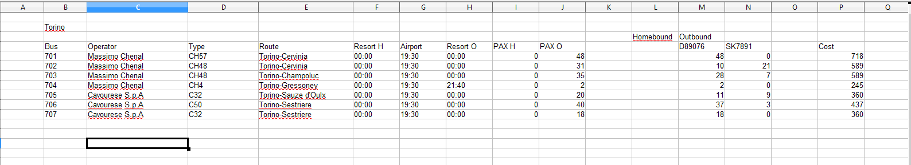

# Flight Transfer Export

#### **Overview**

The **Flight Transfer Export** feature is available to **Admin** and **Guide** user types.\
It generates various reports and lists based on data configured in [**Flight Transfer Settings**](flight-transfer/).

Each export type offers different **filters** and **output formats** (PDF or Excel) depending on the selected list.

#### **Purpose**

The purpose of this feature is to provide a comprehensive overview of all airport transfers, ensuring efficient coordination between flights, buses, and passengers.\
It supports operational management by:

* Displaying capacity utilization for buses and transfers
* Tracking passenger allocations for inbound and outbound flights
* Offering printable or exportable reports for guides, operators, and agencies
* Enabling clear communication between airport and resort transfer management

### Airport Plan Overview 

Generates a list containing both **homebound** and **outbound** flight data.\
Each record includes:

* Departure date and agency
* Legend (detailed below)
* All airports, or only the selected one from filters, showing outbound and homebound flights
* Estimated time of arrival and departure for flights (**Columns A–B**)
* Flight number (**Column C**)
* IATA code (**Column D**)
* Number of seats booked on outbound/homebound flights (**Column E**)
* Number of free seats on homebound/outbound flights (**Column F**)
* Number of booked transfers (**Column G**)
* Resorts columns with total number of transfers assigned (**Columns H–… depending on number of resorts**)
* Arrival column showing passengers with **flight only** (without transfer booked) — **last column**

**Legend**

The background color indicates capacity status:

* 🟩 **Green** – Bus capacity is adequate (available seats ≤ bus allocation)
* 🟥 **Red** – Bus capacity is too low (booked passengers exceed bus allocation)
* ⚪ **No color** – No buses or allocations assigned yet

Additional formatting:

* **Bold** – Buses are confirmed (confirmation is checked)
* **Underlined** – All passengers seated / still passengers booked for the given flight or resort transfer

<figure><figcaption></figcaption></figure>

Filters:

* Departure Date From
* Departure Date To
* Arrivals

<figure><figcaption></figcaption></figure>

### Transfer Airport Report PDF/Excel 

A detailed list of all transfers serving a specific airport, showing their **load capacity** and **route plan**.\
Divided into two main sections.

**Part 1 – General Information**

* Agency details (name, phone number, email)
* Arrival airport and date
* ETD – Estimated time of departure (flight)
* ETA – Estimated time of arrival (flight)
* Departure – Homebound flight number
* Arrival – Outbound flight number
* Total number of allocated passengers with transfer booked (selected as an extra)
* **Homebound Bus Schedule:**
  * Flight arrival time at airport
  * Passengers with transfer and their route
  * Passengers without transfer
  * Total number of passengers

<figure><figcaption></figcaption></figure>

**Part 2 – Bus & Route Details**

* Bus details: name, number, departure and return times, route name
* Route plan **to the airport**: resorts, stop times, flight numbers, number of passengers per resort
* Route plan **from the airport**: resorts, stop times, flight numbers, number of passengers per resort
* Bus company details: driver name, guide name, phone, email
* Guides assigned to the bus

Filters:

* Departure Date From
* Arrivals
* Resorts

### Transfer Bus Report 

Generates an overview of buses in the airport, either **homebound** or **outbound**.

**Information grouped by:**

* Transfer number
* Operator
* Transfer type
* Route
* Resort departure hour
* Airport hour
* Resort arrival hour
* Number of passengers (departure and return)
* Number of passengers per flight for each transfer
* Cost per transfer

<figure><figcaption></figcaption></figure>

Filters:

* Departure Date From
* Arrivals
* Resorts
* Operators
* Buses

### Flight Transfer Order 

Creates a list of transfers for a specific **transfer operator** and **date**.

**Details included:**

* Transfer details – bus name, type, route
* Outbound information – passenger number, flight number, flight time
* Homebound information – passenger number, flight number, flight time
* Transfer operator details – driver name, guide name

<figure><figcaption></figcaption></figure>

Filters:

* Departure Date From
* Arrivals
* Resorts
* Operators
* Buses

### Transfer Seating/Pax PDF/Excel 

Exports passenger seating information for **outbound** or **homebound** transfers.

**Included data:**

* Total number of passengers
* Passenger names
* Booking number
* Passenger’s resort
* Bus number
* Flight number
* Airports
* Stops

<figure><figcaption></figcaption></figure>

Filters:

* Departure Date From
* Outbound/Homebound
* Arrivals
* Resorts
* Operators
* Buses

### Transfer Seating/Bus + Stop PDF/Excel 

A detailed list of buses and their routes, grouped by **stops** and **bookings**.

**Information includes:**

* Transfer number
* Transfer type
* Flight details
* Number of passengers
* Stops and assigned bookings

<figure><figcaption></figcaption></figure>

Filters:

* Departure Date From
* Outbound/Homebound
* Arrivals
* Resorts
* Operators
* Buses

### Transfer Seating/Bus + Pax PDF/Excel 

Displays all passengers grouped by bus.

**Details include:**

* Passenger name
* Booking number
* Flight number
* Flight departure and arrival
* Passenger resort
* Passenger hotel

<figure><figcaption></figcaption></figure>

Filters:

* Departure Date From
* Outbound/Homebound
* Arrivals
* Resorts
* Operators
* Buses

#### Departure information 

Exports **departure-related data** (configured in _Flight Transfer → Departure Information_) into a **PDF** file for each booking.\
The exported data includes:

1. **Booking details:**\
   Customer name, booking number, accommodation, passenger count, flight number
2. **Customer name**
3. **Destination Text – Beginning**
4. **Departure Information Text for Hotels**
5. **Destination Text – Transport Type**
6. **Destination Text – Closing**

Filters:

* Departure Return Date
* Arrivals
* Resorts

***

### FAQ

#### Which export should be used for airport-wide transfer planning?

Use **Airport Plan Overview**.

It gives a combined view of flights, seat usage, booked transfers, and resort distribution.

#### Which export should be used for a transport operator?

Use **Flight Transfer Order**.

It focuses on operator-specific transfer details, bus data, and outbound or homebound flight information.

#### Which export should be used to see passenger seating by bus?

Use **Transfer Seating/Bus + Pax PDF/Excel**.

It groups passengers by bus and includes booking, resort, hotel, and flight details.

#### Which export should be used to review stop-based loading?

Use **Transfer Seating/Bus + Stop PDF/Excel**.

It groups the result by stops and assigned bookings.

#### Why are passengers missing from a transfer export?

Check the active filters first.

The most common causes are **Arrivals**, **Resorts**, **Operators**, **Buses**, or the selected **Outbound/Homebound** direction.

#### Why do some passengers appear without transfer allocation?

Those passengers usually have a flight but no transfer extra booked.

This is especially visible in airport planning and airport report outputs.

#### When should PDF be used instead of Excel?

Use PDF for printable operational handouts.

Use Excel when sorting, filtering, or further analysis is needed.

***

### Related pages

* [Flight Transfer](flight-transfer/) — Overview of flight transfer setup and linked transfer tools.
* [Transfer listing](flight-transfer/transfer-listing.md) — Review transfer data in a list view before exporting.
* [Flight Transfer List](flight-transfer/flight-transfer-list.md) — Work with transfer lists related to flight transfer operations.
* [Lists](export-1/lists.md) — Export other operational booking lists from the Export module.
