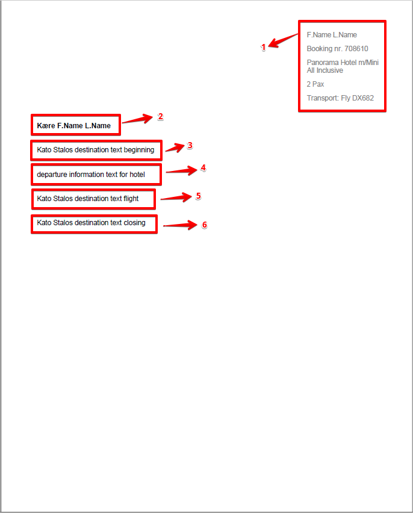

# Flight Transfer Export

**Available to:** Admin and Guide user types

### Overview

The **Flight Transfer Export** function enables users to generate reports based on data from the **Flight Transfer Settings**. These reports provide detailed information about flight-related transfers and can be exported in different formats depending on operational needs.

### Purpose

This feature supports both administrators and guides in managing and monitoring passenger transfers between flights and resorts. By exporting the relevant lists, users can ensure smooth coordination of transfers and accurate communication with transport operators.

### Filters

The available **filters** vary depending on the type of list selected for export. Each export type provides its own filtering options to tailor the output to the required data.

### Airport Plan Overview​ 

Generates a list which will contain (for homebounds and outbounds):

* departure date and agency
* Legend detailed below
* all airports/or the selected one from the filters, with flights outbound and homebound
* estimated time of arrival and departure for flights(A, B columns)
* flight number (C column)
* IATA code (D column)
* number of seats booked on the outbound/homebound flights (E column)
* number of free seats on the homebound/outbound flights (F column)
* number of booked transfers (G column)
* resorts columns with the total number of transfers assigned (starts with H and ends depending on the number of resorts)
* arrival column with number of passengers with flight only without transfer booked (last Column)

(Legend) The background is colored accordingly:

* green- if bus capacity is adequate/seating on a bus is smaller than the allocation of a bus
* red- if the bus capacity is too low/seating on a bus is bigger than the allocation of the bus
* no background- if there are no buses assigned/no bus and allocation created so far
* bold value- if buses are confirmed/confirmation is checked
* underlined value- if all pax are seated/if there are still pax booked on a given flight/resort transfer

<figure><figcaption></figcaption></figure>

Filters:

* Departure Date From
* Departure Date To
* Arrivals

<figure><figcaption></figcaption></figure>

### Transfer Airport Report PDF/Excel​ 

It is a list of all transfers serving an airport, their load capacity, and the route plan. The list can be exported in PDF or Excel versions, is divided into 2 parts, and contains:

**Part 1 contains**:

* Agency details (name, phone number, email address)
* Arrival airport and date
* ETD- estimated time of departure of the flight
* ETA- estimated time of arrival of the flight
* Departure- Homebound Flight number
* Arrival- Outbound Flight number
* Pax- total number of allocated pax on the corresponding flight having a flight transfer booked (extras on the booking selected)
* Homebound Bus Schedule
* Time of the flight arrival at the airport
* Passengers with a transfer and their route
* Passengers without transfer
* Total number of passengers

<figure><figcaption></figcaption></figure>

**Part 2 contains**:

* Bus details - name, number, time it leaves the home resort, and time it returns to it, route name
* Route plan to the airport - resorts on the route and their stop times, flight number of the passengers, and number of passengers to pick up from each resort
* Route plan from the airport - resorts on the route and their stop times, flight number of the passengers, and number of passengers to leave at each resort
* Bus company details - bus driver name, guide name, phone, email
* Guides on the bus

<figure><figcaption></figcaption></figure>

Filters:

* Departure Date From
* Arrivals
* Resorts

<figure><figcaption></figcaption></figure>

### Transfer Bus Report​ 

Generates a list that gives an overview of the buses in the airport, either homebound or outbound.

Information is grouped by:

* Transfer number
* Operator
* Transfer type
* Route
* Resort departure hour
* Airport hour
* Resort arrival hour
* Passenger number on departure from the resort
* Passenger number on return to the passenger resort
* Number of passengers per flight for each transfer
* Cost per transfer

<figure><figcaption></figcaption></figure>

Filters:

* Departure Date From
* Arrivals
* Resorts
* Operators
* Buses

<figure><figcaption></figcaption></figure>

### Flight Transfer Order​ 

Generates a list that contains information about the transfers of a transfer operator for a certain date:

* transfer details - bus name, type and route
* outbound information - passengers number, flight number, flight time
* home information - passengers number, flight number, flight time
* transfer operator details - driver name, guide name

<figure><figcaption></figcaption></figure>

Filters:

* Departure Date From
* Arrivals
* Resorts
* Operators
* Buses

<figure><figcaption></figcaption></figure>

### Transfer Seating/Pax PDF/Excel​ 

The list can be exported in PDF or Excel version and contains information about:

* total number of passengers for either outbound or homebound
* passenger names
* booking number of the passenger
* resort of the passenger
* bus number of the passenger
* flight number
* airports
* stops

<figure><figcaption></figcaption></figure>

Filters:

* Departure Date From
* Outbound/Homebound
* Arrivals
* Resorts
* Operators
* Buses

<figure><figcaption></figcaption></figure>

### Transfer Seating/Bus + Stop PDF/Excel​ 

A list containing detailed information about each bus and their route grouped by the stops made and bookings. Can be exported in PDF or Excel versions.

Details:

* Transfer number
* Transfer type
* Flight details
* Number of passengers
* Stops and bookings assigned to it

<figure><figcaption></figcaption></figure>

Filters:

* Departure Date From
* Outbound/Homebound
* Arrivals
* Resorts
* Operators
* Buses

<figure><figcaption></figcaption></figure>

### Transfer Seating/Bus + Pax PDF/Excel​ 

A list detailing all passengers by bus that can be exported as a pdf or excel file and contains:

* Passenger name
* Booking number
* Flight number
* Departure and Arrival for flight
* Resort of the passenger
* Hotel of the passenger

<figure><figcaption></figcaption></figure>

Filters:

* Departure Date From
* Outbound/Homebound
* Arrivals
* Resorts
* Operators
* Buses

<figure><figcaption></figcaption></figure>

### Departure information​ 

Exports the information set in **Flight Transfer/Departure information** in a pdf file for each booking and the data is displayed in this order:

* Booking details (customer name, booking number, accomodation place, number of passengers on the booking, flight number) -> taken from the booking
* Customer name -> taken from the booking
* Destination Text - Beginning
* Departure Information Text for Hotels
* Destination Text - Transport type
* Desination Text - Closing

<figure><figcaption></figcaption></figure>

Filters:

* Departure Return Date
* Arrivals
* Resorts

<figure><figcaption></figcaption></figure>
