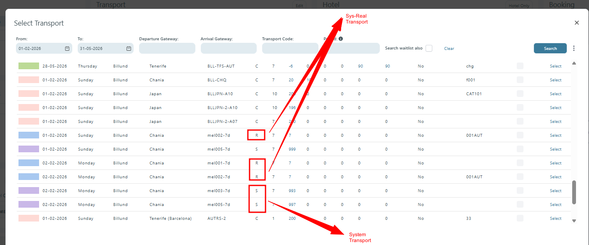
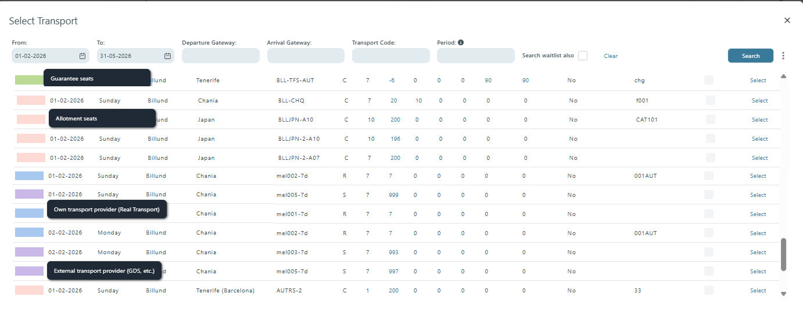

# GDS Transport Identification and Exclusion

### Purpose

The GDS Transport Identification and Exclusion feature improves visibility and control of transport providers throughout the booking flow.

The feature allows users to:

* Distinguish between Sys-Real and external (GDS/System) transports
* Understand transport seat types directly from visual indicators
* Exclude external providers during package searches
* Maintain consistent transport visibility across booking flow and web-booking

This reduces booking mistakes and improves transport selection efficiency.

***

## Feature Overview

The feature introduces:

* Improved transport type identification
* New STATUS color indicators
* Tooltips for transport statuses
* A workflow option to exclude external providers
* Consistent transport status visibility in transport and flight listings

***

## Configuration

### Workflow Configuration

A new drop-down selection is available in Workflow search criteria.

| Field                     | Description                                        |
| ------------------------- | -------------------------------------------------- |
| Exclude External provider | Excludes System/GDS transports from search results |

#### Behavior

When enabled:

* System transports are excluded
* Only Sys-Real and other internal transports remain visible

This allows users to search for packages without external providers.

***

## Transport Identification

### TYPE Column

The `TYPE` column identifies the transport provider type.

| Value | Meaning            |
| ----- | ------------------ |
| `R`   | Sys-Real Transport |
| `S`   | System Transport   |

<figure><figcaption></figcaption></figure>

#### Previous Behavior

Previously, the letter `S` was used for both transport types, making provider identification unclear.

***

## STATUS Column

A new `STATUS` column is introduced in the Select Transport dialog.

### Placement

The STATUS column is:
\
\- Positioned on the left next to each transport
\
\- Displays colored squares
\
\- Use tooltips to explain the status

***

## STATUS Colors

<figure><figcaption></figcaption></figure>

| Color  | Meaning              | Tooltip                                   |
| ------ | -------------------- | ----------------------------------------- |
| Green  | Guaranteed seats     | `Guarantee seats`                         |
| Pink   | Allotment seats      | `Allotment seats`                         |
| Blue   | Sys-Real transport   | `Own transport provider (Real Transport)` |
| Purple | System/GDS transport | `External transport provider (GDS, etc.)` |

***

## Booking Flow

### How It Appears

#### Sys-Real Transport

A Sys-Real transport displays:

* TYPE = `R`
* Blue STATUS indicator

Tooltip:

`Own transport provider (Real Transport)`

***

#### System/GDS Transport

A System transport displays:

* TYPE = `S`
* Purple STATUS indicator

Tooltip:

`External transport provider (GDS, etc.)`

***

### Example

A user searches for packages and opens the Select Transport dialog.

The list contains:

| STATUS | TYPE | Description                 |
| ------ | ---- | --------------------------- |
| Blue   | R    | Internal Sys-Real transport |
| Purple | S    | External GDS transport      |
| Green  | -    | Guaranteed seats            |
| Pink   | -    | Allotment seats             |

The user immediately understands:

* Which transports are external
* Which seats are guaranteed
* Which transports belong to internal providers
