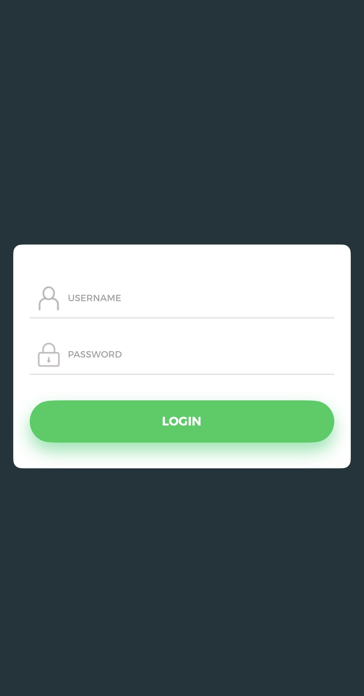
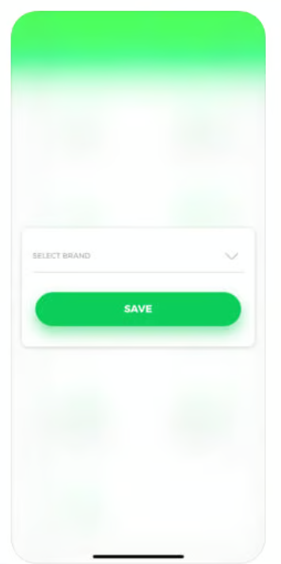
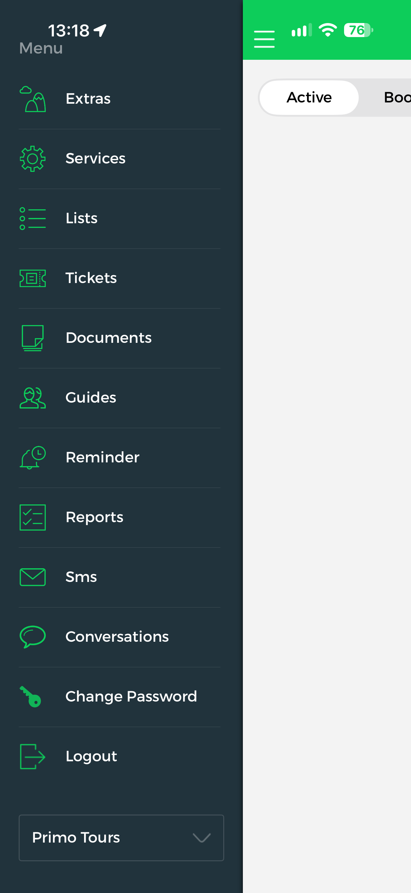
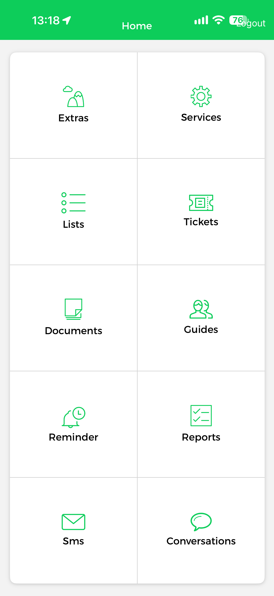

# Guide App

### Overview

The **Guide App** is the mobile application that guides use at the destination. It tracks the activity of guides, helps guides coordinate with each other, supports guests directly through chat, and exports passenger lists in multiple formats. Guides also use it to sell excursions on behalf of guests.

A guide signs in with the username and password of a Tourpaq user and selects a brand. After sign-in, the **Home** screen shows ten sections: **Extras**, **Services**, **Lists**, **Tickets**, **Documents**, **Guides**, **Reminder**, **Reports**, **Sms** and **Conversations**. The top bar shows the title **Home** and a **Logout** link. Each section has its own page below this one.

Inside a section, the burger icon at the top left opens the **side menu**. The side menu lists the same ten sections, plus **Change Password** and **Logout**, and a brand selector at the bottom.

The Guide App is not the Guest App. Guests sign in to the Guest App with a booking number. Content in Tourpaq Office under **Guest App** (Vocabulary, Insider Tips, Maps, Weekly Activities, Good to Know, Settings) is shown in the Guest App. An excursion can be ordered in both apps, as described on Extras.

### Purpose

* Sign in, choose a brand, and change your password.
* Find which Tourpaq Office page feeds each Guide App section.
* Check what must be configured before a section shows data to a guide.
* Check which user rights a section needs.
* Tell the Guide App apart from the Guest App.

### Preconditions

* A Tourpaq user for the guide — see [Users Management](../../users/users/users-management.md) and [Guide teams](../../guides/).
* The Guide App is installed on the guide's device.
* For **Lists**: the user is a **guide** or **guide master**. Other users cannot generate the export files.
* For excursion sales in **Extras**: the setup described on Extras. Only guides can sell products in the app.

### How-to



**Sign in**

1. Open the Guide App.
2. Enter your Tourpaq username in **Username**.
3. Enter your Tourpaq password in **Password**.
4. Tap **Login**.

The list of available menus is shown right after the sign-in succeeds.



**Select a brand**

1. On the **Select Brand** screen, tap the **Select Brand** list.
2. Choose the brand you work under.
3. Tap **Save**.



**Open a section**

Tap the section on the **Home** screen. Inside a section, tap the burger icon at the top left to open the side menu, then tap another section.



**Switch brand**

1. Open the side menu.
2. Tap the brand selector at the bottom of the menu.
3. Choose the brand.



**Change your password**

1. Open the side menu.
2. Tap **Change Password**.



**Sign out**

Tap **Logout** in the top bar of the **Home** screen, or tap **Logout** in the side menu.



**Change how long a session lasts**

Go to **Users → Brands**, open the brand, and change **Destination API Token** on the **General** tab. Enter the number of minutes.



After sign-in, the **Home** screen shows the sections listed under Field Reference. A session that is idle for longer than the configured time expires, and the guide signs in again.

### Field Reference

#### Sign-in screen

<figure><figcaption>
The Guide App sign-in screen.
</figcaption></figure>

| Field        | Description                               | Notes                                                                          |
| ------------ | ----------------------------------------- | ------------------------------------------------------------------------------ |
| **Username** | The username of the guide's Tourpaq user. | The same username the guide uses to sign in to Tourpaq Office.                 |
| **Password** | The password of that Tourpaq user.        | Hidden as you type. Change it later with **Change Password** in the side menu. |
| **Login**    | Signs the guide in and opens the app.     | Tap it after you enter both fields.                                            |

#### Select Brand screen

<figure><figcaption>
The Select Brand screen, shown over a blurred Home screen.
</figcaption></figure>

| Field            | Description                                 |
| ---------------- | ------------------------------------------- |
| **Select Brand** | The brand the guide works under in the app. |
| **Save**         | Confirms the chosen brand.                  |

#### Side menu

<figure><figcaption>
The side menu, opened with the three lines icon from inside a section.
</figcaption></figure>

| Item                                                                                                                               | Description                                                                                    |
| ---------------------------------------------------------------------------------------------------------------------------------- | ---------------------------------------------------------------------------------------------- |
| **Extras**, **Services**, **Lists**, **Tickets**, **Documents**, **Guides**, **Reminder**, **Reports**, **Sms**, **Conversations** | The same ten sections as on the **Home** screen. Tap one to open it.                           |
| **Change Password**                                                                                                                | Opens the screen where the guide changes the password of their Tourpaq user.                   |
| **Logout**                                                                                                                         | Signs the guide out of the Guide App.                                                          |
| **Brand selector**                                                                                                                 | Shows the current brand and lets the guide choose another one. Sits at the bottom of the menu. |

#### Home sections

<figure><figcaption>
The Home screen with the ten sections.
</figcaption></figure>

| Section           | Description                                                                                                        |
| ----------------- | ------------------------------------------------------------------------------------------------------------------ |
| **Extras**        | Excursions that the guide can sell and the orders already made. Fed by Extras that are set up with **Guide sale**. |
| **Services**      | Not yet documented.                                                                                                |
| **Lists**         | Passenger lists that the guide can export. Guide or guide master login required.                                   |
| **Tickets**       | Not yet documented.                                                                                                |
| **Documents**     | Not yet documented.                                                                                                |
| **Guides**        | Not yet documented.                                                                                                |
| **Reminder**      | Not yet documented.                                                                                                |
| **Reports**       | Not yet documented.                                                                                                |
| **Sms**           | Not yet documented.                                                                                                |
| **Conversations** | Chat with guests. Not yet documented in detail.                                                                    |

#### Session

| Field                     | Description                                                                                                                                                        | Notes                                                                                                                                                                         |
| ------------------------- | ------------------------------------------------------------------------------------------------------------------------------------------------------------------ | ----------------------------------------------------------------------------------------------------------------------------------------------------------------------------- |
| **Destination API Token** | Number of minutes of inactivity after which the guide's session expires and notifications stop. Set in the **General** tab of Edit Brand under **Users → Brands**. | The default is 30 minutes, counted from the last user action. A service stops the notifications, so a short delay can occur. The label still contains the word _Destination_. |

#### Known limitations

* Only guides can add products and make them available in the app.
* Stop sales hours do not affect the guide's list of excursions. A guide sees all available excursions.
* An excursion with allotment type **None** or **LinkedToTransport** cannot be ordered in the apps.
* The status of an order in the app is cleared when the guest travels home.

### Related pages

* Extras
* Lists
* [Guest App](../../visit-sun-app.md)
* [Guide teams](../../guides/)
* [Brands](../../brands/)
