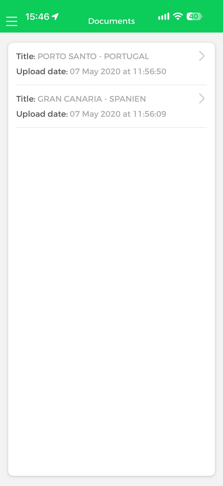
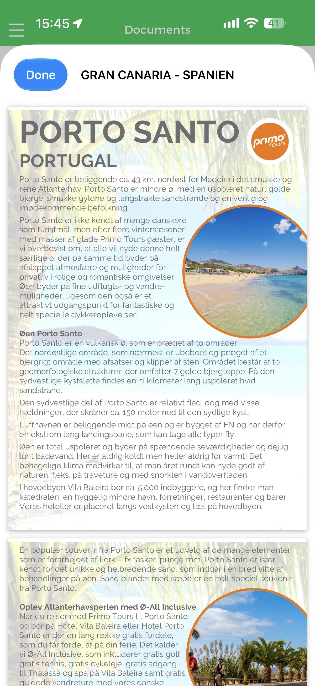
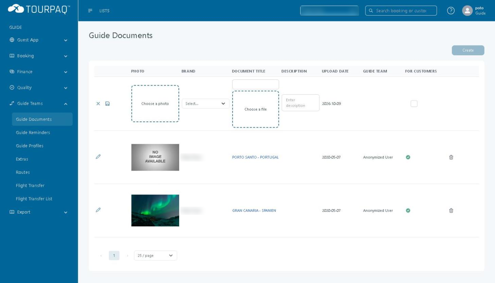

# Documents

#### Overview

**Documents** is the section of the Guide App where a guide opens the documents that were uploaded for the brand in Tourpaq Office. It is one of the ten sections on the Guide App **Home** screen and is also available from the side menu. The screen title is **Documents**.

In Tourpaq Office, the documents are managed on the **Guide Documents** page under **Guide Teams**.

#### Purpose

Use Documents to:

* See which documents are available to you in the Guide App, with their title and upload date.
* Open a document and read it on your phone.

In the verified example the documents are destination information sheets, such as `PORTO SANTO - PORTUGAL` and `GRAN CANARIA - SPANIEN`, in PDF form.

#### Preconditions

* You are signed in to the Guide App with your Tourpaq user and have selected a brand on the **Select Brand** screen.
* At least one document exists under **Guide Teams → Guide Documents** in Tourpaq Office.&#x20;

#### How-to

**Open a document in the Guide App**

1. In the Guide App, tap **Documents** on the **Home** screen, or open it from the side menu. The screen title is **Documents**.
2. Read the list. Each card shows the **Title** and the **Upload date** of one document, with a chevron on the right.
3. Tap a card to open the document.
4. Read the document in the viewer. The viewer shows the document title at the top.
5. Tap **Done** in the top left corner to return to the list.

<figure><figcaption></figcaption></figure>

The list shows the documents in the order of the example: `PORTO SANTO - PORTUGAL` and `GRAN CANARIA - SPANIEN`.

**Add a document in Tourpaq Office**

Documents are created in Tourpaq Office. For the full procedure, see Guide Documents.

1. Go to **Guide Teams → Guide Documents**. The page title is **Guide Documents**.
2. Click **Create**. A new row opens at the top of the list.
3. Fill in the row: choose the **Brand**, enter the **Document title**, choose the file and, if needed, a photo and a **Description**.
4. Select the **For customers** check box if customers should see the document, and save the row with the save icon on its left.

<figure><figcaption></figcaption></figure>

The new row opens with the **Upload date** set to the current date and **For customers** cleared. The existing rows have a pencil icon to edit and a bin icon to delete the record.

#### Field Reference

**Documents list in the Guide App**

| Field           | Description                                  | Notes                                                                                                                    |
| --------------- | -------------------------------------------- | ------------------------------------------------------------------------------------------------------------------------ |
| **Title**       | The title of the document.                   | Matches **Document title** in Tourpaq Office, for example `PORTO SANTO - PORTUGAL`.                                      |
| **Upload date** | The date and time the document was uploaded. | Shown as `07 May 2020 at 11:56:50`. Matches **Upload date** in Tourpaq Office (`2020-05-07`), which shows the date only. |

**Guide Documents in Tourpaq Office**

| Field              | Description                                   |
| ------------------ | --------------------------------------------- |
| **Photo**          | The preview image of the document.            |
| **Brand**          | The brand the document belongs to.            |
| **Document title** | The title of the document.                    |
| **Description**    | A short description of the document.          |
| **Upload date**    | The date the document was uploaded.           |
| **Guide Team**     | The guide team that uploaded the document.    |
| **For customers**  | Shows whether customers can see the document. |

**Relationship between Tourpaq Office and the Guide App**

| Tourpaq Office                                                           | Guide App                                                                                        |
| ------------------------------------------------------------------------ | ------------------------------------------------------------------------------------------------ |
| **Guide Documents** record `PORTO SANTO - PORTUGAL`, uploaded 2020-05-07 | **Documents** card **Title** `PORTO SANTO - PORTUGAL`, **Upload date** `07 May 2020 at 11:56:50` |
| **Guide Documents** record `GRAN CANARIA - SPANIEN`, uploaded 2020-05-07 | **Documents** card **Title** `GRAN CANARIA - SPANIEN`, **Upload date** `07 May 2020 at 11:56:09` |
| **Brand**, **For customers**, **Guide Team**                             | Which documents the guide sees                                                                   |

**Availability and limitations**

* The documents are listed in the Guide App with the information described above. Only the title and the upload date are shown on the list cards.

#### Related pages

* Guide App
* Guide Documents
* Guide teams
* Tickets
