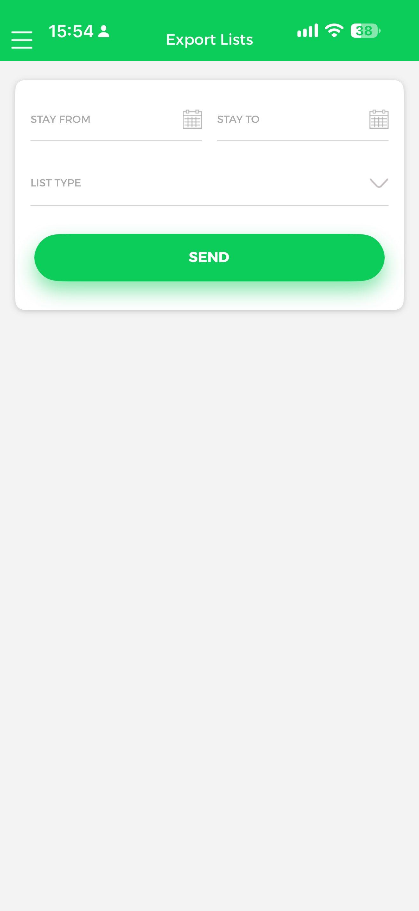
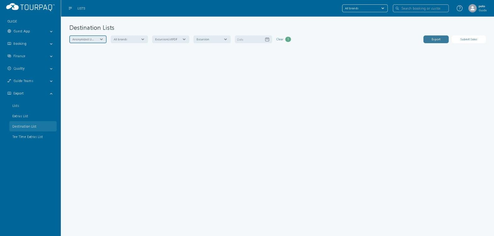

# Lists

#### Overview

**Lists** is the section of the Guide App where a guide generates guest lists. The section opens on the **Export Lists** screen.

The screen offers four list types:

* **Excursions List PDF** — the guests booked on one excursion on one date.
* **Guide List PDF**
* **Passenger List PDF**
* **Departure Homebound PDF**

#### Purpose

* Give the guide the guest lists needed to run excursions.
* Check which guests have booked an excursion on a given date.
* Check the excursions sold and the amount paid per booking, in the sales ledger.

#### Preconditions

* You sign in as a **guide** or **guide master**. Other users cannot generate the export files. See Guide App.
* Excursions are set up and sold as described on Extras.

#### How-to

**1. Open Export Lists**

Sign in to the Guide App and tap **Lists** on the Home screen. The **Export Lists** screen opens.

<figure><figcaption></figcaption></figure>

**2. Choose the list type**

Tap **List Type**. A list of four types opens. Tap one to select it, or tap **Close** to leave the list without choosing.

<figure><figcaption></figcaption></figure>

**3. Open the Excursions List PDF for a date**

1. Select **Excursions List PDF**. The screen now shows **Date** (today's date is filled in, for example `08 Oct 2026`) and a **Load** button.
2. Change **Date** with the calendar icon if you need another day.
3. Tap **Load**. The **Excursions** section lists the excursions for that date.

<figure><figcaption></figcaption></figure>

**4. Select an excursion and load it**

1. Tap the excursion, for example **Japan Excursion 3**. It appears under **Selected Excursion**.
2. To choose another excursion, tap the **X** next to **Selected Excursion**.
3. Tap **Load**. The list opens as a PDF.

<figure><figcaption></figcaption></figure>

**5. Read the PDF**

The PDF is titled **Extra:** followed by the excursion name, with the date on the same line. Below it, a table lists the guests, and a summary table counts them per hotel.

<figure><figcaption></figcaption></figure>

The PDF opens in the device viewer. Its toolbar offers close, markup, search and share.


The PDF in the screenshot has no guest rows and shows `0` in every summary cell, because no guest was booked on that excursion on that date. Guest rows appear when guests are booked.


**Generate the same list in Tourpaq Office**

Go to **Export → Destination List**. The page is titled **Destination Lists**. Set the filters, then click **Export**: a user selector, a brand selector (**All brands** by default), the list type (**ExcursionListPDF** or **LiquidationReport**), **Excursion** and **Date**. **Clear** resets the filters.

<figure><figcaption></figcaption></figure>

#### Field Reference

**Export Lists screen**

| Field         | Description                                                                                                                | Notes                                                                          |
| ------------- | -------------------------------------------------------------------------------------------------------------------------- | ------------------------------------------------------------------------------ |
| **Stay From** | Start of the stay period for the export. Pick it with the calendar icon.                                                   | Shown before a list type is chosen.                                            |
| **Stay To**   | End of the stay period for the export. Pick it with the calendar icon.                                                     | Shown before a list type is chosen.                                            |
| **List Type** | The list you generate: **Excursions List PDF**, **Guide List PDF**, **Passenger List PDF** or **Departure Homebound PDF**. | Choosing **Excursions List PDF** replaces Stay From and Stay To with **Date**. |
| **Send**      | Button shown with Stay From and Stay To.                                                                                   |                                                                                |

**Excursions List PDF**

| Field                  | Description                                                                                          | Notes                                                            |
| ---------------------- | ---------------------------------------------------------------------------------------------------- | ---------------------------------------------------------------- |
| **Date**               | The day whose excursions are listed. The current date is filled in.                                  | Format `08 Oct 2026`.                                            |
| **Selected Excursion** | The excursion that will be exported. Shown after you tap an excursion in the **Excursions** section. | Tap **X** to clear it.                                           |
| **Load**               | Generates the PDF for the date and the selected excursion.                                           | Tapped first to list the excursions, then again to open the PDF. |
| **Excursions**         | The excursions available on the chosen date.                                                         |                                                                  |

**Excursions List PDF columns**

| Column              | Description                        |
| ------------------- | ---------------------------------- |
| **Adults No**       | Number of adults in the booking.   |
| **Childs No**       | Number of children in the booking. |
| **Guest Name**      | Name of the guest.                 |
| **Hotel**           | Hotel of the booking.              |
| **Room**            | Room of the booking.               |
| **Guide**           | Guide assigned.                    |
| **Voucher Number**  | Voucher number.                    |
| **Contact number**  | Guest phone number.                |
| **Contact e-mail**  | Guest e-mail address.              |
| **Time**            | Excursion time.                    |
| **Pickup Location** | Where the guest is picked up.      |
| **BKG**             | Booking number.                    |
| **Payment Type**    | How the excursion was paid.        |
| **Source**          | Where the order was made.          |
| **Observations**    | Remarks on the order.              |

#### Related pages

* Guide App
* Extras
* Lists (Export)
* Extras List
* Guide Sales Ledger
