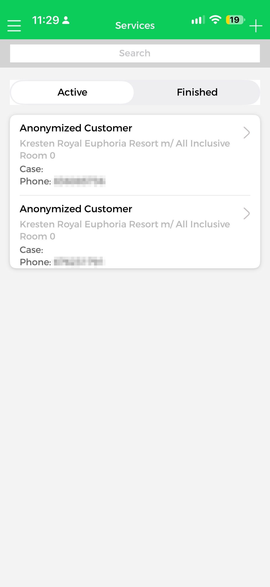
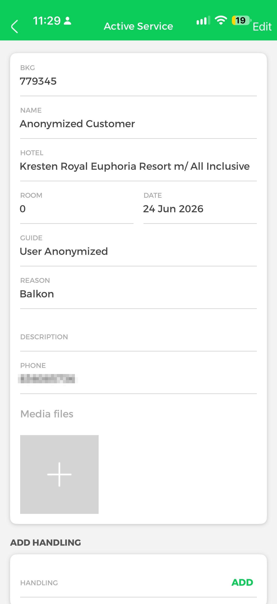
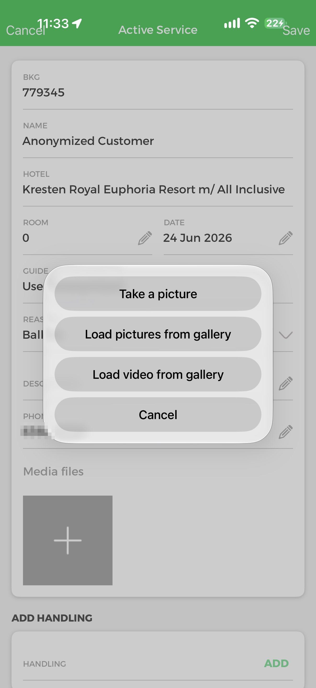
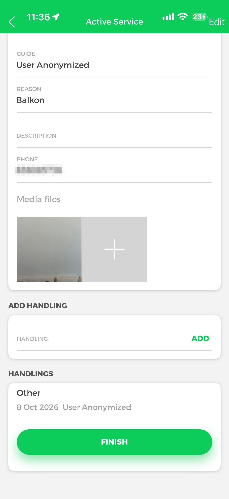
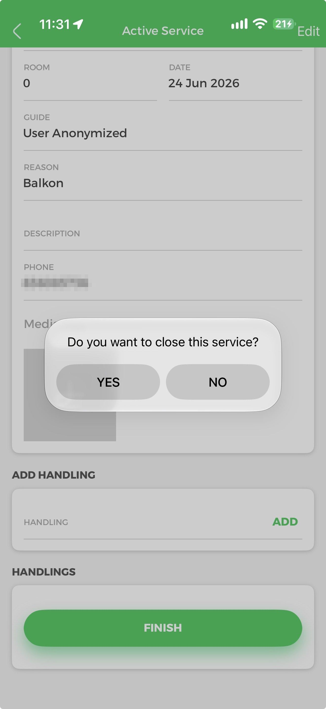
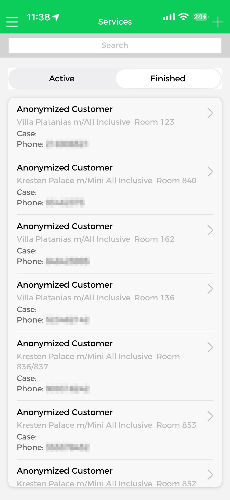
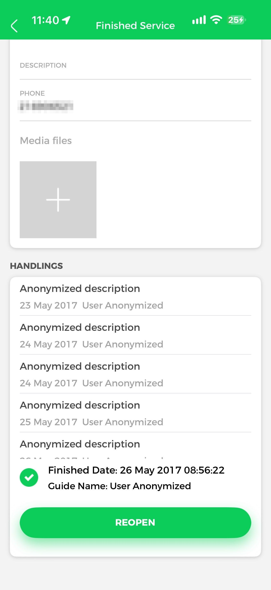
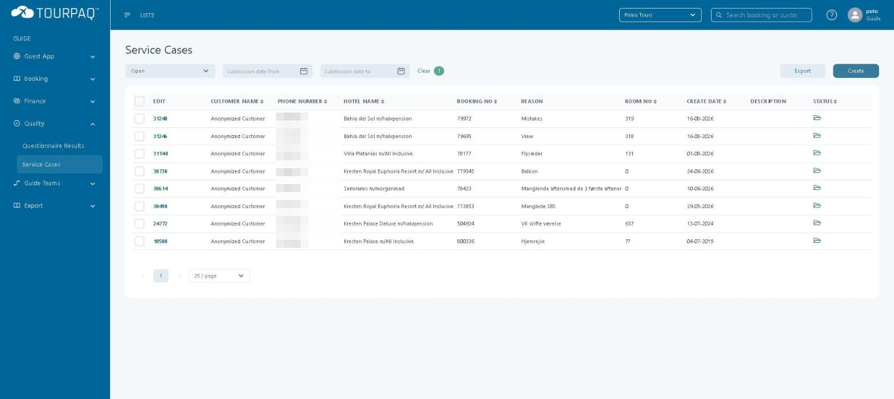
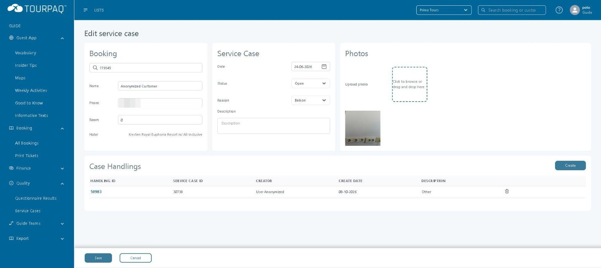
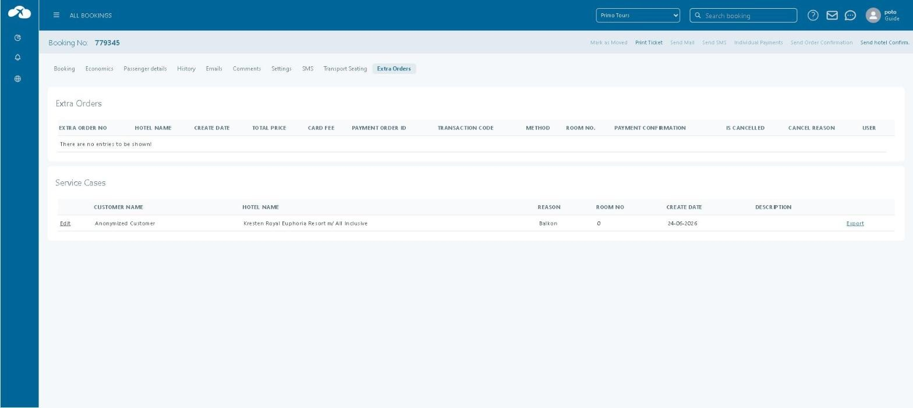

# Services

#### Overview

**Services** is the Guide App section where a guide works with [service cases](../../service-cases/) — customer complaints registered against a booking.

A service in the Guide App and a service case in Tourpaq Office are the same record. What the guide adds in the app (photos, handlings, closing the case) is saved on the service case, and what is changed in Tourpaq Office shows in the app.

The section has two lists:

* **Active** — service cases with status `Open`.
* **Finished** — service cases with status `Closed`.

#### Purpose

Use Services to:

* Look up a customer's complaint on location, with booking number, hotel, room and reason.
* Record what you did about it as a handling, and attach photos or video as evidence.
* Finish the case when it is resolved, or reopen it if the problem comes back.

#### Preconditions

* You are logged in with a **Guide** user. Services, and the matching **Quality → Service Cases** menu in Tourpaq Office, are available only to Guide users.
* Service Case Management is enabled for your company — see [Service Cases](../../service-cases/).
* The service case exists and is linked to a booking. Cases are created in Tourpaq Office with **Create** on the **Service Cases** page.

#### How-to



**Open a service in the Guide App**

1. On the Guide App Home screen, tap **Services**.
2. Select **Active** for open cases or **Finished** for closed cases. Use **Search** to filter the list.
3. Tap a case to open it.

<figure><figcaption>
The Services list in the Guide App, Active tab.
</figcaption></figure>

The **Active Service** screen opens.

<figure><figcaption>
An active service in the Guide App.
</figcaption></figure>



**Edit the case and add photos or video**

1. Tap **Edit**. A pencil icon appears next to the fields you can change.
2. Change **Room**, **Date**, **Reason**, **Description** or **Phone** as needed.
3. Tap the **+** tile under **Media files** and choose **Take a picture**, **Load pictures from gallery** or **Load video from gallery**.
4. Tap **Save**. To discard your changes, tap **Cancel**.

<figure><figcaption>
Edit mode, with the media picker open.
</figcaption></figure>



**Add a handling**

1. Under **ADD HANDLING**, enter what you did in **HANDLING**.
2. Tap **ADD**.

The handling appears under **HANDLINGS** with the date and your name.

<figure><figcaption>
A photo and a handling added to the service.
</figcaption></figure>



**Finish the service**

1. Tap **FINISH**.
2. Confirm **Do you want to close this service?** with **YES**.

<figure><figcaption>
Confirming that the service is closed.
</figcaption></figure>

The case moves to the **Finished** list.



**Reopen a finished service**

1. In **Services**, select **Finished** and open the case.
2. Tap **REOPEN**.

<figure><figcaption>
The Finished tab.
</figcaption></figure>

<figure><figcaption>
A finished service, showing who closed it and when.
</figcaption></figure>



**Find the same case in Tourpaq Office**

Log in to Tourpaq Office with your Guide user. You can reach a service case in two ways:

* **From the list:** go to **Quality → Service Cases** and click the case number in the **EDIT** column.
* **From the booking:** open the booking, select the **Extra Orders** tab, and click **Edit** in the **Service Cases** section.

Both open the **Edit service case** page.



Changes made in the Guide App are saved on the service case. On staging, a photo and a handling added in the Guide App appeared on the **Edit service case** page for the same case in Tourpaq Office.

#### Field Reference

**Guide App — Services list**

| Field             | Description                                                               | Notes                              |
| ----------------- | ------------------------------------------------------------------------- | ---------------------------------- |
| **Search**        | Filters the list.                                                         |                                    |
| **Active**        | Shows open service cases.                                                 | Status `Open` in Tourpaq Office.   |
| **Finished**      | Shows closed service cases.                                               | Status `Closed` in Tourpaq Office. |
| List entry        | Customer name, hotel, room, **Case** and **Phone**. Tap to open the case. |                                    |
| **+** (top right) | Shown on the Services screen.                                             |                                    |

**Guide App — Active Service**

| Field                  | Description                            | Notes                                                                                                                                           |
| ---------------------- | -------------------------------------- | ----------------------------------------------------------------------------------------------------------------------------------------------- |
| **BKG**                | Booking number the case belongs to.    | Read-only in the app. Matches **BOOKING NO** in Tourpaq Office.                                                                                 |
| **NAME**               | Customer name from the booking.        | Read-only in the app.                                                                                                                           |
| **HOTEL**              | Hotel from the booking.                | Read-only in the app.                                                                                                                           |
| **ROOM**               | Customer's room number.                | Editable after **Edit**.                                                                                                                        |
| **DATE**               | Date of the service case.              | Editable after **Edit**. Matches **Date** on the Edit service case page.                                                                        |
| **GUIDE**              | Guide user shown on the case.          | Read-only.                                                                                                                                      |
| **REASON**             | Category of the complaint.             | Editable after **Edit**, from a drop-down list.                                                                                                 |
| **DESCRIPTION**        | Free-text details of the complaint.    | Editable after **Edit**.                                                                                                                        |
| **PHONE**              | Customer's phone number.               | Editable after **Edit**.                                                                                                                        |
| **Media files**        | Photos and video attached to the case. | Added with **Take a picture**, **Load pictures from gallery** or **Load video from gallery**. Photos appear under **Photos** in Tourpaq Office. |
| **HANDLING** / **ADD** | Records an action taken on the case.   | Each handling is listed under **HANDLINGS** with date and guide name, and under **Case Handlings** in Tourpaq Office.                           |
| **FINISH**             | Closes the case after confirmation.    | Moves the case to **Finished**.                                                                                                                 |

**Guide App — Finished Service**

| Field             | Description                                          |
| ----------------- | ---------------------------------------------------- |
| **HANDLINGS**     | All handlings on the case, with date and guide name. |
| **Finished Date** | Date and time the case was closed.                   |
| **Guide Name**    | Guide who closed the case.                           |
| **REOPEN**        | Reopens the case.                                    |

**Tourpaq Office — Quality → Service Cases**

<figure><figcaption>
Service Cases under Quality, as seen by a Guide user. Phone numbers masked.
</figcaption></figure>

| Field                                                                                                                          | Description                                                   | Notes                                                                                                                                               |
| ------------------------------------------------------------------------------------------------------------------------------ | ------------------------------------------------------------- | --------------------------------------------------------------------------------------------------------------------------------------------------- |
| Status filter                                                                                                                  | Shows **All cases**, **Open** or **Closed**.                  | Defaults to **Open**.                                                                                                                               |
| **Submission date from** / **Submission date to**                                                                              | Limits the list by create date.                               | **Clear** resets the filters.                                                                                                                       |
| **Export**                                                                                                                     | Exports the selected cases.                                   |                                                                                                                                                     |
| **Create**                                                                                                                     | Opens **Add service case**.                                   | The form has **Booking**, **Name**, **Phone**, **Room**, **Date**, **Status**, **Reason**, **Custom Reason**, **Description** and **Upload photo**. |
| **EDIT**                                                                                                                       | Case number. Click to open **Edit service case**.             |                                                                                                                                                     |
| **CUSTOMER NAME**, **PHONE NUMBER**, **HOTEL NAME**, **BOOKING NO**, **REASON**, **ROOM NO**, **CREATE DATE**, **DESCRIPTION** | Case details, the same values the Guide App shows.            |                                                                                                                                                     |
| **STATUS**                                                                                                                     | Open-folder icon for `Open`, closed-folder icon for `Closed`. |                                                                                                                                                     |


A Guide user sees this page under **Quality → Service Cases**. The [Service Cases](../../service-cases/) page documents the full Tourpaq Office version under **Quality Management → Service Cases**, with more filters, overview columns and totals.


**Tourpaq Office — Edit service case**

<figure><figcaption>
The service case from the Guide App screenshots, opened in Tourpaq Office. Phone number masked.
</figcaption></figure>

| Field                         | Description                                                                                                      | Notes                                                                                                                                           |
| ----------------------------- | ---------------------------------------------------------------------------------------------------------------- | ----------------------------------------------------------------------------------------------------------------------------------------------- |
| **Booking**                   | Booking number the case belongs to.                                                                              | Guide App: **BKG**.                                                                                                                             |
| **Name**, **Phone**, **Room** | Customer details for the case.                                                                                   | Guide App: **NAME**, **PHONE**, **ROOM**.                                                                                                       |
| **Hotel**                     | Hotel from the booking.                                                                                          | Read-only. Guide App: **HOTEL**.                                                                                                                |
| **Date**                      | Date of the case.                                                                                                | Guide App: **DATE**.                                                                                                                            |
| **Status**                    | `Open` or `Closed`.                                                                                              | `Open` = **Active**, `Closed` = **Finished** in the Guide App.                                                                                  |
| **Reason**                    | Complaint category.                                                                                              | On staging the list was **Cleaning**, **View**, **Mistakes**, **Sickness**, **Excursions**, **Other**, **Balkon**. Values are company-specific. |
| **Description**               | Free-text details.                                                                                               | Guide App: **DESCRIPTION**.                                                                                                                     |
| **Upload photo**              | Adds photos to the case.                                                                                         | Shows photos added from the Guide App.                                                                                                          |
| **Case Handlings**            | **HANDLING ID**, **SERVICE CASE ID**, **CREATOR**, **CREATE DATE**, **DESCRIPTION**. **Create** adds a handling. | Handlings added from the Guide App appear here with the guide as **CREATOR**. The bin icon deletes a handling.                                  |


The bin icon in **Case Handlings** deletes the handling. **TO VERIFY** — whether the deletion can be undone, and whether it is also removed from the Guide App.


**Tourpaq Office — Booking → Extra Orders**

<figure><figcaption>
The Service Cases section on the booking's Extra Orders tab.
</figcaption></figure>

| Field             | Description                                                                                                                      | Notes                                                                                                       |
| ----------------- | -------------------------------------------------------------------------------------------------------------------------------- | ----------------------------------------------------------------------------------------------------------- |
| **Extra Orders**  | Extra orders placed on the booking.                                                                                              | Separate from service cases. A booking can have a service case and no extra orders.                         |
| **Service Cases** | Every service case on the booking: **CUSTOMER NAME**, **HOTEL NAME**, **REASON**, **ROOM NO**, **CREATE DATE**, **DESCRIPTION**. | A service case belongs to the booking, not to an extra order. It is shown on this tab only for convenience. |
| **Edit**          | Opens **Edit service case**.                                                                                                     |                                                                                                             |
| **Export**        | Exports the service case.                                                                                                        |                                                                                                             |

#### Related pages

* [Guide App](./)
* [Service Cases](../../service-cases/)
