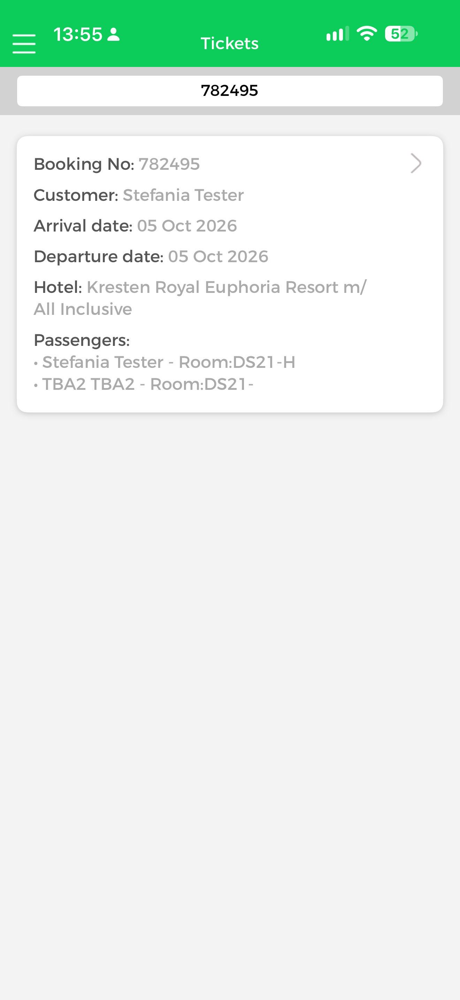
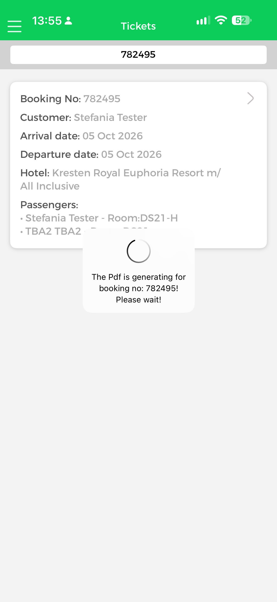
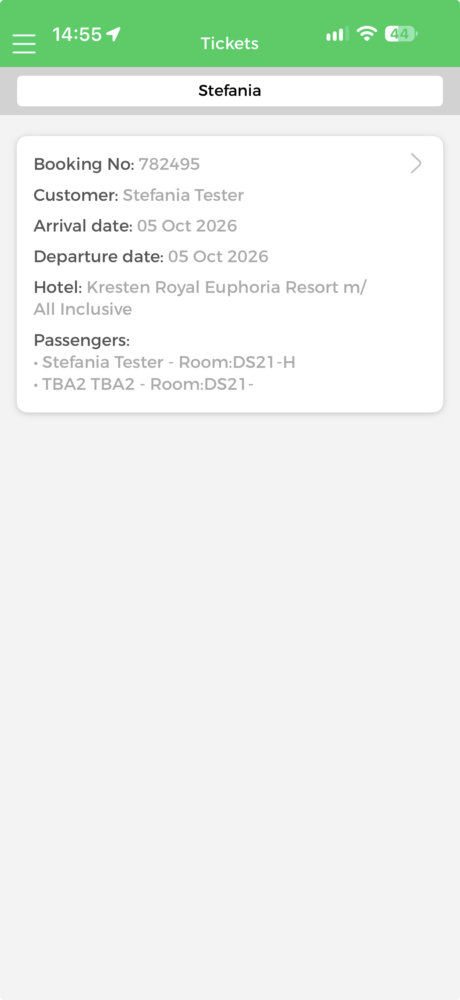
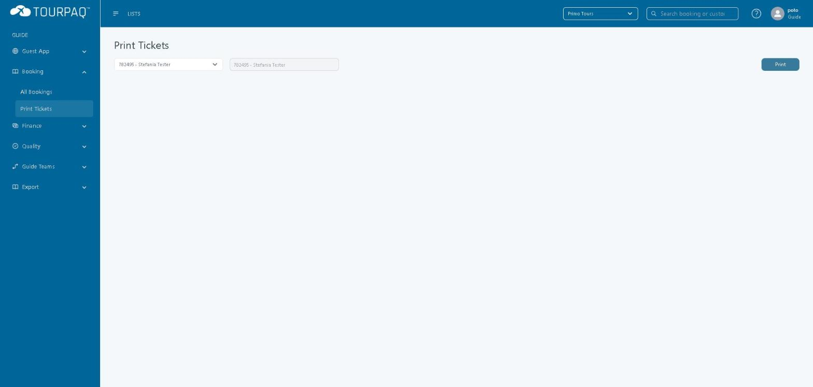
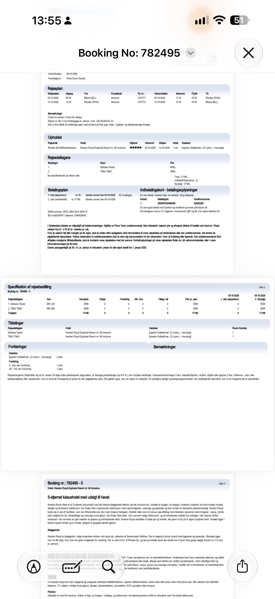

# Tickets

#### Overview

**Tickets** is the section of the Guide App where a guide looks up a booking by its booking number and opens the booking's ticket as a PDF. It is one of the ten sections on the Guide App **Home** screen and is also available from the side menu.

#### Purpose

Use Tickets to:

* Find a guest's booking at the destination by booking number.
* Check the customer, dates, hotel, passengers and room codes of the booking.
* Open the booking's ticket PDF on the guide's phone.

#### Preconditions

* You are signed in to the Guide App with your Tourpaq user and have selected a brand on the **Select Brand** screen. See Guide App.
* The booking exists under the selected brand. In the verified example, booking `782495` exists under the brand **Primo Tours** and is found in Tourpaq Office under **Booking → Print Tickets**.

#### How-to

**Open a booking's ticket**

1. In the Guide App, tap **Tickets** on the **Home** screen, or open it from the side menu. The screen title is **Tickets**.
2. Enter the booking number in the search field at the top of the screen, for example `782495`.
3. Tap the booking card. The card has a chevron on its right-hand side.
4. Wait while the app shows "The Pdf is generating for booking no: 782495! Please wait!".
5. Read the ticket in the PDF viewer. The viewer title is **Booking No: 782495**. Tap the close button in the top right corner to return to the list.

<figure><figcaption></figcaption></figure>

<figure><figcaption></figcaption></figure>

The ticket PDF opens in the viewer.

The search field also accepts a customer name. In the verified example, entering Stefania finds booking 782495 for Stefania Tester.

<figure><figcaption></figcaption></figure>

**Find the booking in Tourpaq Office**

The same booking is found in Tourpaq Office under **Booking → Print Tickets**. In the verified example, the user is a guide user and the brand is **Primo Tours**.

The **Print Tickets** page shows a **Search bookings...** field, a second field that repeats the selected booking, and a **Print** button. The **Print** button is disabled until you select a booking.

1. Go to **Booking → Print Tickets**.
2. In **Search bookings...**, enter the booking number and select the booking, for example `782495 - Stefania Tester`.

The selected booking appears in both fields and the **Print** button becomes active.

For the ticket features available to an administrator, see Print Tickets.

#### Field Reference

**Booking card**

<figure><figcaption></figcaption></figure>

| Field              | Description                                              | Notes                                                                                                                            |
| ------------------ | -------------------------------------------------------- | -------------------------------------------------------------------------------------------------------------------------------- |
| **Search field**   | Finds the booking by booking number or by customer name. | In the verified example it holds `782495`. It also works with a customer name, for example Stefania.                             |
| **Booking No**     | The booking number in Tourpaq Office.                    | Matches the booking number selected under **Booking → Print Tickets** in Tourpaq Office.                                         |
| **Customer**       | The customer name on the booking.                        | Matches the customer shown next to the booking number in Tourpaq Office, for example `782495 - Stefania Tester`.                 |
| **Arrival date**   | The arrival date of the booking.                         | Shown as `05 Oct 2026` in the verified example.                                                                                  |
| **Departure date** | The departure date of the booking.                       | Shown as `05 Oct 2026` in the verified example. The ticket PDF for the same booking shows a stay from 05-10-2026 to 12-10-2026.  |
| **Hotel**          | The hotel booked.                                        | In the verified example, the name matches the hotel on the ticket PDF.                                                           |
| **Passengers**     | One line per passenger, with the room code.              | Shown as `Name - Room:code`. In the example the second passenger's code ends with a dash and no suffix.                          |

**Ticket PDF**

The PDF opens from the booking card and has several pages. In the verified example, the PDF is in Danish and contains:

| Section                              | Description                                                                                            |
| ------------------------------------ | ------------------------------------------------------------------------------------------------------ |
| **Rejseplan**                        | The flights: dates, departure and arrival times, airports, airline, flight numbers and remarks.        |
| **Opholdet**                         | The stay: destination, hotel, star rating, arrival and departure dates, number of rooms and room type. |
| **Rejsedeltagere**                   | The passengers, with the price per passenger and the total.                                            |
| **Betalingsplan**                    | The payment plan and the payment details for the booking.                                              |
| **Specifikation af rejsebestilling** | The price specification per passenger, the room assignments and the explanations.                      |
| Hotel description                    | The hotel description, with location and facilities.                                                   |

<figure><figcaption></figcaption></figure>

**Relationship between Tourpaq Office and the Guide App**

| Tourpaq Office                                                  | Guide App                                                                              |
| --------------------------------------------------------------- | -------------------------------------------------------------------------------------- |
| **Booking → Print Tickets**, booking `782495 - Stefania Tester` | **Tickets** list, card with **Booking No** `782495` and **Customer** `Stefania Tester` |
| Booking record under the brand                                  | The brand selected on the **Select Brand** screen                                      |
| Source of the ticket PDF                                        | **Booking No: 782495** PDF viewer                                                      |

**Availability and limitations**

* The ticket PDF is generated when the guide taps the booking card, so the guide waits for the message "The Pdf is generating for booking no: 782495! Please wait!" to disappear.

#### Related pages

* [Guide App](./)
* [Print Tickets](../../tickets/print-tickets.md)
* [E-tickets Overview](../../e-tickets-overview.md)
* [Users Management](../../users/users/users-management.md)
* [Brands](../../brands/)
