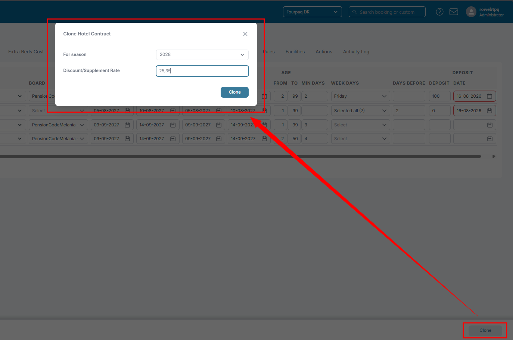
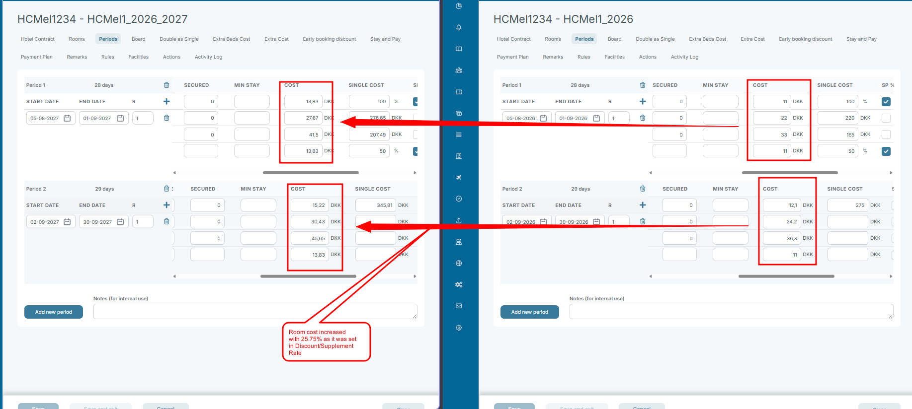

# Hotel Contract Clone

The **Clone Hotel Contract** functionality allows you to create a copy of an existing hotel contract for a new season.

When cloning, the system can automatically apply a percentage adjustment to the room cost values.

### Open Clone Hotel Contract

1. Open the Hotel Contract.
2. Click **Clone**.
3. The **Clone Hotel Contract** dialog opens.

<figure><figcaption></figcaption></figure>

### Fields

| Field                        | Description                                                                                              |
| ---------------------------- | -------------------------------------------------------------------------------------------------------- |
| **For season**               | Defines the target season for the new cloned contract.                                                   |
| **Discount/Supplement Rate** | Applies a percentage increase or decrease to the room cost during cloning. Decimal values are supported. |

***

### Discount/Supplement Rate

The **Discount/Supplement Rate** field supports up to 2 decimals.

Examples:

| Value   | Result                        |
| ------- | ----------------------------- |
| `10`    | Increases room cost by 10%    |
| `25.35` | Increases room cost by 25.35% |

> The percentage adjustment is only applied to the room cost values.

#### Impacts

The Discount/Supplement Rate impacts:

* Room costs

#### Does not impact

The Discount/Supplement Rate does **not** impact:

* Release rules
* Deposit rules
* Facilities
* Actions
* Activity Log
* Board definitions
* Weekdaysettings
* Min/max days
* Cancellation rules
* Other non-room-cost configuration values

***

### For season

The **For season** field defines which season the cloned contract belongs to.

When cloning:

* A new contract is created for the selected season
* Existing contract structure and configuration are copied
* Room costs can optionally be adjusted using the Discount/Supplement Rate

#### Impacts

The selected season impacts:

* The season assignment of the new contract
* Availability of the contract within that season
* Seasonal separation between contracts

#### Does not impact

Changing the season during cloning does **not**:

* Modify the original contract
* Change historical contracts
* Automatically change rules or configuration
* Modify non-pricing settings
* Affect bookings already connected to the original contract

***

### Example

If a 2026 contract is cloned into season **2027** with a **25.75** Discount/Supplement Rate:

* A new 2027 contract is created
*   Room costs are increased by 25.75%&#x20;

    <figure><figcaption></figcaption></figure>
* All other copied configurations remain unchanged unless manually edited afterward
