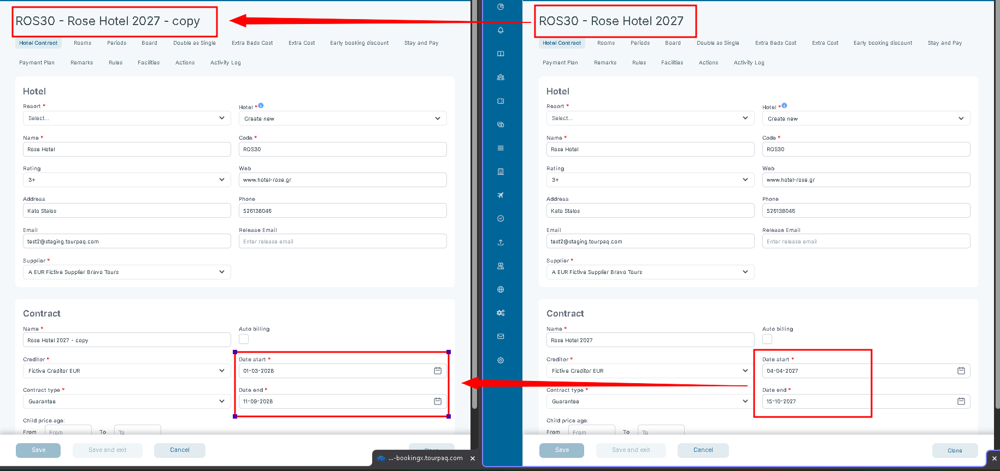
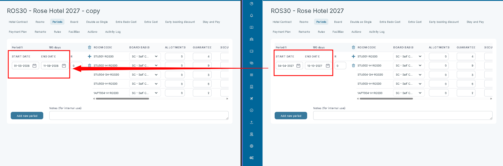
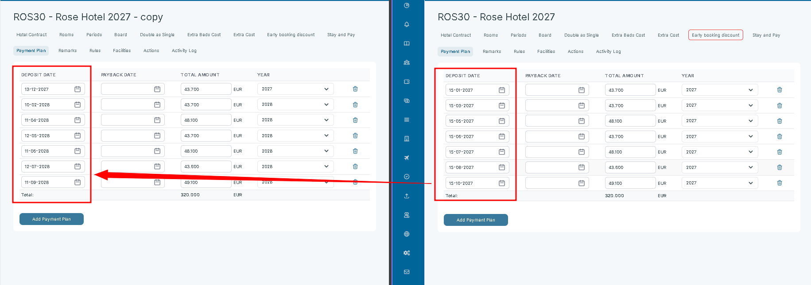
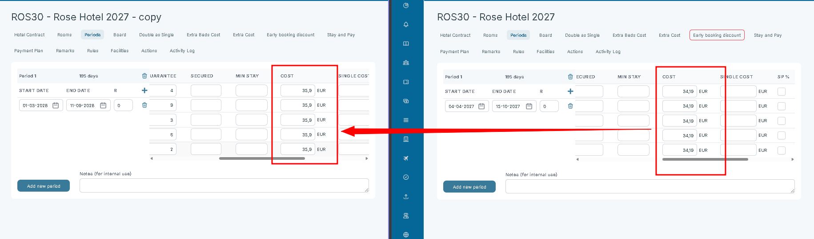

# Hotel Contract Clone

## Overview

The **Clone Hotel Contract** feature allows you to create a copy of an existing hotel contract, making it easier to prepare contracts for a new season without recreating all configuration from scratch.

When cloning a contract, Tourpaq automatically creates a new contract based on the original and adjusts all date-based information according to the selected start date.

### Before you begin

Before cloning a hotel contract:

* Ensure the source hotel contract contains all required configuration.
* Decide the **new contract start date**. Tourpaq uses this date to automatically calculate all other contract dates.

> The difference between the original contract start date and the new start date is applied consistently throughout the cloned contract.

### Open Clone Hotel Contract

* Open **Hotel Contracts**.
* Select the hotel contract you want to clone.
* Click **Clone**.
* Complete the **Clone Hotel Contract** dialog.
* Click **Clone** to create the new contract.

<figure><figcaption></figcaption></figure>

### Clone Hotel Contract dialog

1. **Select new start date** - Choose the start date for the new contract.

Tourpaq calculates all other dates automatically by applying the difference between:

* the original contract start date
* the selected new start date

2. **Increase room cost -** Enter the percentage by which room costs should be increased. The field clearly displays the **%** symbol to indicate that the value is percentage-based.

***

## How the feature manifests in the system

After the contract is cloned, Tourpaq automatically creates a new contract with the following changes.

### Contract name

The new contract uses the original contract name with **" - copy"** appended.

Example:

```
Winter 2026
```

becomes

```
Winter 2026 - copy
```

You can rename the contract afterwards to follow your company's naming convention.

## Date adjustments

When a new start date is selected, Tourpaq automatically updates all related dates by applying the difference between the original and new contract start dates.

The following elements are updated automatically.

### Hotel Contract

* Date Start
* Date End

<figure><figcaption></figcaption></figure>

### Periods

All period dates are shifted accordingly.

<figure><figcaption></figcaption></figure>

### Gala Dinner

* Start Date
* End Date

### Early Booking Discount

* Stay Start
* Stay End
* Booking Start
* Booking End
* Deposit Date

### Stay and Pay

* Stay Start
* Stay End
* Booking Start
* Booking End

### Payment Plan

* Deposit Date
* Payback Date

<figure><figcaption></figcaption></figure>

Every date is calculated as:

> **Original date + (New contract start date - Original contract start date)**

No other contract configuration is changed.

## Example

An existing hotel contract has the following information:

| Field          | Value           |
| -------------- | --------------- |
| Contract Start | 1 November 2025 |
| Contract End   | 30 April 2026   |

The contract is cloned using:

| Field                 | Value           |
| --------------------- | --------------- |
| Select new start date | 8 November 2025 |
| Increase room cost    | 5%              |

The difference between the two start dates is **7 days**.

Tourpaq automatically updates all supported dates by **7 days**.

For example:

| Original                   | New                      |
| -------------------------- | ------------------------ |
| Contract Start             | 1 Nov 2025 → 8 Nov 2025  |
| Contract End               | 30 Apr 2026 → 7 May 2026 |
| Gala Dinner                | 24 Dec → 31 Dec          |
| Early Booking Deposit Date | 1 Sep → 8 Sep            |
| Payment Plan Deposit Date  | 15 Oct → 22 Oct          |

The cloned contract is created with the name:

```
Winter 2026 - copy
```

and all room costs are increased by **5%**.

<figure><figcaption></figcaption></figure>
