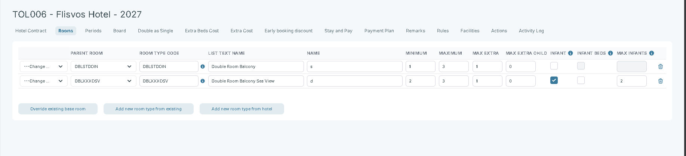

# Rooms – Hotel Contract Configuration

## Overview

The **Rooms** tab of a [hotel contract](hotel-contract-contract-name.md) is where you add the room types sold under that contract and configure them. Each row is one room type. For every room type you set occupancy limits — how many adults and children it holds — and infant handling — whether infants are allowed, whether they use a bed, and how many are permitted.

Tourpaq treats a passenger as an infant only while they are one year old or younger on the arrival home date. If an infant turns two during the stay, the passenger counts as a child for the whole stay, for both cost and occupancy — the settings on this page do not need to account for that change separately.

## Purpose

Use the Rooms tab to:

* Define which room types this supplier sells under the contract, independently of the hotel's own room list.
* Set the minimum, maximum, and extra-occupancy limits that period pricing and booking validation depend on.
* Match Tourpaq's infant handling to the supplier's policy for each room type — for example, allowing infants only in some room types, or capping how many share a room without an extra bed.

## Preconditions

* The hotel contract exists and is open for editing — see [Hotel contract - Contract Name](hotel-contract-contract-name.md).
* If you plan to reuse a room type already configured on the hotel, that room type exists on the hotel record — see [Base room types](../base-room-types.md).
* You know the supplier's occupancy rules for each room type, including its infant policy: whether infants are allowed, whether they occupy a bed, and any maximum count.

#### How-to



**Open the Rooms tab**

Go to **Hotels → Contract List**, open the contract, and select the **Rooms** tab.



**Add a room type**

Choose the method that matches where the room type should come from:

* Click **Override existing base room** to build a room type from scratch. Choose a [base room type](../base-room-types.md) under **Parent Room** for reporting, then fill in every other field yourself.
* Click **Add new room type from existing** to add a room type using a code from the system-wide base room type catalog. Tourpaq fills in **Name** from that code's standard definition; you still enter the **List Text Name** and the occupancy fields.
* Click **Add new room type from hotel** to copy a room type that is already configured on the hotel, including its occupancy and infant settings, by selecting it from the **Room Type Code** dropdown.



**Set occupancy**

Enter **Minimum**, **Maximum**, **Max Extra**, and **Max Extra Child** for the room type.



**Configure infant handling**

Check **Infant** if infants are allowed in the room type — new room types have this checked by default. Then, to match the supplier's policy:

* Check **Infant Beds** if an infant occupies an extra bed in the room.
* Leave **Infant Beds** unchecked, and enter a value in **Max Infants**, if infants do not use a bed and you want to cap how many can share the room. Leave **Max Infants** empty to allow any number.



**Change how an existing room type is sourced**

Replacing the source overwrites every field already entered in the row, including any occupancy and infant values — there is no undo once you save. Open the dropdown at the start of the row, currently showing `---Change Room Type---`, and choose **Override existing base room**, **Room type from existing**, or **Room type from hotel** to replace the row.



**Remove a room type**

Click the 🗑️ delete icon at the end of the row.



**Save**

Click **Save**.



The room type becomes available for periods, pricing, and booking searches on this contract as soon as you save.

#### Field Reference


**Room identification and occupancy**

| Field                     | Description                                                                                                                                                                                                              | Notes                                                                                               |
| ------------------------- | ------------------------------------------------------------------------------------------------------------------------------------------------------------------------------------------------------------------------ | --------------------------------------------------------------------------------------------------- |
| **Parent Room**           | Links the row to a code in the [base room type](../base-room-types.md) catalog, for grouping and reporting. The dropdown to its left replaces the whole row — see **Change how an existing room type is sourced** above. | Existing rows show `---Change Room Type---` until you pick a replacement action.                    |
| **Room Type Code**        | Sets the code Tourpaq uses for this room type in imports, exports, and rules.                                                                                                                                            | The hotel code is appended automatically when the contract is imported — enter the code without it. |
| **List Text Name**        | Sets the label shown for this room type in dropdowns and public-facing lists, such as the booking engine.                                                                                                                |                                                                                                     |
| **Name**                  | Sets an internal reference name for the room type, typically used in supplier communication rather than shown to guests.                                                                                                 |                                                                                                     |
| **Minimum** / **Maximum** | Sets the minimum and maximum number of guests a booking in this room type must have.                                                                                                                                     | Period pricing and booking validation are enforced against these values.                            |
| **Max Extra**             | Sets how many guests beyond the base occupancy can be added as extra adults.                                                                                                                                             |                                                                                                     |
| **Max Extra Child**       | Sets how many children can be added beyond the base occupancy, in addition to **Max Extra** adults.                                                                                                                      |                                                                                                     |

Tooltip on **Room Type Code**:

```
Note: the hotel code will automatically be appended to the specified code, when the contract is imported.
```

**Infant handling**

<figure><figcaption></figcaption></figure>

| Field           | Description                                                                       | Notes                                                                                                                                                                                                                     |
| --------------- | --------------------------------------------------------------------------------- | ------------------------------------------------------------------------------------------------------------------------------------------------------------------------------------------------------------------------- |
| **Infant**      | Allows infants to be booked into this room type.                                  | Checked by default on a new room type. Unchecking it greys out and clears **Infant Beds** and **Max Infants** for this row.                                                                                               |
| **Infant Beds** | Gives each infant in the room an extra bed.                                       | Editable only when **Infant** is checked; greyed out otherwise. Checking it greys out and clears **Max Infants** — the two fields are mutually exclusive. Unchecked by default.                                           |
| **Max Infants** | Caps the number of infants allowed in the room type. Leave it empty for no limit. | Editable only when **Infant** is checked and **Infant Beds** is unchecked. Accepts `0`–`2`; Tourpaq rejects a higher value and blocks **Save** with _"The Max infants field should be maximum 2!"_ until it is corrected. |

Tooltip on **Infant**: If checked, infants are allowed in the room type.

Tooltip on **Infant Beds**: When checked, infants will use an extra bed in the room type.

Tooltip on **Max Infants**: Specify the maximum number of infants in the room type. If the value is empty the hotel has not set a limit.


An infant who does not use **Infant Beds** still needs a **Max Infants** limit if you want to cap how many can share the room outside its normal occupancy — leaving the field empty means the hotel has not set a limit. An infant using **Infant Beds** instead counts against **Max Extra** like any other extra occupant, so **Max Infants** does not apply and is disabled.


**Add room type actions**

| Field                               | Description                                                                                                                 |
| ----------------------------------- | --------------------------------------------------------------------------------------------------------------------------- |
| **Override existing base room**     | Adds a blank room type row linked to a [base room type](../base-room-types.md) you choose, for you to fill in from scratch. |
| **Add new room type from existing** | Adds a room type row using a code from the system-wide base room type catalog, with **Name** pre-filled.                    |
| **Add new room type from hotel**    | Adds a room type row by copying a room type already configured on the hotel, including its occupancy and infant settings.   |
| 🗑️ **Delete icon**                 | Removes the room type row from the contract.                                                                                |


When you import the hotel contract, Tourpaq updates a room type's infant configuration on the contract if the import creates a new base room type — imported values can overwrite what you configured here. Confirm the infant settings after importing.


#### Related pages

* [Hotel contract - Contract Name](hotel-contract-contract-name.md)
* [Base room types](../base-room-types.md)
* [Periods – Hotel Contract Configuration](periods-hotel-contract-configuration.md)
* [Board Supplements - Hotel Contract Configuration](board-supplements-hotel-contract-configuration.md)
* [Extra Beds Cost – Hotel Contract Configuration](extra-beds-cost-hotel-contract-configuration.md)
