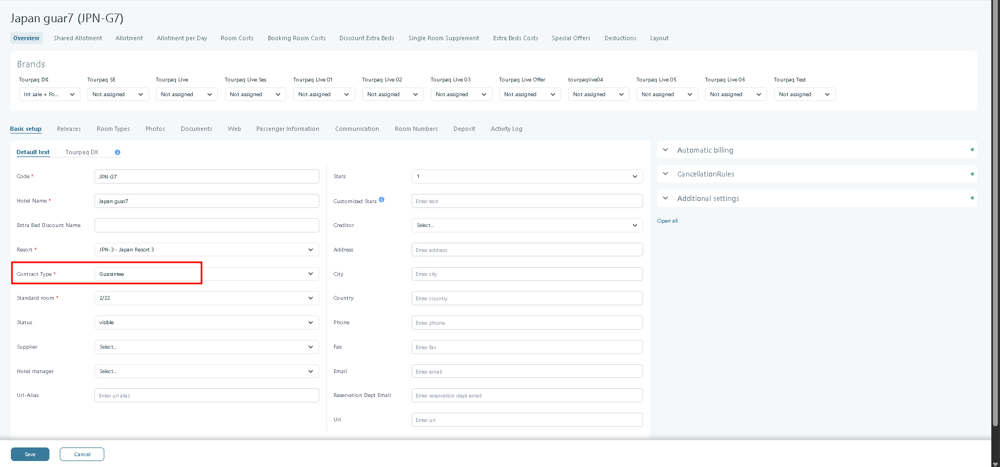
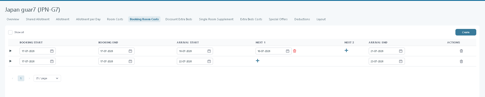
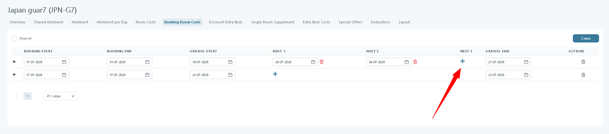
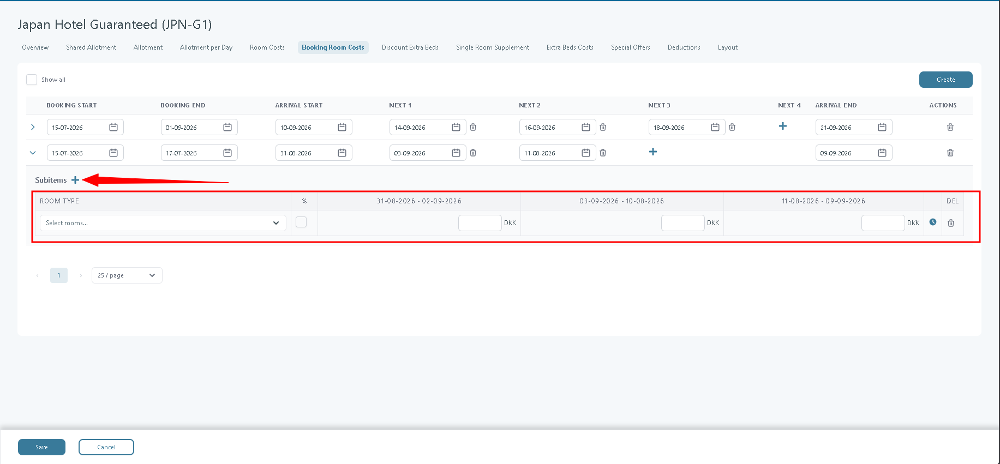
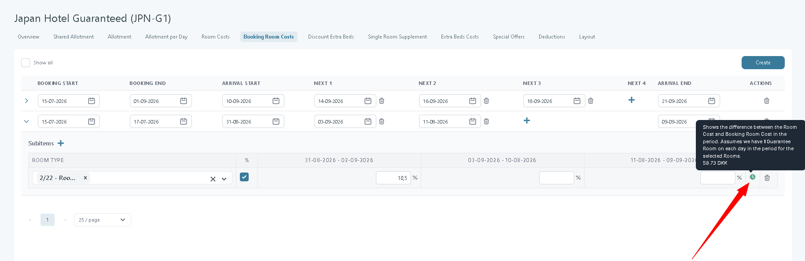
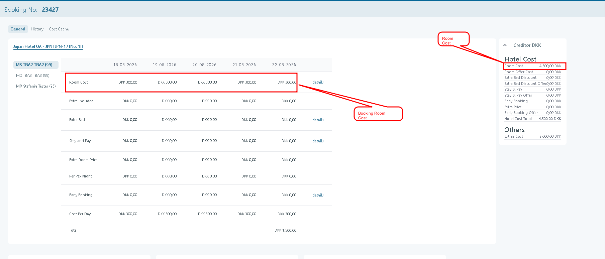

# Booking Room Costs

### Overview

Booking Room Costs allow you to separate the contractual hotel cost from the cost used internally by Tourpaq for commercial calculations.

This feature is designed for **Guarantee** and **Guarantee + Allotment** hotel contracts where the hotel charges a flat room rate throughout the season, but the tour operator wants to apply seasonal cost variations. By introducing an optional Booking Room Cost layer, you can increase or decrease the booking cost during different periods without changing the supplier settlement cost.

The original **Room Cost** remains the contractual cost used for hotel settlements, Auto-billing, SPOs, and Cost Rules. The optional **Booking Room Cost** is used for bookings, price lists, profit calculations, and finance reporting. If no Booking Room Cost is configured, Tourpaq automatically uses the standard Room Cost.

This separation enables seasonal price differentiation while preserving accurate supplier settlements and allowing automatic financial processes to continue using the contractual hotel cost.

### Purpose

Booking Room Costs introduce a second room cost layer for guaranteed hotel contracts. The feature allows you to differentiate the cost used internally for bookings without changing the contractual settlement cost agreed with the hotel.

Many guaranteed hotel contracts use a flat room cost throughout the season. From a commercial perspective, however, tour operators often want lower prices during the low season and higher prices during the high season. Until now, this required changing the Room Cost in the hotel contract, which prevented Tourpaq from using the correct supplier cost for settlements and auto-billing.

With Booking Room Costs, Tourpaq separates these two purposes:

* **Room Cost** remains the contractual supplier cost used for hotel settlement.
* **Booking Room Cost** is an optional internal cost used for bookings and commercial calculations.

This enables seasonal price differentiation while preserving accurate supplier settlements and automatic financial processes.

### Customer outcome

The feature allows tour operators to maintain two independent price structures:

* **Settlement price**, used when paying the hotel.
* **Internal booking price**, used for commercial pricing and profitability.

This provides several benefits:

* Lower booking costs can be used during low season and higher booking costs during high season, even when the hotel contract has a flat rate.
* Auto-billing continues to work because supplier settlements always use the contractual Room Cost.
* Early bookings calculate the correct profitability.
* Financial reports reflect the internal commercial cost rather than the supplier settlement cost.
* Price lists can follow seasonal pricing without modifying the hotel contract.

***

## Availability

The **Booking Room Costs** tab is available only for hotel contracts with one of the following contract types:

* Guarantee
* Guarantee + Allotment

<figure><figcaption></figcaption></figure>

For all other contract types, only the standard Room Cost is used.

This prevents Booking Room Costs from accidentally affecting contracts that do not use guaranteed allotments.

***

## Configuration

Navigate to:

**Hotels → Booking Room Costs**

The page follows the same layout and behaviour as the **Room Costs Rules** page.

Each Booking Room Cost defines:

* a booking period
* one or more arrival periods
* one or more room groups
* the Booking Room Cost for each arrival period

### Create a Booking Room Cost

Select **Create** to add a new rule.

<figure><figcaption></figcaption></figure>

Each rule contains:

| Field         | Description                               |
| ------------- | ----------------------------------------- |
| Booking Start | First booking date where the rule applies |
| Booking End   | Last booking date where the rule applies  |
| Arrival Start | First arrival date in the season          |
| Next          | Creates additional arrival periods        |
| Arrival End   | Last arrival date in the season           |

The combination of booking period and arrival period must be unique.

***

### Split the season into arrival periods

A single Booking Room Cost can divide a season into multiple arrival periods.

Example:

| Arrival period  |
| --------------- |
| 01 Apr - 30 Apr |
| 01 May - 31 May |
| 01 Jun - 30 Jun |

Use **+** to create additional periods.

<figure><figcaption></figcaption></figure>

Each **Next** column represents the start of a new arrival period and can be removed individually using the bin icon.

Date validation ensures that:

* Arrival End is later than Arrival Start.
* Every Next date is later than the previous date.
* Every Next date is earlier than the following date.

***

### Configure room groups

Each Booking Room Cost contains one or more room groups.

Use **+** below the rule to create a room group.

<figure><figcaption></figcaption></figure>

For every room group you define:

* the rooms included
* how the Booking Room Cost is calculated
* the Booking Room Cost for each arrival period

#### Room selection

Only rooms with guaranteed allotment during the selected arrival period are available.

The following rules apply:

* Only visible rooms can be selected.
* A room can only belong to one room group.
* Not all rooms need to be assigned.
* If no room is selected, the rule applies to all rooms.

***

### Cost distribution

Booking Room Cost can be entered as either:

* a fixed amount
* a percentage

The **%** checkbox controls which method is used. The cost values can contain 2 decimals.

#### Fixed amount

The entered value becomes the Booking Room Cost.

The hotel currency is displayed.

#### Percentage

The entered value represents a percentage adjustment relative to the Room Cost.

The percentage symbol is displayed instead of the currency.

***

### Empty values

Booking Room Cost is optional for every arrival period.

If a value is left empty, Tourpaq automatically uses the standard Room Cost.

***

### Compare with Room Cost

While editing Booking Room Costs, Tourpaq continuously compares the configured Booking Room Cost with the original Room Cost.

<figure><figcaption></figcaption></figure>

Selecting the clock icon displays:

> Shows the difference between the Room Cost and Booking Room Cost in the period. Assumes we have 1 Guarantee Room on each day in the period for the selected Rooms

The calculation is updated immediately, even before the changes are saved.

The cost-related discounts will not be based on booking room cost (Early booking, Stay\&pay, SPO, Extra Beds)

***

## Special behaviour

### Guaranteed rooms only

Booking Room Cost applies only to **Guaranteed rooms**.

If a booking contains both guaranteed and allotment rooms, different cost layers may be used within the same booking.

Example:

* First room consumes a guaranteed room and uses the Booking Room Cost.
* Second room uses an allotment room and therefore uses the standard Room Cost.

***

### Extra beds

Booking Room Cost only affects ordinary beds.

Extra beds always use the original Room Cost.

***

### Uses Booking Room Cost

The following areas use Booking Room Cost whenever one is available:

* Bookings
* Price Lists
* Profit calculations
* Finance reports
* Booking-related cost calculations

If no Booking Room Cost exists, Room Cost is used automatically.

When calculating the room cost, Tourpaq determines whether the **Booking Room Cost** or the **Room Cost** should be applied based on the following logic:

1. **Check if a Booking Room Cost exists**
   * If no Booking Room Cost exists, the system uses the applicable **Room Cost**.
   * If a Booking Room Cost exists, the system identifies the corresponding **Room Cost** for the same hotel, room type, and validity period.
2. **Check the Stay Type of the corresponding Room Cost**
   * If the **Stay Type** is set to **Per Pax Per Night**, the system uses the **Booking Room Cost** for the calculation.
   * If the **Stay Type** is different from **Per Pax Per Night**, the system ignores the Booking Room Cost and uses the **Room Cost** instead.
3.  **Result**

    The Booking Room Cost is therefore applied **only when a corresponding Room Cost exists for the same period and its Stay Type is set to Per Pax Per Night**.

**Rule:**

`Booking Room Cost is used = Booking Room Cost exists AND Room Cost Stay Type = Per Pax Per Night`

In all other cases, the **Room Cost** is used.

<figure><figcaption></figcaption></figure>

### Uses Room Cost

The following areas always use the contractual Room Cost:

* Hotel settlements
* Auto-billing
* SPO calculations
* Cost Rules
* Hotel contract maintenance

This ensures that supplier payments always reflect the agreed hotel contract, regardless of how booking costs are distributed during the season.

***

### Invoice

In the booking, go to **Profit → Hotel Cost**. In the **Creditor** tab, the system displays the **real Room Cost**, while the **Cost per Day** is calculated using the **Booking Room Cost**.

<figure><figcaption></figcaption></figure>
