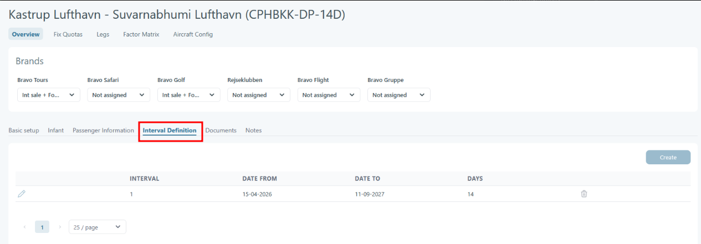

# Hotel night calculation

## Overview

Hotel night calculation is the logic Tourpaq uses to turn a transport's arrival and departure times into a hotel stay.

The calculation has three outputs, produced in order:

* Check-in date — the first night of the hotel stay.
* Hotel nights — the number of nights charged.
* Check-out date — the morning the guest leaves the hotel.

Two System Setup limits can each add one hotel day to the base stay:

* Early arrival limit — adds one night _before_ arrival when the flight lands early.
* Late departure limit — adds one night _after_ the stay when the home-bound flight departs late.

## Purpose

Use this page to:

* Explain to a customer or agent why a booking shows the check-out date it does.
* Check whether the Early arrival limit and Late departure limit are set to match your operational policy.
* Confirm a stay length before adjusting a booking, rather than overriding the calculated dates by hand.

## Preconditions

* The transport exists and has an interval defined — see [Transport Definition](../../real-transports/transport-definition.md).
* The Early arrival limit and Late departure limit are configured — see [System Setup – Transport Providers.](../../setup/system-setup/system-setup-transport-providers/)
* You know the transport's outbound arrival time and home-bound departure time.

## How-to

The stay is calculated automatically when the booking is created.&#x20;

&#x20;1\. Calculate the hotel check-in date

Take the outbound arrival date and time. Compare the arrival time to the Early arrival limit.

If the arrival time is _before_ the limit, the system adds one hotel day before arrival (`+DAYS`). Otherwise, the check-in date is the arrival date.&#x20;

&#x20;2\. Calculate the number of hotel  nights

The system uses the Interval definition configured from the transports

<figure><figcaption></figcaption></figure>

Compare the home-bound departure time to the Late departure limit. If the departure time is _after_ the limit, the system adds one hotel day after the stay (`LAND DAYS`). If it is _before_ the limit, no night is added.


The **Late Departure Limit** only adds **one extra hotel night** when the return departure time is **after** the configured limit. It does not reduce the number of nights when the departure is before the limit.


3. Calculate the hotel check-out date

The hotel check-out date is calculated as:

`check-in date + interval nights − 1 + late-departure adjustment`

The result is the check-out date shown on the booking.


The dates shows on the booking are the calculated result. If they do not match the flight times as you expect, check the two limits in System Setup before changing the booking.


Example:

| Input                | Value              |
| -------------------- | ------------------ |
| Outbound arrival     | `18-11-2026 06:20` |
| Home-bound departure | `01-12-2026 00:05` |
| Interval             | `14` days          |
| Early arrival limit  | `04:00`            |
| Late departure limit | `03:30`            |

Applying the rules:

* Arrival `06:20` is _after_ the Early arrival limit of `04:00`, so no day is added before arrival. Check-in: `18-11-2026`.
* Departure `00:05` is _before_ the Late departure limit of `03:30`, so no night is added. Hotel nights: `14`.
* Check-out: `18-11-2026` + `14` − `1` = `01-12-2026`.

The guest's last night in the hotel is 30 November, and they leave on the morning of 1 December. The flight departs in the early hours of 1 December, so the check-out date and the departure date fall on the same day.

#### Field Reference

The two limits that drive the calculation live on the General tab of Setup → System Setup → Transport Providers.

<table><thead><tr><th width="162">Field</th><th>Description</th><th width="108">Required</th><th>Notes</th></tr></thead><tbody><tr><td><strong>Early arrival limit</strong></td><td>The arrival time before which Tourpaq adds one hotel day ahead of arrival (<code>+DAYS</code>).</td><td>No</td><td>Compared against the outbound arrival time. Applies to new bookings only.</td></tr><tr><td><strong>Late departure limit</strong></td><td>The home-bound departure time after which Tourpaq adds one hotel night after the stay (<code>LAND DAYS</code>).</td><td>No</td><td>Compared against the home-bound departure time. <strong>Only adds a night when departure is after the limit; it never removes a night when departure is before the limit.</strong> Applies to new bookings only.</td></tr></tbody></table>


The limits apply to new bookings only. Changing a limit does not recalculate the hotel nights on bookings that already exist. Existing bookings keep the stay they were created with.



A home-bound flight that departs just after midnight sits _before_ a typical early-morning Late departure limit. Tourpaq therefore does not add a night, and the check-out date lands on the same calendar day as the departure. This is correct against the configured rule. Raise the limit only if your policy is to charge the extra night for these departures.


#### Related pages

* [System Setup – Transport Providers](../../setup/system-setup/system-setup-transport-providers/)
* [Transport Definition](../../real-transports/transport-definition.md)
* [Add LAND-Days to Real Transports (Offset Handling)](../../real-transports/departures/add-land-days-to-real-transports-offset-handling.md)
* [Hotel Room](../../booking/new-booking/hotel-room.md)
