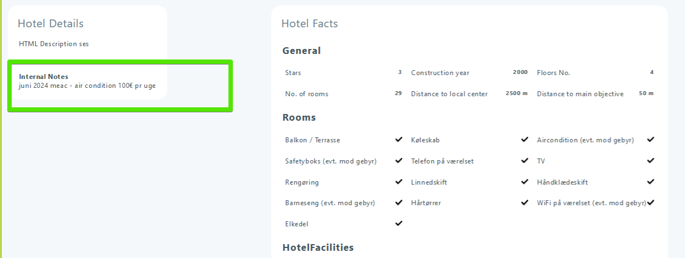
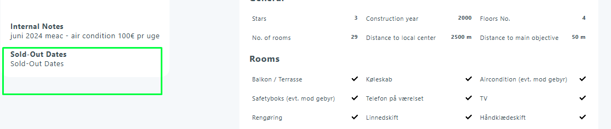

# Hotel Web

### Overview

The **Hotel Web** area in **Tourpaq Office** controls what customers see online. It also controls what is shown in offers, tickets, and vouchers.

Use it to keep text, facilities, and customer-facing notes up to date per brand.

You can find it in **Hotel > Hotels**. Select a hotel, then open **Overview > Web**.

### Purpose

Use this page to:

* Maintain hotel text for the website, offers, tickets, and vouchers.
* Write brand-specific content when the same hotel is sold under multiple brands.
* Keep customer-facing data consistent with internal setup (facilities, categories, etc.).

### Sections and fields

<figure><figcaption></figcaption></figure>

#### Brand tabs

Each **brand** has its own tab (for example, _TourpaqDK_). Switching the tab changes which text is edited and displayed.

#### Text fields

* **Short description**
  * Short summary for lists and search results.
* **Customer info**
  * Customer-facing text shown when a voucher is generated.
* **HTML description**
  * Main hotel description.
  * Used on the website, in tickets, and in offers.
  * Add the marker `[SelectOfferEmailSummary]` if you want offers to show only the text above it.
* **Alternative HTML description**
  * Optional text used for certain brands or layouts.
* **Internal notes**
  * Internal text shown in **Offer** and **Create Booking** when the hotel pop-up is opened.
* **Sold-out dates**
  * Informational text shown in **Offer** and **Create Booking** when the hotel pop-up is opened.

***

#### Right-side panels (expandable)

* **General settings**
  * Basic hotel facts like construction year, number of floors, and number of beds.
* **Hotel facilities**
  * Amenities shown on the website (pool, Wi‑Fi, restaurant, etc.).
* **Customer opinion**
  * Reviews, ratings, or testimonial text.
* **Hotel categories**
  * Hotel type (for example, adults-only).
* **Hotel customer notifications**
  * Alerts shown to customers on the hotel.
* **Open all**
  * Expands all panels for faster editing.

### Short description 

Shown on the website. It is typically used in lists and search results.

<figure><figcaption></figcaption></figure>

<figure><figcaption></figcaption></figure>

### Customer Info 

Shown when a voucher is generated.

<figure><figcaption></figcaption></figure>

### HTML Description 

Used on the website, in tickets, and in offers. In offers, you can add the marker `[SelectOfferEmailSummary]`. Only the text above the marker will be displayed.

<figure><figcaption></figcaption></figure>

### Alternative HTML Description 

Optional description for specific brands or layouts.

<figure><figcaption></figcaption></figure>

<figure><figcaption></figcaption></figure>

### Internal Notes 

Shown in **Offer** and **Create Booking** when the hotel pop-up is opened.

<figure><figcaption></figcaption></figure>

<figure><figcaption></figcaption></figure>

### Sold-Out Dates 

Shown in **Offer** and **Create Booking** when the hotel pop-up is opened. This is informational text. It does not block sales.

<figure><figcaption></figcaption></figure>

<figure><figcaption></figcaption></figure>

### FAQ

Where do I find the Hotel Web page?

Go to **Hotel > Hotels**. Select the hotel. Open **Overview > Web**.

Why do I see different text per brand?

Each brand has its own tab. Text you enter is saved per brand.

Which field is shown on the website hotel page?

Use **HTML description**. Use **Short description** for lists and search results.

What does <code>[SelectOfferEmailSummary]</code> do?

It is a marker used in offers. Only the text above the marker is shown in the offer summary.

Where is “Customer info” shown?

It is shown when a voucher is generated.

Are “Internal notes” visible to customers?

No. They are shown internally in **Offer** and **Create Booking**.

Do “Sold-out dates” prevent bookings?

No. They are informational only.

To block sales, use [Stop Sales](../../stop-sales.md) or [Close Out](../../close-out/).

How do I control which facilities show online?

Use the **Hotel facilities** panel on the right. You also need a facilities template on the hotel. See [Facilities](../../facilities.md).

