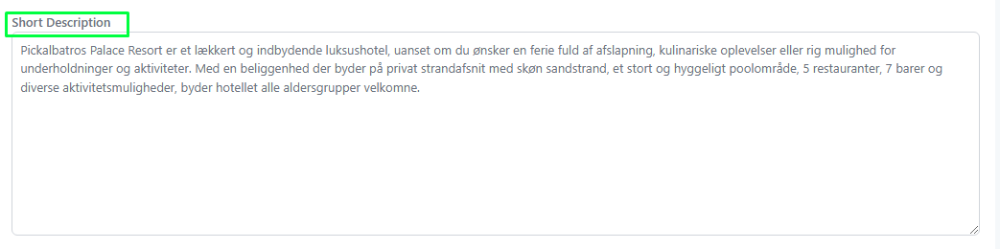
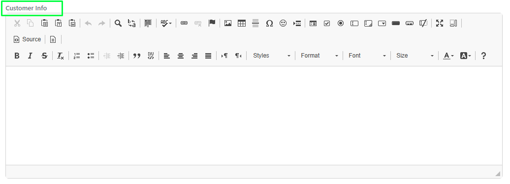
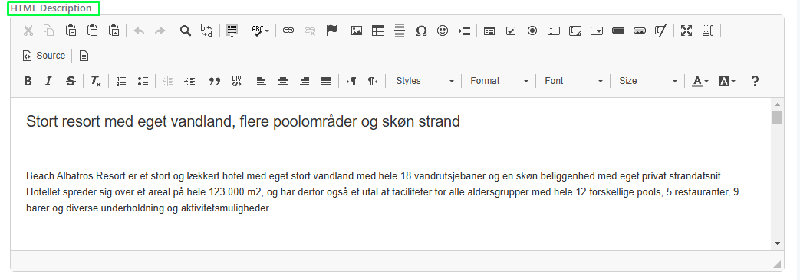
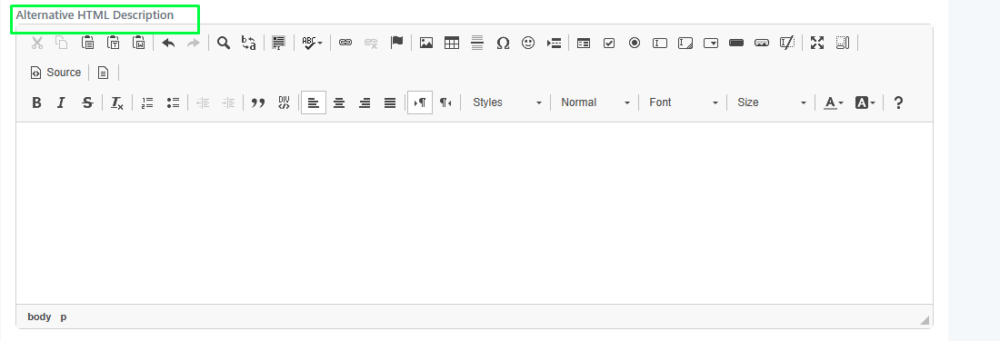

# Hotel Web

### **Overview**

The **Hotel / Web** page in **Tourpaq Office** allows users to manage and update hotel information that is displayed on the public website.\
This page provides direct control over the text and details visible to end customers, ensuring that descriptions, facilities, and other relevant information are accurate and aligned with each brand’s marketing standards.

The page is typically used by product or content managers to maintain hotel descriptions, add customer-relevant details, and structure the online presentation of each property.

This page can be found in **Hotel/Hotels**. Select a hotel and acces **Overview/Web**.

### **Purpose**

The purpose of this page is to:

* Manage hotel content used in online catalogs and offers.
* Customize the text for different brands or markets.
* Ensure consistency between internal data (such as facilities and categories) and the information shown to end users.
* Edit or localize content for specific brands when a hotel is shared across multiple brands.

### **Page Sections and Fields**

<figure><figcaption></figcaption></figure>

#### **Brand Tabs**

At the top, each **brand** has its own tab (e.g., _TourpaqDk)_\
These tabs allow editing of hotel text per brand.\
When switching brands, the content fields below will update to show that brand’s version of the hotel description and related text.

**Text Sections**

| Field                            | Description                                                                                                                                                                                                                                                             |
| -------------------------------- | ----------------------------------------------------------------------------------------------------------------------------------------------------------------------------------------------------------------------------------------------------------------------- |
| **Short Description**            | A short text summary of the hotel. It’s typically shown on listing pages or search results.                                                                                                                                                                             |
| **Customer Info**                | Internal notes that may be shown to customers or used for special messages. Is used when the voucher is generated.                                                                                                                                                      |
| **HTML Description**             | The main content for the hotel page. It supports HTML formatting for headings, bold text, and links. It is used in Ticket, Website, and Offer. In Offer, an attribute "\[SelectOfferEmailSummary]" can be set, and only the text up to the attribute will be displayed. |
| **Alternative HTML Description** | Optional description text used for specific brands or alternative layouts.                                                                                                                                                                                              |
| **Internal Notes**               | It is used in Offer and Create Booking when the hotel popup is opened.                                                                                                                                                                                                  |
| **Sold Out Dates**               | It is used in Offer and Create Booking when the hotel pop-up is opened.                                                                                                                                                                                                 |

***

**Expandable Panels (Right Side)**

| Panel                            | Description                                                                                          |
| -------------------------------- | ---------------------------------------------------------------------------------------------------- |
| **General Settings**             | Contains general data about the hotel (e.g., construction year, nr of floors, no, of beds,etc).      |
| **Hotel Facilities**             | Checklist or list of available amenities (pool, Wi-Fi, restaurant, etc.) that appear on the website. |
| **Customer Opinion**             | Section for customer reviews, ratings, or testimonial text.                                          |
| **Hotel Categories**             | Defines the type or category of the hotel (e.g.,, adults-only).                                      |
| **Hotel Customer Notifications** | Used to add alerts or important messages displayed to customers when viewing the hotel.              |
| **Open all**                     | Expands all collapsible panels for easier bulk editing.                                              |

### Short Description 

Used in Web Site

<figure><figcaption></figcaption></figure>

<figure><figcaption></figcaption></figure>

### Customer Info 

Is used when the voucher is generated.

<figure><figcaption></figcaption></figure>

### HTML Description 

It is used in Ticket, Website, and Offer. In Offer, an attribute "\[SelectOfferEmailSummary]" can be set, and only the text up to the attribute will be displayed.

<figure><figcaption></figcaption></figure>

### Alternative HTML Description 

After hotel facility you can set an alternative description

<figure><figcaption></figcaption></figure>

<figure><figcaption></figcaption></figure>

### Internal Notes 

It is used in Offer and Create Booking when the hotel popup is opened.

<figure><figcaption></figcaption></figure>

<figure><figcaption></figcaption></figure>

### Sold-Out Dates 

It is used in Offer and Create Booking when the hotel popup is opened.

<figure><figcaption></figcaption></figure>

<figure><figcaption></figcaption></figure>
