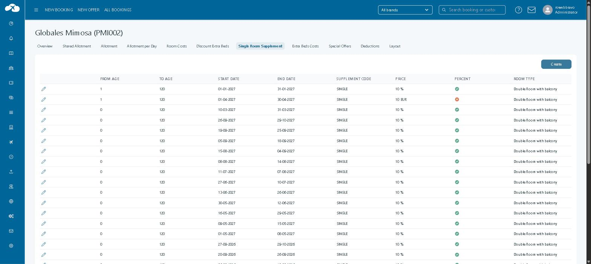
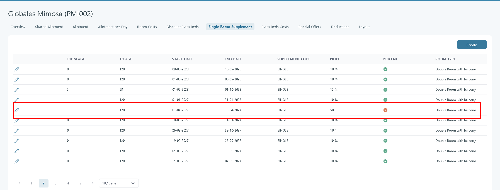
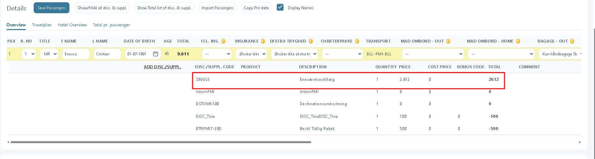
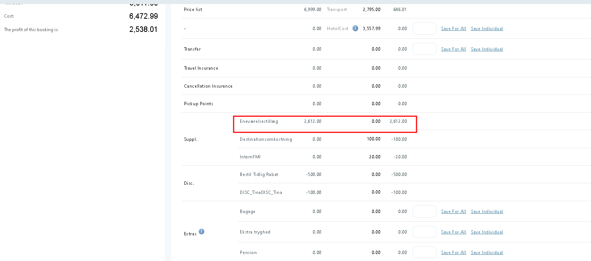
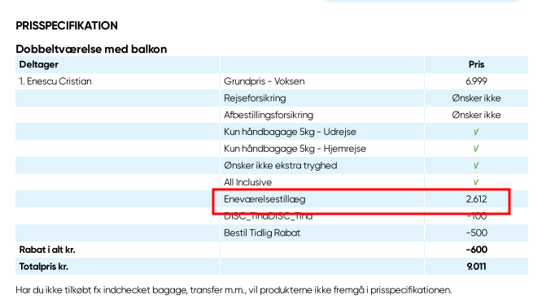

# Single Room Supplement

### Overview

A **single room supplement** is an extra charge when one guest uses a room meant for two or more guests (for example, a double room).

In Tourpaq, this uses the standard supplement code `SINGLE`.&#x20;

When you add the first rule for a hotel, Tourpaq auto-create missing data:

* A supplement category named `single-room` with code `SINGLE`.
* A supplement with code `SINGLE` named **Single room supplement (automatically added)**.

<figure><figcaption></figcaption></figure>

### Purpose

* Add a supplement for single occupancy.
* Limit when it applies (dates, ages, room types).
* Support both fixed amounts and percentages.

### Preconditions

*   A supplement with code **SINGLE** exists.

    <figure><figcaption></figcaption></figure>
*   The **SINGLE** supplement is set **For sale** on the active Brand

    <figure><figcaption></figcaption></figure>
*   The rule in **Hotel →** The supplement does not require a price rule because the values of the single room supplement are calculated under the hotel

    <figure><figcaption></figcaption></figure>

### Where to find it

Go to **Hotel → Single Room Supplement**.

### How it works

* Tourpaq checks the booking for **single occupancy**.
* If the booking matches a rule in this tab, Tourpaq applies the `SINGLE` supplement.

When a room type is booked for **one guest**, Tourpaq applies the rule below (if matched):

<figure><figcaption></figcaption></figure>

### Field reference

* **From Age**: The minimum age at which the Room Supplement is added.
* **To Age**: The maximum age at which the room supplement is added.
* **Start Date**: The start period (from/to) where the room supplement rule is active.
* **End Date**: The start period (from/to) where the room supplement rule is active.
* **Price:** The supplement amount for the rule.
* **Percent**: If checked, Price is a percentage on top of the Single Cost instead of a fixed amount.
* **Room Type:** The room type where this rule is applicable.


Tourpaq selects the matching Single Room Supplement rule once, using the guest's arrival date (the first night of the stay), age, and room type.

* When Percent is off, Tourpaq takes Price as a fixed amount in Creditor Currency (or Company Currency if the hotel has no creditor configured), multiplies it by the stay interval (nights), and the system converts the total to the booking's sale currency; this amount does not change even if the Single Cost changes during the stay.
* When Percent is on, Tourpaq calculates the percentage on top of the applicable Single Cost for each night of the stay and sums the result across the stay; no currency conversion applies. The calculation formula is: **Single Price from Room Cost \* Single Room Supplement price + Single Price for Room Cost**



Changing a Single Room Supplement rule does not change the price on existing bookings. The new rule applies only to bookings created after the change.


### Examples

1\. **Single room supplement:** percent = false, use the price as a fixed amount multiplies it by the stay interval (nights), and the system converts the total to the booking's sale currency;

**Calculation: (Single Room Supplement Price \* Stay Interval) \* Currency Converter**

2. **Single Room Supplement:** percent = true

**Calculation**: Single Price from Room Cost \* Single Room Supplement price + Single Price for Room Cost ( 116 \* 125/100 + 116 = 261 DKK)

The Single Room Supplement can be visible in:

<figure><figcaption></figcaption></figure>

*   Booking Office Passenger discount/supplement&#x20;

    <figure><figcaption></figcaption></figure>

*   Profit Tab&#x20;

    <figure><figcaption></figcaption></figure>

*   Print ticket&#x20;

    <figure><figcaption></figcaption></figure>

### Instructions for use



**Open Single Room Supplement**

Go to **Hotel → Single Room Supplement**.



**Confirm the `SINGLE` supplement is sellable**

Make sure `SINGLE` exists and is set **For sale + Internet Sale**



**Create the rule**

Click **Create** and set dates, age range, room type, and price.



**Save and test**

Save the hotel.

Create a booking with one guest in the target room type.




If the supplement does not apply, check dates, age limits, and room type matching first.



The **Single Room Supplement** is not supported for **Hotel Combination** bookings.


### Related pages

* [Single Room Cost](single-room-cost.md)
* [Hotel night calculation](../hotel-night-calculation.md)
* [Hotel creation](../)
