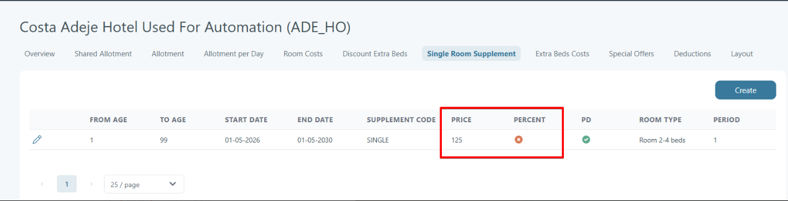
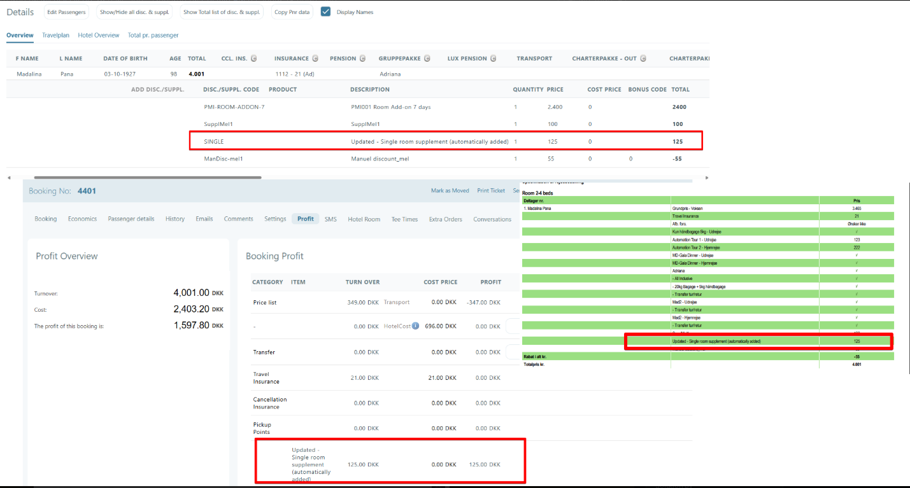
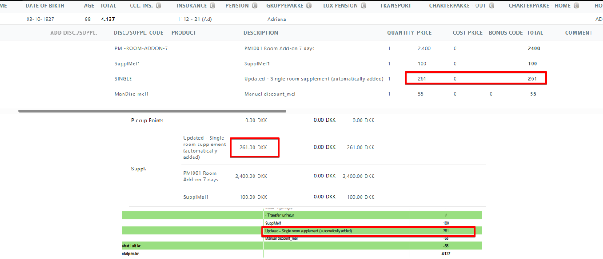

# Single Room Supplement

### Overview

A **single room supplement** is an extra charge when one guest uses a room meant for two or more guests (for example, a double room).

In Tourpaq, this uses the standard supplement code `SINGLE`.

<figure><figcaption></figcaption></figure>

### Purpose

* Add a supplement for single occupancy.
* Limit when it applies (dates, ages, room types).
* Support both fixed amounts and percentages.

### Where to find it

Go to **Hotel → Single Room Supplement**.

### Preconditions

*   A supplement with code **SINGLE** exists.

    <figure><figcaption></figcaption></figure>
*   The **SINGLE** supplement is set **For sale** on the active Brand

    <figure><figcaption></figcaption></figure>
*   The rule in **Hotel → Single Room Supplement** matches the booking.

    <figure><figcaption></figcaption></figure>

### How it works

* Tourpaq checks the booking for **single occupancy**.
* If the booking matches a rule in this tab, Tourpaq applies the `SINGLE` supplement.

When a room type is booked for **one guest**, Tourpaq applies the rule below (if matched):

<figure><figcaption></figcaption></figure>

When you add the first rule for a hotel, Tourpaq can auto-create missing data:

* A supplement category named `single-room` with code `SINGLE`.
* A supplement with code `SINGLE` named **Single room supplement (automatically added)**.

### Field reference

* **Actions**: Edit an existing rule.
* **From Age**: The minimum age at which the Room Supplement is added.
* **To Age**: The maximum age at which the room supplement is added.
* **Start Date**: The start period (from/to) where the room supplement rule is active.
* **End Date**: The stay period (from/to) where the room supplement rule is active.
* Supplement Code: **The code of the supplement added, typically `SINGLE`. The code must be set** For sale **on the active brand.**
* **Price:** The supplement amount for the rule. When Percent is off, Tourpaq treats Price as a fixed amount in Creditor Currency (or Company Currency if the hotel has no creditor configured), multiplies it by the stay interval (the number of nights), and the Booking Engine converts the total to the booking's sale currency. When Percent is on, Tourpaq treats Price as a percentage added on top of the applicable Single Cost for each night of the stay; no currency conversion applies.
* **Percent**: If checked, Price is a percentage on top of the Single Cost instead of a fixed amount.
* **Room Type:** The room type where this rule is applicable.


Tourpaq selects the matching Single Room Supplement rule once, using the guest's arrival date (the first night of the stay), age, and room type.&#x20;

* When Percent is off, Tourpaq takes Price as a fixed amount in Creditor Currency (or Company Currency if the hotel has no creditor configured), multiplies it by the stay interval (nights), and the Booking Engine converts the total to the booking's sale currency; this amount does not change even if the Single Cost changes during the stay.&#x20;
* When Percent is on, Tourpaq calculates the percentage on top of the applicable Single Cost for each night of the stay and sums the result across the stay; no currency conversion applies. The calculation formula is: **Single Price from Room Cost \* Single Room Supplement price + Single Price for Room Cost**

For example: a hotel with a Creditor configured has a SINGLE rule with Price = 50 DKK, Percent off, for a 3-night stay. Tourpaq reads the 50 DKK in the Creditor Currency, multiplies by 3 nights, and the Booking Engine converts 150 DKK to the sale currency. If the same hotel had no Creditor configured, Tourpaq would read the 50 DKK in the Company Currency instead, then apply the same 3-night multiplication and conversion.



Changing a Single Room Supplement rule does not change the price on bookings that already exist. The&#x20;

new rule applies only to bookings created after the change.

For example: a booking made under the 50 DKK rule above keeps its 150 DKK Single Room Supplement even after the rule's Price is later changed to 60 DKK. Only bookings created after the change use 60 DKK.


### Examples

1\.  **Single room supplement** (automatically added) for: Passenger disc./supplement, Print Ticket, Profit Tab

<figure><figcaption></figcaption></figure>

<figure><figcaption></figcaption></figure>

2. **Single Room Supplement:** percent = true

<figure><figcaption></figcaption></figure>

**Calculation**: Single Price from Room Cost \* Single Room Supplement price + Single Price for Room Cost ( 116 \* 125/100 + 116 = 261 DKK)

### Instructions for use



**Open Single Room Supplement**

Go to **Hotel → Single Room Supplement**.



**Confirm the `SINGLE` supplement is sellable**

Make sure `SINGLE` exists and is set **For sale + Internet Sale**



**Create the rule**

Click **Create** and set dates, age range, room type, and price.



**Save and test**

Save the hotel.

Create a booking with one guest in the target room type.




If the supplement does not apply, check dates, age limits, and room type matching first.


### Related pages

* [Single Room Cost](single-room-cost.md)
* [Hotel night calculation](../hotel-night-calculation.md)
* [Hotel creation](../)
