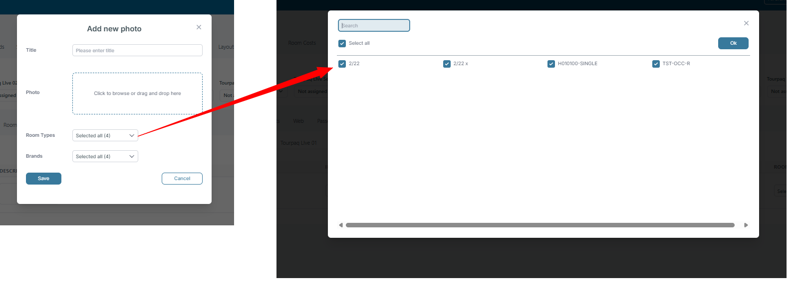

# Photos & Documents

### Overview

The **Photos** section lets you upload, manage, and organize images for a hotel.

These images can be reused across multiple brands.

Correct setup ensures customers see the right images in lists and hotel views.

### Purpose

* Keep a consistent visual representation of the hotel.
* Add a clear title and optional description per photo.
* Link photos to a room type when relevant.
* Control which brands can show each photo.
* Pick one **main photo** for customer-facing channels.

### Documents (PDFs)

This page covers hotel **photos**.

If you need to deliver hotel-related PDF documents to customers, use [Ticket Attachments](../../email-setup/tickets-attachments/ticket-attachments.md).

If you need to attach documents to a specific booking, use [Comments](../../booking/new-booking/comments.md).

### Fields

<figure><figcaption></figcaption></figure>

1. **Image**
   * Displays the uploaded photo.
   * Click the preview to check image quality.
   * Photos should be high-resolution and reflect the hotel accurately (e.g., lobby, rooms, pool, dining areas).
2. **Image Title**
   * A short label for the photo (e.g., _Lobby_, _Standard Room_, _Pool_).
   * Helps both internal staff and customers identify the image.
   * Use clear, professional naming (avoid generic names like "Image1").
3. **Description**
   * Optional longer text that describes the photo.
   * Example: _“Spacious standard room with king-size bed and city view.”_
   * Adds clarity for customers and improves accessibility.
4. **Brands**
   * Controls which brands or sales channels can show the photo.
   * Select one or more brands.
   * Use **Select all** if the photo should be available everywhere.
5. **Is Main Photo**
   * Checkbox to mark one image as the **primary photo**.
   * The _main photo_ will be the first image customers see.
   * Only one photo should be selected per hotel.
6.  **Room Type**

    The Room Type photo functionality allows hotel images to be associated with specific room types. This helps ensure that room images displayed throughout the system accurately represent the accommodation being sold.                                                                                                           The enhancement allows a single photo to be related to multiple room types, reducing duplicate work and simplifying hotel maintenance.

    #### Example

    A hotel has three room types:

    * Standard Double Room
    * Superior Double Room
    * Family Room

    All three room types use the same room image. Instead of uploading the image three times, the photo can now be uploaded once and linked to all three room types.
7. **Delete (Trash Icon)**
   * Removes the photo from the system.
   * Use with caution, as deleted images cannot be recovered unless re-uploaded.
8. **Create Button** (top right)
   * Allows you to upload a new image to the photo list.
   * Recommended formats: `JPG` or `PNG`.
   * Recommended size: at least **1200 px** wide.

### How to add photos

1. Click **Create** to upload a new photo.
2. Fill in the **Image Title** with a descriptive name.
3. Add a **Description** if further context is useful.
4. Assign the photo to the appropriate **Brand(s)**.
5. Select **Is Main Photo** for the image that should represent the hotel primarily.
6. Select one or more room types from the Room Type field.
7. Save changes.
8. Review all uploaded images to ensure completeness and consistency.

<figure><figcaption></figcaption></figure>

The selected photo will now be associated with all chosen room types.

#### Example

A hotel administrator uploads a photo showing a recently renovated room design.

The image is linked to:

* Standard Room
* Superior Room
* Deluxe Room

The photo only needs to be maintained once while remaining available for all three room types.

***

### How the Feature Works in Hotel Setup

During hotel maintenance, users can associate a single image with multiple room types.

This improves efficiency when room categories share the same layout, furnishings, or promotional imagery.

#### Example

A resort offers:

* Garden View Room
* Pool View Room
* Sea View Room

The physical room layout is identical for all three categories.

The administrator uploads one room image and relates it to all three room types instead of creating separate photo records.

### How the Feature Works in APIs

Photos linked to multiple room types are available through the relevant hotel APIs.

API consumers can retrieve the photo together with all associated room type relationships.

This ensures that integrations receive the same room imagery regardless of whether the photo is shared between one or multiple room types.

#### Example

An external booking website retrieves hotel room information through the API.

A single room photo is associated with three room types in Tourpaq.

The API returns the photo as part of the room data for each applicable room type, allowing the website to display the same image where appropriate.

***

### User Impact

Users can manage room photos more efficiently by maintaining a single photo record for multiple room types.

Benefits include:

* Reduced duplicate uploads.
* Faster hotel setup.
* Easier photo maintenance.
* Consistent room imagery across room categories.
* Simplified API integrations.

#### Example

Before this enhancement, updating a shared room image required changing multiple photo records.

Now, a single photo can be updated once and the change automatically applies to all associated room types.
