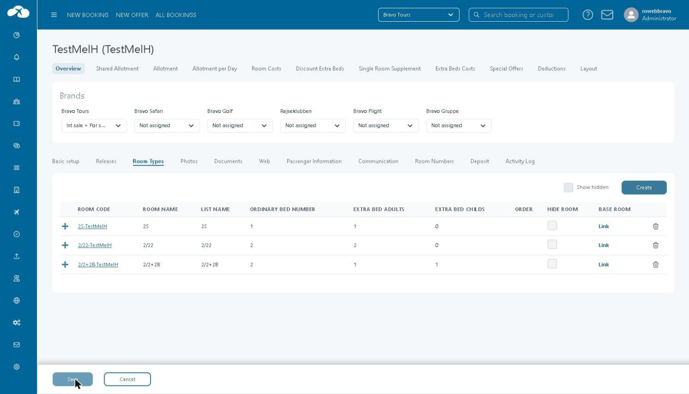
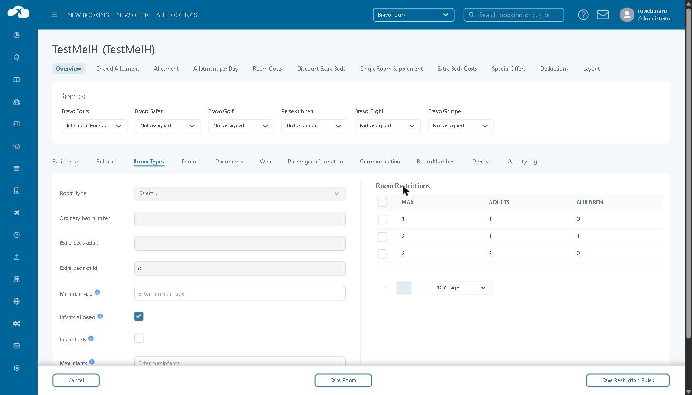
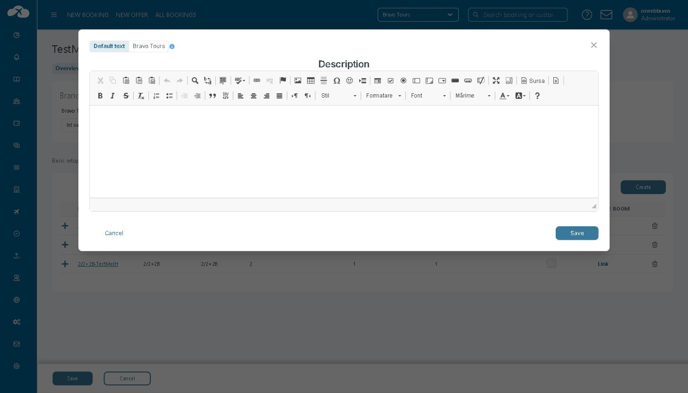

# Room Types

## Overview

The **Room Types** tab, in Hotel creation, is where you add the room types a hotel sells and configure how each one behaves for this hotel. Every room type on this tab is linked to a [Base Room Type ](../../base-room-types.md)— the shared master room definition an administrator sets up once and can reuse across hotels.

On this tab you can:

* Add a room type to the hotel from the Base Room Types catalogue.
* Set the hotel-specific bed counts used to build its occupancy restrictions.
* Set minimum age and infant rules, and restrict which guest combinations can be booked.
* Hide or remove a room type from sale, and write brand-specific descriptions.

The room code, name, list text, and full bed and cost configuration for a room type live on its linked Base Room Type record, opened from this tab via **Link**.

## Purpose

Use the Room Types tab to:

* Build the list of room types a specific hotel can sell, drawn from the shared [Base Room Types](../../base-room-types.md) catalogue.
* Set occupancy and infant rules — minimum age, infant limits, permitted guest combinations — that apply only to this hotel's use of the room type.
* Control whether a room type is currently for sale, without deleting its setup.

## Preconditions

* The hotel record exists — see[ General tab](general-tab.md).
* The Base Room Type you want to offer already exists in the Base Room Types catalogue — see [Base room type](../../base-room-types.md)s. If it doesn't exist yet, an administrator must create it there first.

### How-to



### Open the Room Types tab

Go to **Hotel → Hotels**, open the hotel, and select the **Room Types** tab.



### Add a room type to the hotel

Click **Create**, then select a room type from the **Room type** dropdown. Tourpaq fills in **Ordinary bed number**, **Extra beds adult**, and **Extra beds child** from the selected Base Room Type — adjust them if this hotel needs different values, then click **Save Room**.



### Set occupancy and infant rules

Click the **Room Code** of an existing room type. Enter a **Minimum Age** if the room type has a guest age limit, and set **Infants allowed**, **Infant beds**, and **Max infants** to match this hotel's infant policy for the room type. Click **Save Room**.



### Restrict guest combinations

In **Room Restrictions**, tick the occupancy combinations you want to restrict, then click **Save Restriction Rules**.



### Add a brand-specific description

Click **+** next to a room type to open its description editor. Write the **Default text**, or select a brand tab (for example **Bravo Tours**) to write a description shown only to that brand, then click **Save**.



### Hide, show, or remove a room type

Tick **Hide Room** to take a room type out of sale without deleting it. Tick **Show hidden** to bring hidden room types back into the list. Click the trash icon and confirm to permanently delete a room type from the hotel.



The room type appears in the hotel's Room Types list with its code, bed configuration, and a **Link** to its Base Room Type record.


Deleting a room type removes it from this hotel. Confirm it isn't referenced in an active price list, contract, or booking configuration before deleting it.


#### Field Reference

<figure><figcaption>
The Room Types tab for a hotel.
</figcaption></figure>

Room Types list

| Field                   | Description                                                                                                 | Notes                                                                                   |
| ----------------------- | ----------------------------------------------------------------------------------------------------------- | --------------------------------------------------------------------------------------- |
| **Room Code**           | The room type's code for this hotel. Click it to open its occupancy and infant settings.                    | Set when the room type is created; not editable afterwards.                             |
| **Room Name**           | The room type's display name in Tourpaq Office.                                                             | Maintained on the linked Base Room Type record — click **Link** to edit it.             |
| **List Name**           | The room type's name used in export files.                                                                  | Corresponds to the **List Text** field on the linked Base Room Type record.             |
| **Ordinary Bed Number** | The number of standard beds in the room, used to build its occupancy combinations.                          | Edit via **Room Code → Ordinary bed number**, described under Room type settings below. |
| **Extra Bed Adults**    | The number of extra beds available for adults.                                                              | Edit via **Room Code → Extra beds adult**.                                              |
| **Extra Bed Childs**    | The number of extra, child-sized beds.                                                                      | Edit via **Room Code → Extra beds child**.                                              |
| **Order**               | The room type's sort position, used to prioritise room offers elsewhere in Tourpaq.                         | Related to Customise room offer priority on the hotel's [General ta](general-tab.md)b.  |
| **Hide Room**           | Removes the room type from sale without deleting it.                                                        | Hidden room types are excluded from this list unless **Show hidden** is ticked.         |
| **Base Room**           | Opens the room type's linked [Base Room](../../base-room-types.md) [Type](../../base-room-types.md) record. |                                                                                         |
| **Create**              | Opens a blank room type so you can add it to the hotel.                                                     |                                                                                         |
| **Show hidden**         | Shows room types that have **Hide Room** ticked, in addition to visible ones.                               |                                                                                         |
| **Delete (trash icon)** | Permanently deletes the room type from the hotel, after a confirmation prompt.                              | Cannot be undone.                                                                       |


Editing a field on the linked Base Room Type record changes it for every hotel that shares that Base Room Type, not only this one.


#### Room type settings

<figure><figcaption>
Occupancy and infant settings for a room type, with Room Restrictions.
</figcaption></figure>

| Field                   | Description                                              | Notes                                                                              |
| ----------------------- | -------------------------------------------------------- | ---------------------------------------------------------------------------------- |
| **Room type**           | The Base Room Type this room type is created from.       | Only selectable when creating a new room type; locked once the room type is saved. |
| **Ordinary bed number** | The number of standard beds in the room.                 |                                                                                    |
| **Extra beds adult**    | The number of extra beds available for adults.           |                                                                                    |
| **Extra beds child**    | The number of extra, child-sized beds.                   |                                                                                    |
| **Minimum Age**         | The minimum age allowed for guests in this room type.    | Leave empty to apply no age limit.                                                 |
| **Infants allowed**     | Allows infants to stay in this room type.                |                                                                                    |
| **Infant beds**         | Infants use an extra bed in this room type.              | Relevant only when **Infants allowed** is ticked.                                  |
| **Max infants**         | The maximum number of infants allowed in this room type. | Leave empty for no limit.                                                          |


**Room Restrictions** lists every occupancy combination (adults and children) that fits within the room type's bed configuration, up to its maximum occupancy. Tick a combination and click **Save Restriction Rules** to apply the restriction.


#### Room description

<figure><figcaption>
The room type description editor, with per-brand tabs.
</figcaption></figure>

Click **+** next to a room type to write a description shown to customers. Use the **Default text** tab for the description shown when no brand-specific text is set, or select a brand tab to write text shown only to that brand.

#### Related pages

* [Base room types](../../base-room-types.md)
* [General tab](general-tab.md)
