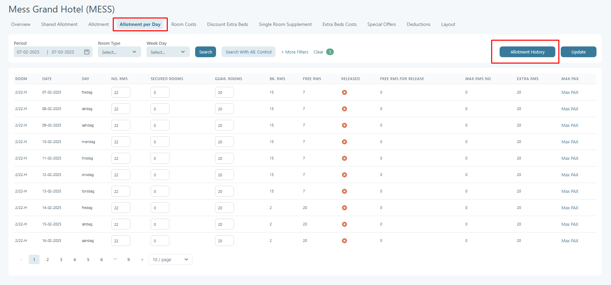
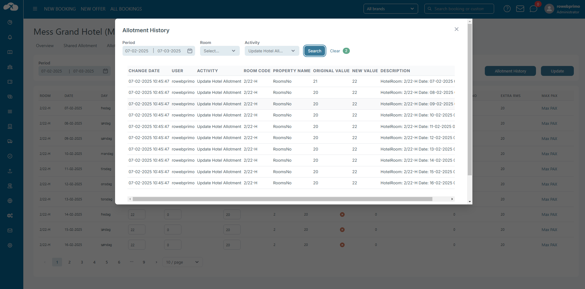

# Hotel Activity Log

The **Activity Log** records changes made to room allotments in the system. This log helps track modifications to hotel room availability and ensures accountability for updates made in the system.

<figure><figcaption></figcaption></figure>

#### **Key Elements in the Image:**

1. **Filters & Search:**
   * **Change Date:** Allows selection of a date range (e.g., 27-02-2025 to 27-03-2025).
   * **Room Selection:** Currently set to "D21."
   * **Activity Type:** Dropdown to filter specific activities.
   * **Search Button:** Filters data based on the selected criteria.
   * **Clear Button:** Resets the filters.
2. **Activity Log Table:**
   * **Columns:**
     * **Change Date & Time:** Timestamp of each action.
     * **User:** Shows the user who made the changes.
     * **Activity:** Describes the action (e.g., "Update Hotel Allotment").
     * **Room Code:** Indicates which room was affected (e.g., "D21").
     * **Property Name:** Defines the modified property (e.g., "GuaranteedRoomsNo").
     * **Original Value:** The previous value before the update (e.g., 20).
     * **New Value:** The updated value (e.g., 10).
     * **Description:** Likely provides additional details about the change.

### **Allotment History**

Additionally, there is an Allotment History under Allotment per Day, which can be accessed by clicking the Allotment History button.

<figure><figcaption></figcaption></figure>

<figure><figcaption></figcaption></figure>
