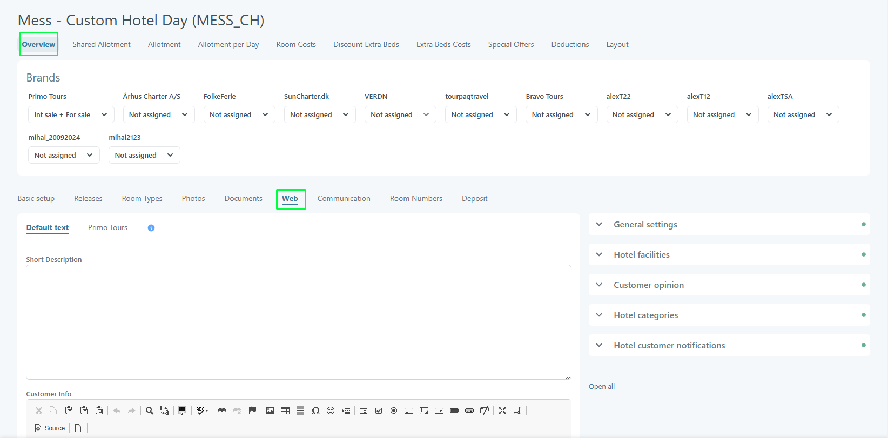
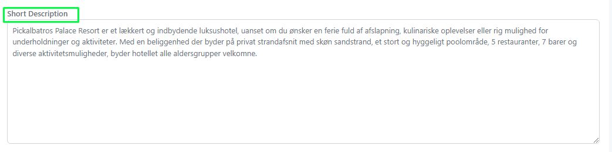
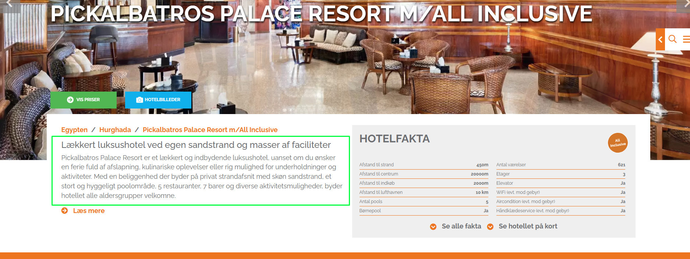
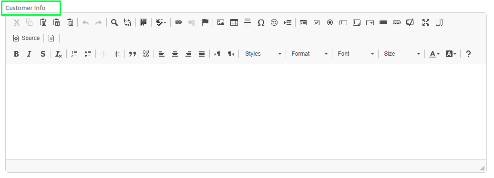
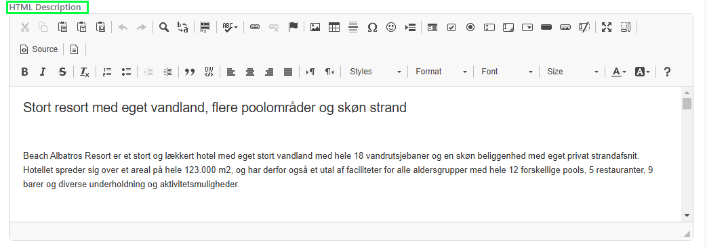
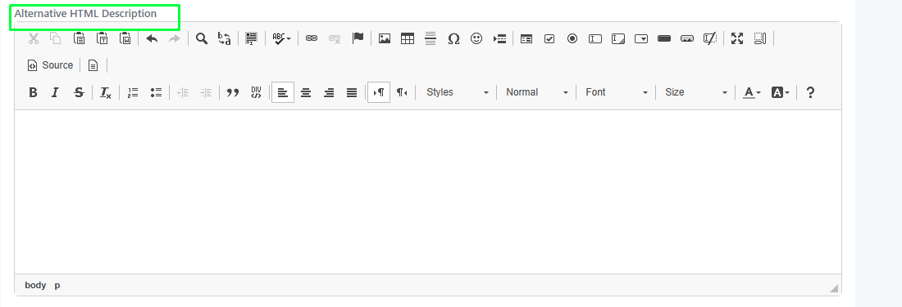
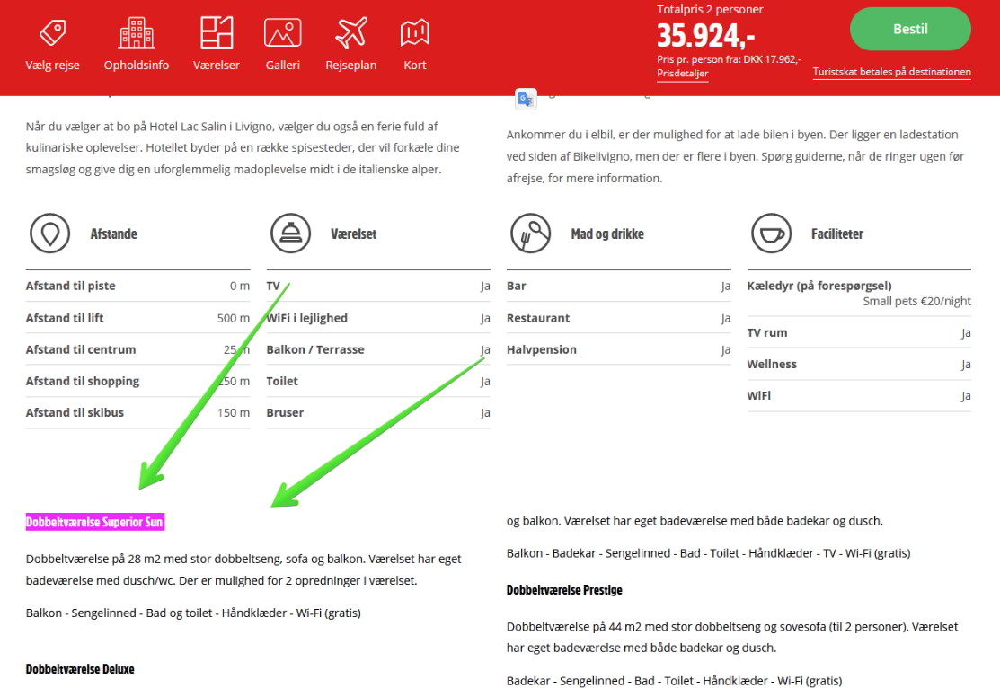
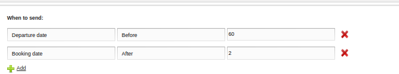
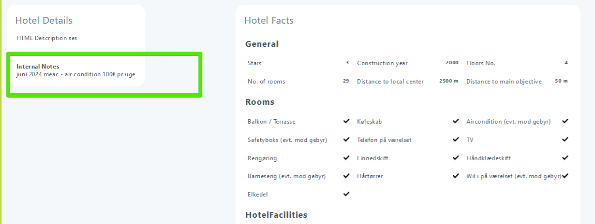
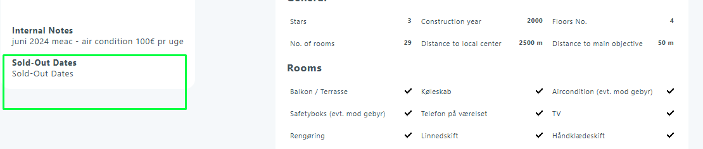

# Hotel Web

This page can be found in **Hotel/Hotels**. Select a hotel and acces **Overview/Web**.

<figure><figcaption></figcaption></figure>

This page includes specific fields, and their content will be displayed in specific locations. The displayed content can be customized for each agency, with an option to include default content.

### Short Description 

Used in Web Site

<figure><figcaption></figcaption></figure>

<figure><figcaption></figcaption></figure>

### Customer Info 

Is used when the voucher is generated.

<figure><figcaption></figcaption></figure>

### HTML Description 

It is used in Ticket, Website, and Offer. In Offer, an attribute "\[SelectOfferEmailSummary]" can be set, and only the text up to the attribute will be displayed.

<figure><figcaption></figcaption></figure>

### Alternative HTML Description 

After hotel facility you can set an alternative description

<figure><figcaption></figcaption></figure>

<figure><figcaption></figcaption></figure>

### Internal Notes 

It is used in Offer and Create Booking when the hotel popup is opened.

<figure><figcaption></figcaption></figure>

<figure><figcaption></figcaption></figure>

### Sold-Out Dates 

It is used in Offer and Create Booking when the hotel popup is opened.

<figure><figcaption></figcaption></figure>

<figure><figcaption></figcaption></figure>
