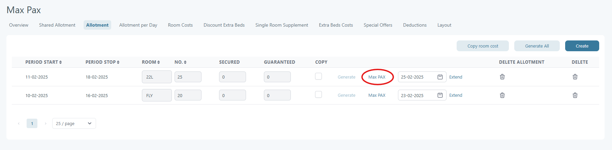
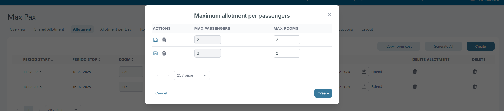
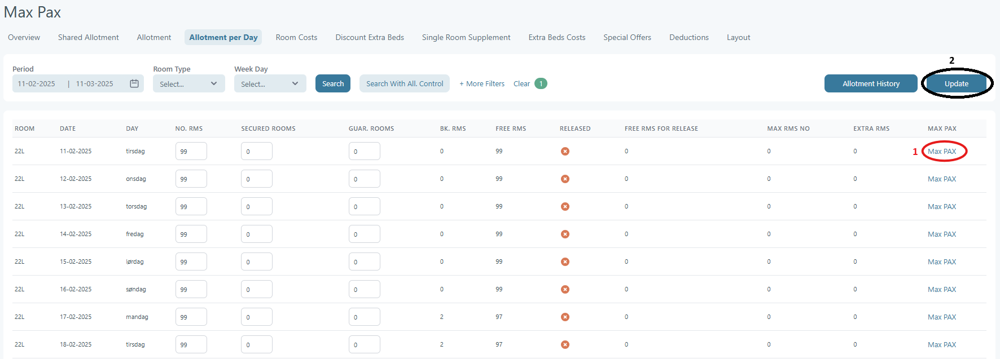
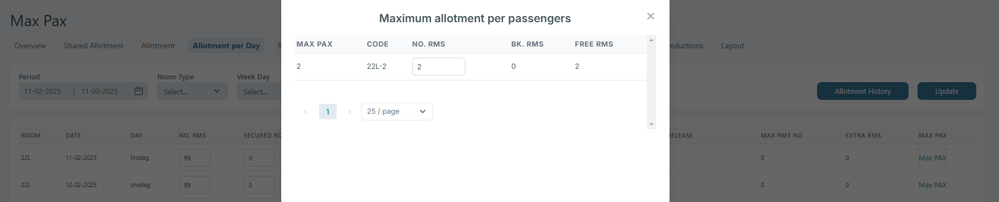

# Different Max Pax

Different Max Pax can be accessed from Hotel -> Allotment -> Max Pax. Users can define maximum occupancy levels for the same room type, ensuring better room allocation and availability management.

<figure><figcaption></figcaption></figure>

In the picture below, the room is set up so that when booked for 2 or 3 passengers, only 2 can be accommodated in any configuration.

<figure><figcaption></figcaption></figure>

The number of available rooms can also be adjusted daily in the Allotments per Day tab, allowing you to set the availability for each configuration on a per-day basis.

<figure><figcaption></figcaption></figure>

After modifying the configuration (as shown in the example below), you'll need to click the update button (labeled with 1 in the image above) to save the changes.

<figure><figcaption></figcaption></figure>
