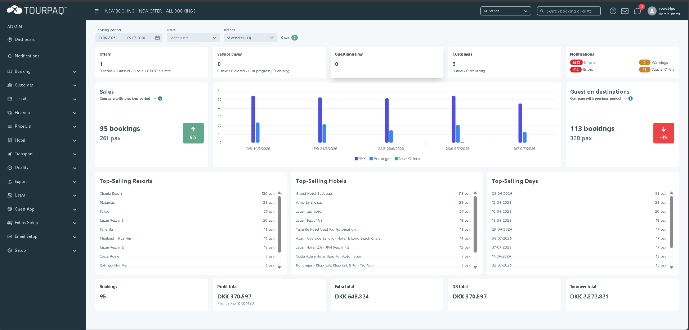

# Homepage


{% column width="41.66666666666667%" %}
## Tourpaq Documentation

Everything you need to configure, manage and integrate Tourpaq.

Browse user guides, administration, integrations and release notes.

<a href="https://app.gitbook.com/s/ZCqO8EQ5P5Mioq1zbQAc/" class="button primary">Get Started -></a>   <a href="./" class="button secondary">What's New</a>


{% column width="58.33333333333333%" %}
<figure><figcaption></figcaption></figure>



### Explore Tourpaq

<table data-view="cards"><thead><tr><th></th></tr></thead><tbody><tr><td>
🚀 Getting Started

New to Tourpaq?

→
</td></tr><tr><td>
📖 User Guide

Daily operations

→
</td></tr><tr><td>
⚙ Administration

Configure the system

→
</td></tr><tr><td>
🔌 Integrations

External providers

→
</td></tr><tr><td>
💻 Developers

API &#x26; Webhooks

→
</td></tr><tr><td>
🆕 Release Notes

Latest features

→
</td></tr></tbody></table>

### Browse by module



#### Booking

Create Booking

Flight Change

Payments

Customer Center

Search Booking

View all →



#### Hotels

Contracts

Rooms

Allotments

Combinations

Photos

View all →










