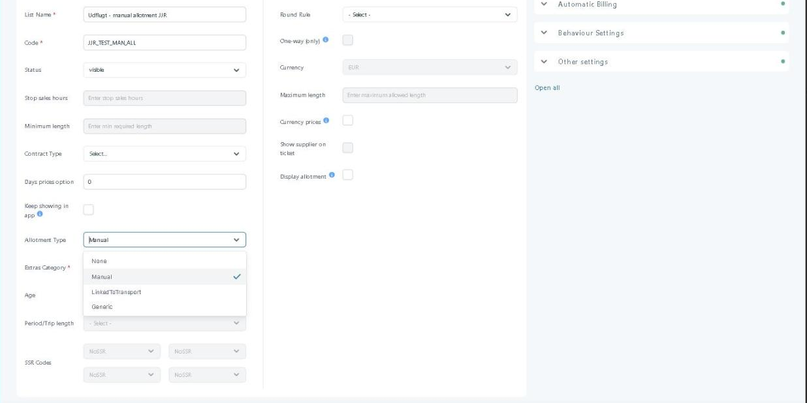

# Opera Integration (Tourpaq → PMS)


Hotels on Oracle Opera PMS manage their rooms in Opera. The Opera integration lets Tourpaq sell those rooms and send each booking back to the hotel as a reservation.

### Overview

The **Opera integration** connects Tourpaq Office with **Oracle Opera PMS**, the system in which the hotel manages its rooms. Tourpaq reads room inventory from Opera and sends bookings, customers, passengers, products and transport details to Opera.

Data moves in two directions:

* **Opera → Tourpaq** — inventory. A Tourpaq service reads the **House**, **Room** and **Block** inventory from Opera every hour.
* **Tourpaq → Opera** — bookings. Tourpaq sends each created or updated booking to Opera as a reservation.

```
Opera                                        Tourpaq
House inventory ──┐
Room inventory  ──┼── read every hour ────▶  Hotel allotment
Block inventory ──┘                          (shown per room type)

Tourpaq                                      Opera
Booking (created or updated) ─────────────▶  Reservation
  Booking No · Customer · Passengers · Products · Transport · Block Code

Matching rules
  Room Types tab: ROOM CODE   ═══ must match exactly ═══   Opera room type code
  Extra: Code                 ═══ naming convention  ═══   Opera package code
  Transport                   ═══ block code         ═══   Opera Block Code
```

For a hotel managed by Opera, availability comes from Opera and manual allotment handling in Tourpaq is overridden.


This page describes the integration from the Tourpaq side. Opera screens are shown only where they help you check a mapping.


### Purpose

Use the Opera integration to:

* Sell rooms that the hotel manages in Opera, without maintaining manual allotment in Tourpaq.
* Deliver Tourpaq bookings to the hotel as reservations in Opera.
* Check that Tourpaq room codes, Extras and block codes match what exists in Opera.
* Work on a booking without sending its changes to Opera, when you update Opera by hand.

### Preconditions

* The hotel exists in Tourpaq — see Hotel creation and the General tab.
* Every room type used at the hotel has a **ROOM CODE** identical to the room type code in Opera — see Base room types.
* The Opera endpoint and credentials are added to the Config system. They are added manually.
* Extras that go to Opera are in an extras category with an Opera **Category Type**, and each Extra's **Code** follows the naming convention of the Opera package — see Edit Extra Category.
* For package trips with transport, the Opera block exists with its block code, for the departure and period.

#### How-to



**Mark the hotel as managed by Opera**

1. Go to **Hotel → Hotels** and open the hotel.
2. On the **Basic setup** tab, open **Additional settings**.
3. In **Managed by**, select `OracleOpera`.
4.  Click **Save**.&#x20;

    <figure><figcaption></figcaption></figure>

The hotel now shows `OracleOpera` in the **BED BANK** column of the **Hotels** list. Select **Display only Bed Banks** in the list to show only these hotels.



**Match the room codes**

1. Open the hotel and go to the **Room Types** tab.
2. Compare each **ROOM CODE** with the room type code in Opera. In Opera, room type codes appear in the **Rooms Availability Summary** on the dashboard.
3. Correct any code that differs.

Tourpaq reads the inventory of every room type of the hotel from Opera. Codes must match exactly.



**Set up the Extras**

1. Go to **Extras Setup → Extras Category** and open the category.
2. Under **Settings**, set **Category Type** to `Opera Package`, `Opera Item Inventory` or `Opera Baggage`.
3. Click **Save**.
4. Go to **Extras Setup → Extras**, open the Extra and check that **Extras Category** is the Opera category.
5. Set **Code** to the code of the matching Opera package.

Extras in this category are sent to Opera with their code. Only the code is mapped.



**Check that Opera has the block**

1. In Opera, go to **Bookings → Blocks → Manage Block**.
2. Search for the block by **Block Code**.
3. Check that **Block Status**, **Start Date** and **End Date** cover the departure.

Opera inventory for the block becomes sellable in Tourpaq after the next hourly synchronisation.



**Work on a booking without sending changes to Opera**

1. Open the booking.
2. Select **Disable Opera Connect**.
3. Make your changes and click **Save**.
4. In the confirmation dialog, click **Save**.

<figure><figcaption><p>The Disable Opera Connect checkbox on the booking page.</p></figcaption></figure>

The booking and passenger changes are saved in Tourpaq. Nothing is sent to Opera. The checkbox is shown only when communication settings with Opera exist.


Creating or updating a booking sends the booking data to Opera, unless **Disable Opera Connect** is selected. A booking or passenger cancelled while it is selected stays active in Opera until you cancel it there.




### **Opera Allotment Mapping**

Allotments, in Tourpaq, per hotel, are synchronized through a service called Bad Bank Service. Depending on the hotel's settings, this service pulls all the allotments related to the hotel connected to the opera**Allotments (Inventory)**

For each individual room, there are other rooms assigned. The Bad Bank service looks at Opera every day and notices if it has a shortage or availability. The first time he searches the House, then on the individual room. If the latter is 0 or negative, the NO value from Hotel Allotment in Tourpaq will be updated.&#x20;

<figure><figcaption></figcaption></figure>

<figure><figcaption></figcaption></figure>

**Behavior**

* Each Opera allotment corresponds to a specific:
  * Hotel
  * Room type
  * Date range
* Tourpaq uses this mapping to:
  * Validate availability
  * Allocate rooms during booking

### Field Reference

<table><thead><tr><th width="160">Field</th><th>Description</th><th width="193">Required</th><th>Notes</th></tr></thead><tbody><tr><td><strong>Managed by</strong></td><td><strong>Hotel → Hotels → hotel → Basic setup → Additional settings.</strong> Selects the system that manages the hotel. <code>OracleOpera</code> makes Opera the source of availability.</td><td>Conditional — select <code>OracleOpera</code> for every hotel managed in Opera</td><td>Overrides manual allotment handling in Tourpaq.</td></tr><tr><td><strong>BED BANK</strong></td><td>Column in the <strong>Hotels</strong> list. Shows <code>OracleOpera</code> for hotels managed by Opera.</td><td>–</td><td>Filter with <strong>Display only Bed Banks</strong>.</td></tr><tr><td><strong>ROOM CODE</strong></td><td>Column on the hotel <strong>Room Types</strong> tab. The code that Tourpaq matches to the Opera room type.</td><td>Yes</td><td>Must match the Opera room type code exactly.</td></tr><tr><td><strong>Category Type</strong></td><td><strong>Extras Setup → Extras Category → Settings.</strong> <code>Opera Package</code>, <code>Opera Item Inventory</code> or <code>Opera Baggage</code> links the category to the Opera integration.</td><td>No</td><td>Extras in the category are sent to Opera.</td></tr><tr><td><strong>Code</strong> (Extra)</td><td><strong>Extras Setup → Extras.</strong> The code of the Extra. Tourpaq maps it to the Opera package.</td><td>Yes</td><td>The mapping is a naming convention: use the Opera package code.</td></tr><tr><td><strong>Disable Opera Connect</strong></td><td>Stops changes to this booking from being sent to Opera while it is selected.</td><td>No</td><td>Shown only when communication settings with Opera exist. Each save asks for confirmation.</td></tr></tbody></table>

**Inventory values**

Opera holds three inventory values. Tourpaq reads all three.

| Value     | Description                                                                                                   |
| --------- | ------------------------------------------------------------------------------------------------------------- |
| **House** | The total number of rooms in the hotel.                                                                       |
| **Room**  | The number of rooms available for one room type.                                                              |
| **Block** | Rooms reserved in Opera under a block code, for a specific name and period. Opera has no notion of transport. |

<figure><figcaption><p>Manage Block in Opera</p></figcaption></figure>

<figure><figcaption><p>Property availability oin Opera</p></figcaption></figure>

**Availability calculation**

The synchronisation service reads House, Room and Block inventory every hour. A full synchronisation of all room types took about 40 minutes in a load test. New block inventory in Opera therefore becomes sellable in Tourpaq after 40 minutes to 1 hour 40 minutes, depending on when the service runs.

For a package trip with transport, Tourpaq checks availability for every room type in this order:

1. **Block** inventory for the booking's block.
2. If Block is 0 or negative, **House** inventory. House can be booked only when its value is greater than zero.

If a booking needs more rooms than the block holds, Tourpaq takes the available rooms from the block and the rest from House.

For a Hotel Only booking, availability is limited to the House and Room inventory.

For a room type, Tourpaq treats House and Room together as follows:

| House | Room | Available rooms |
| ----- | ---- | --------------- |
| 2     | 4    | 2               |
| 4     | 3    | 3               |

A room type is available when both House and Room are larger than zero. The number of available rooms is the smaller of the two.


Tourpaq does not stop you from booking a room that is linked in Opera to the block of one departure airport for the block of another. Opera rejects the booking when the room is linked to a different block.


**Block codes**

The name of a block in Opera is free text. Tourpaq uses the **Block Code** of the block. In the Opera staging environment, for example, blocks `BLL202620271` and `CPH202620271` start with the departure airport codes `BLL` and `CPH` and run from 01-11-2026 to 01-11-2027.

Opera shows these fields for each block in **Bookings → Blocks → Manage Block**:

| Column                       | Description                                     |
| ---------------------------- | ----------------------------------------------- |
| **Block Name**               | The name of the block.                          |
| **Block ID**                 | The Opera identifier of the block.              |
| **Block Status**             | For example `ACT` (active) or `DEF` (definite). |
| **Block Code**               | The code that Tourpaq uses.                     |
| **Start Date**, **End Date** | The period that the block covers.               |

**Extras sent to Opera**

Extras that Tourpaq sends to Opera use an Opera **Category Type**:&#x20;

<figure><figcaption><p>Extras in Tourpaq</p></figcaption></figure>

<figure><figcaption><p>Packages in Opera</p></figcaption></figure>

| Category Type            | Description                                                                |
| ------------------------ | -------------------------------------------------------------------------- |
| **Opera Package**        | Extras that Opera receives as a package, for example the Pension category. |
| **Opera Item Inventory** | Extras that Opera receives as an individual item.                          |
| **Opera Baggage**        | Extras for baggage.                                                        |

Only the Extra's code is mapped, by naming convention.


If Opera does not recognise the code of an Extra in an Opera category, Opera returns an error for the Extra. The booking is still created in Tourpaq. Create the matching package in Opera, or move the Extra to a category that is not an Opera category.


**Data sent to Opera**

When a booking is created, Tourpaq sends:

| Data           | Fields                                                                       |
| -------------- | ---------------------------------------------------------------------------- |
| **Booking**    | Booking No                                                                   |
| **Customer**   | Name, first name, phone, email, birthday, nationality                        |
| **Passengers** | Name, first name, phone, email, birthday, gender                             |
| **Products**   | Products on the booking                                                      |
| **Transport**  | Departure date and time, departure code, arrival date and time, arrival code |
| **Block**      | Block Code                                                                   |

When a booking is updated, Tourpaq sends all of the booking data again, not only the changed data. The room, transport, customer, passenger and Extra details are compared with the existing booking, and the update is sent to Opera.

Enter all customer details before you click **Take Allotment**, to avoid duplicate customers in Opera.

If a required mapping is missing, the booking can fail during export.

**Messages shown when Disable Opera Connect is selected**

| Situation                             | What Tourpaq shows                                             | Result                                                                                                                                       |
| ------------------------------------- | -------------------------------------------------------------- | -------------------------------------------------------------------------------------------------------------------------------------------- |
| **Disable Opera Connect** is selected | The banner `Opera is disabled`, directly below the action bar. | The banner stays visible while synchronisation is disabled for the booking.                                                                  |
| You click **Save**                    | A confirmation dialog with the message below.                  | **Save** saves the booking and passenger changes without synchronisation to Opera. **Cancel** cancels the save and keeps you on the booking. |
| You cancel a booking or a passenger   | A reminder with the message below.                             | The cancellation is not sent to Opera. Cancel the passenger or reservation in Opera yourself.                                                |

<figure><figcaption><p>The Opera is disabled banner.</p></figcaption></figure>

```
Opera Connection is disabled. Are you sure you want to save without syncing to Opera?
```

<figure><figcaption><p>The save confirmation dialog.</p></figcaption></figure>

```
Please remember to cancel the passenger/reservation in Opera as well.
```

<figure><figcaption><p>The cancellation reminder.</p></figcaption></figure>

**Logging**

The integration logs booking export requests, responses from Opera, errors and validation issues, mapping failures, and profile creation or matching results. The primary logs are stored in the database, including request payloads, response payloads and error messages.

#### Related pages

* PMS Integration
* General tab
* Base room types
* Edit Extra Category
* Hotel allotments
* New Booking
