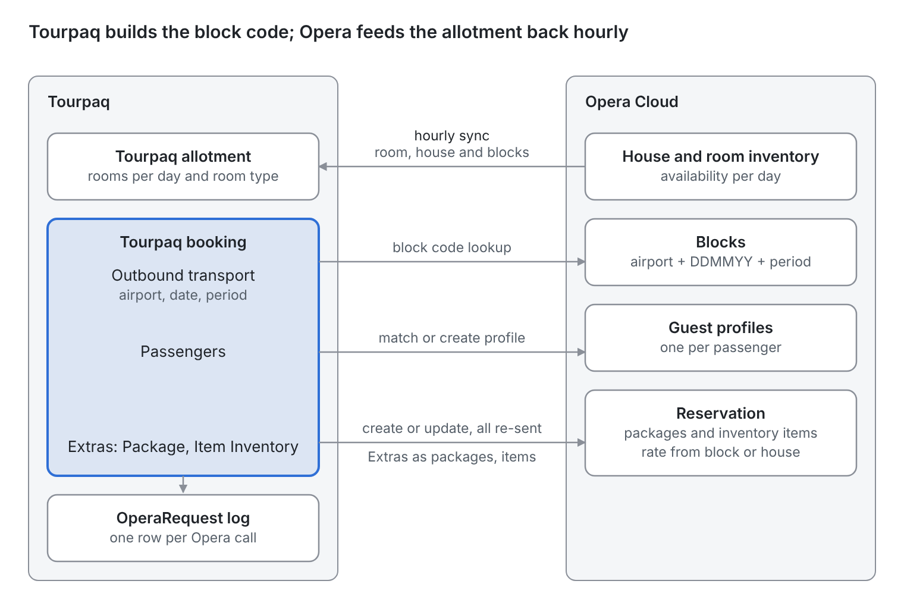

# Opera integration

Hotels on Oracle Opera PMS manage their rooms in Opera. The Opera integration lets Tourpaq sell those rooms and send each booking back to the hotel as a reservation.

#### Overview

The **Opera integration** connects Tourpaq Office with **Oracle Opera PMS**, the system in which the hotel manages its rooms. Tourpaq reads room inventory from Opera and sends bookings, customers, passengers, products and transport details to Opera.

Data moves in two directions:

* **Opera → Tourpaq** — inventory. A Tourpaq service reads the **House**, **Room** and **Block** inventory from Opera every hour. When Opera confirms a reservation, its confirmation number comes back to the Tourpaq booking.
* **Tourpaq → Opera** — bookings. Tourpaq sends each created or updated booking to Opera as a reservation.

```
Opera                                        Tourpaq
House inventory ──┐
Room inventory  ──┼── read every hour ────▶  Hotel allotment (NO.)
Block inventory ──┘

Tourpaq                                      Opera
Booking (created or updated) ─────────────▶  Reservation
  Booking No · Customer · Passengers · Products · Transport · Block Code

Opera                                        Tourpaq
Reservation confirmation number ──────────▶  Booking → Bed Bank tab → Reference

Matching rules
  Room Types tab: ROOM CODE   ═══ must match exactly ═══   Opera room type code
  Extra: Code                 ═══ naming convention  ═══   Opera package code
  Transport                   ═══ block code         ═══   Opera Block Code
```

<figure><figcaption><p>How the parts of the integration interact.</p></figcaption></figure>

A booking pushes data to Opera along three flows: the block lookup, the guest profiles and the reservation. The only flow back is the hourly allotment sync. Every call to Opera is stored in the OperaRequest log.

For a hotel managed by Opera, availability comes from Opera and manual allotment handling in Tourpaq is overridden.


This page describes the integration from the Tourpaq side. Opera screens are shown only where they help you check a mapping. Integration pages in the manual use this structure: Overview, Purpose, Preconditions, How-to (setup tasks in Tourpaq and the external system), and Field Reference (fields, rules, data exchanged, an example and logging).


#### Purpose

Use the Opera integration to:

* Sell rooms that the hotel manages in Opera, without maintaining manual allotment in Tourpaq.
* Deliver Tourpaq bookings to the hotel as reservations in Opera.
* Check that Tourpaq room codes, Extras and block codes match what exists in Opera.
* Find the Opera reservation of a Tourpaq booking.
* Work on a booking without sending its changes to Opera, when you update Opera by hand.

#### Preconditions

* The hotel exists in Tourpaq — see [Hotel creation](https://tourpaq.gitbook.io/staging-tourpaq-docs/hotel/hotel-creation) and the [General tab](https://tourpaq.gitbook.io/staging-tourpaq-docs/hotel/hotel-creation/general-tab).
* Every room type used at the hotel has a **ROOM CODE** identical to the room type code in Opera — see [Room Types](https://tourpaq.gitbook.io/staging-tourpaq-docs/hotel/hotel-creation/room-types) and [Base room types](https://tourpaq.gitbook.io/staging-tourpaq-docs/base-room-types).
* The Opera endpoint and credentials are added to the Config system. They are added manually.
* Extras that go to Opera are in an extras category with an Opera **Category Type**, and each Extra's **Code** follows the naming convention of the Opera package — see [Edit Extra Category](https://tourpaq.gitbook.io/staging-tourpaq-docs/extras-category/extra-category-overview/edit-extra-category).
* For package trips with transport, the Opera block exists with its block code, for the departure and period.

#### How-to



**Mark the hotel as managed by Opera**

1. Go to **Hotel → Hotels** and open the hotel.
2. On the **Basic setup** tab, open **Additional settings**.
3. In **Managed by**, select `OracleOpera`.
4. Click **Save**.

The hotel now shows `OracleOpera` in the **BED BANK** column of the **Hotels** list. Select **Display only Bed Banks** in the list to show only these hotels.



**Match the room codes**

1. Open the hotel and go to the **Room Types** tab.
2. Compare each **ROOM CODE** with the room type code in Opera. In Opera, room type codes appear in the **Rooms Availability Summary** on the dashboard.
3. Correct any code that differs.

Tourpaq reads the inventory of every room type of the hotel from Opera. Codes must match exactly.



**Set up the Extras**

1. Go to **Extras Setup → Extras Category** and open the category.
2. Under **Settings**, set **Category Type** to `Opera Package`, `Opera Item Inventory` or `Opera Baggage`.
3. Click **Save**.
4. Go to **Extras Setup → Extras**, open the Extra and check that **Extras Category** is the Opera category.
5. Set **Code** to the code of the matching Opera package.
6. In Opera, open any reservation, click **Packages** and check that a package with the same **Code** exists in the list of available packages.

Extras in this category are sent to Opera with their code. Only the code is mapped.



**Check that Opera has the block**

1. In Opera, go to **Bookings → Blocks → Manage Block**.
2. Search for the block by **Block Code**.
3. Check that **Block Status**, **Start Date** and **End Date** cover the departure.
4. Check that the room types you want to sell from the block have rooms on the block.

Opera inventory for the block becomes sellable in Tourpaq after the next hourly synchronisation — see Availability calculation.



**Find the Opera reservation of a booking**

1. Open the booking in Tourpaq Office and go to the **Bed Bank** tab.
2. Copy the **Reference**. This is the Opera confirmation number.
3. In Opera, go to **Bookings → Reservations → Manage Reservation**.
4. Enter the number in **Conf / Cxl / External** and click **Search**.

Opera lists the reservation under that confirmation number, for the same property, room type and stay dates as the Tourpaq booking. A booking with several rooms is listed with one line per room under the same confirmation number.



**Work on a booking without sending changes to Opera**

1. Open the booking.
2. In the booking summary panel on the right, select **Disable Opera Connect**.
3. Make your changes and click **Save**.
4. In the confirmation dialog, click **Save**.

<figure><figcaption><p>The Disable Opera Connect checkbox on the booking page.</p></figcaption></figure>

The booking and passenger changes are saved in Tourpaq. Nothing is sent to Opera. The checkbox is shown only for bookings that have an Opera setting.


Creating or updating a booking sends the booking data to Opera, unless **Disable Opera Connect** is selected. A booking or passenger cancelled while it is selected stays active in Opera until you cancel it there.




#### Field Reference

| Field                     | Description                                                                                                                                                            | Required                                                            | Notes                                                                                |
| ------------------------- | ---------------------------------------------------------------------------------------------------------------------------------------------------------------------- | ------------------------------------------------------------------- | ------------------------------------------------------------------------------------ |
| **Managed by**            | **Hotel → Hotels → hotel → Basic setup → Additional settings.** Selects the system that manages the hotel. `OracleOpera` makes Opera the source of availability.       | Conditional — select `OracleOpera` for every hotel managed in Opera | Overrides manual allotment handling in Tourpaq.                                      |
| **BED BANK**              | Column in the **Hotels** list. Shows `OracleOpera` for hotels managed by Opera.                                                                                        | –                                                                   | Filter with **Display only Bed Banks**.                                              |
| **ROOM CODE**             | Column on the hotel **Room Types** tab. The code that Tourpaq matches to the Opera room type.                                                                          | Yes                                                                 | Must match the Opera room type code exactly.                                         |
| **NO.**                   | Column on the hotel **Allotment** tab, next to PERIOD START, PERIOD STOP, ROOM TYPE, MIN. STAY and BOARD BASIS. The number of rooms available for the period.          | –                                                                   | Filled from Opera for hotels managed by Opera.                                       |
| **Category Type**         | **Extras Setup → Extras Category → Settings.** `Opera Package`, `Opera Item Inventory` or `Opera Baggage` links the category to the Opera integration.                 | No                                                                  | Extras in the category are sent to Opera.                                            |
| **Code** (Extra)          | **Extras Setup → Extras.** The code of the Extra. Tourpaq maps it to the Opera package.                                                                                | Yes                                                                 | The mapping is a naming convention: use the Opera package code.                      |
| **Reference**             | **Booking → Bed Bank** tab. The Opera confirmation number of the reservation.                                                                                          | –                                                                   | Read-only. Use it to find the reservation in Opera.                                  |
| **Disable Opera Connect** | Booking summary panel on the right, between **Is Group Booking** and **Remember Extras**. Stops changes to this booking from being sent to Opera while it is selected. | No                                                                  | Shown only for bookings that have an Opera setting. Each save asks for confirmation. |

**Inventory values**

Opera holds three inventory values. Tourpaq reads all three.

| Value     | Description                                                                                                                                                                           |
| --------- | ------------------------------------------------------------------------------------------------------------------------------------------------------------------------------------- |
| **House** | The number of rooms in the hotel that are still available for sale.                                                                                                                   |
| **Room**  | The number of rooms available for one room type.                                                                                                                                      |
| **Block** | Rooms reserved in Opera under a block code, for a specific name and period. Block allotments are available only to bookings that include transport. Opera has no notion of transport. |

**Availability calculation**

The synchronisation service reads House, Room and Block inventory every hour. A full synchronisation of all room types, including the whole season of the blocks and the House availability, took about 40 minutes in a load test. New block inventory in Opera therefore becomes sellable in Tourpaq, in Office and online, after 40 minutes to 1 hour 40 minutes, depending on when the service runs.

**Package trips with transport.** The Block and House calculation applies only to package trips with transport, and to all room types. For every room type, Tourpaq checks availability in this order:

1. **Block** allotment of the booking's block.
2. If the Block allotment for the room type is 0 or negative, **House** allotment. House can be booked only when its value is greater than zero. House is also limited by the Room value of the room type: Tourpaq uses the smaller of House and Room.

If a booking needs more rooms than the block holds, Tourpaq takes the available rooms from the block and the rest from House.

| Situation                                                                                 | Result                                                                                                  |
| ----------------------------------------------------------------------------------------- | ------------------------------------------------------------------------------------------------------- |
| The room type has 1 room on the block and none on House.                                  | The booking succeeds. The Block allotment drops to 0, and the Opera reservation carries the block code. |
| The booking asks for 2 rooms of a room type. The block holds 1 room and House holds more. | The booking succeeds. Tourpaq takes 1 room from the block and 1 room from House.                        |

**Hotel Only bookings.** Availability is limited to the House and Room inventory. Block allotment is not checked. The Block and House order above does not apply to Hotel Only bookings.

For a room type, Tourpaq treats House and Room together as follows:

| House | Room | Available rooms |
| ----- | ---- | --------------- |
| 2     | 4    | 2               |
| 4     | 3    | 3               |

A room type is available when both House and Room are larger than zero. The number of available rooms is the smaller of the two.


Tourpaq does not check that a room is linked to the right block in Opera. If the same block code is used for more than one departure, Tourpaq does not prevent a booking across those departures. Opera rejects a booking when the room is linked to a different block, and the booking does not go through.


**How the allotment number is calculated**

The hourly sync rewrites the Tourpaq allotment number (**NO.**) for each day from three Opera inventories plus what Tourpaq has already sold:

| Part                  | Value used                                                                                                                                                                                 |
| --------------------- | ------------------------------------------------------------------------------------------------------------------------------------------------------------------------------------------ |
| **Room**              | Opera availability for the room type, never below 0.                                                                                                                                       |
| **House**             | Opera House availability.                                                                                                                                                                  |
| **Booked in Tourpaq** | Rooms already booked on that allotment day.                                                                                                                                                |
| **Block**             | Remaining rooms in each block for every departure airport linked to the hotel room, periods 1 and 2 only. The block code is built as described in **How a booking finds its Opera block**. |

Allotment = the smaller of House and Room + Booked in Tourpaq + the remaining rooms of each block.

Example: Room 5, House 3, 2 rooms booked, block `BLL2405271` has 4 rooms left and `CPH2405271` has 0. Allotment = 3 + 2 + 4 + 0 = 9.

The sync updates only the allotment number, and only on days where it changed. Other allotment values are not touched.

Example of mapped room codes `CF1`, `CF2`, `CF22`, `CFV1`, `CFV2`, `CFV22`, `SP1`, `SP2`, `SP22`, `SP42`, `SU1SV`, `SU2`, `SU2SV`, `SU2H`, `SU3LUX` and `PH42`.&#x20;

A manual run of the sync per price list is allowed for the roles SysAdmin, Administrator, BrandManager, Sales and Financial.

The sync shows one of these messages:

* `The hotel is not managed by Opera!`
* `Missing opera credentials!`
* `No Inventory found from the provider!`
* `<n> allotments have been updated for room <code>!`


For a hotel managed by Opera, a manually entered allotment number is overwritten at the next hourly run.


**Block codes**

The name of a block in Opera is free text. Tourpaq uses the **Block Code** of the block. In the Opera staging environment, for example, block codes such as `BLL202620271` and `CPH202620271` start with a departure airport code and run from 01-11-2026 to 01-11-2027.

Opera shows these fields for each block in **Bookings → Blocks → Manage Block**:

| Column                       | Description                                     |
| ---------------------------- | ----------------------------------------------- |
| **Block Name**               | The name of the block.                          |
| **Block ID**                 | The Opera identifier of the block.              |
| **Block Status**             | For example `ACT` (active) or `DEF` (definite). |
| **Block Code**               | The code that Tourpaq uses.                     |
| **Start Date**, **End Date** | The period that the block covers.               |

On the Opera reservation, the used block appears in **Block Code**. The field is empty when the room comes from House.

**How a booking finds its Opera block**

Tourpaq does not store a link between a transport and a block. It builds the block code from the booking's outbound transport each time, and looks that code up in Opera.

| Part of the block code   | Length | Example  |
| ------------------------ | ------ | -------- |
| Departure airport code   | 3      | `BLL`    |
| Departure date as DDMMYY | 6      | `240527` |
| Transport period number  | 1      | `1`      |

Example: a transport from BLL on 24 May 2027 in period 1 looks for block `BLL2405271`.

Tourpaq looks for a block only when:

* The transport period is 1, 2, 3 or 4.
* The departure airport is BLL, CPH or RNN. Other airports never get a block code.

Hotel Only bookings never get a block code. Opera receives them with the internal general note `OUTSIDE ALLOTMENT`.

When the booking is sent to Opera:

1. Tourpaq asks Opera for the block with that code, under the agency's rate plan code.
2. If the block exists and has at least the booked number of rooms on every night, the reservation is made in the block, at the block's rate.
3. Otherwise the reservation is made on House, at the House rate, if House has the rooms.
4. If neither has the rooms, the export fails with `Reservation not availabe on the house!`.

When the booking is updated, the reservation stays where it is if the block code and room type are unchanged. If either changed, Tourpaq checks the new block first and then House.

**Allocation.** In Opera, one block holds the rooms for one departure airport, one departure date and one period. This is what a Tourpaq transport allocation describes.


A block named outside this convention is never used by Tourpaq. Renaming a block code in Opera cuts the block off from Tourpaq bookings.


**Extras sent to Opera**

Extras that Tourpaq sends to Opera use an Opera **Category Type**:

| Category Type            | Description                                                                |
| ------------------------ | -------------------------------------------------------------------------- |
| **Opera Package**        | Extras that Opera receives as a package, for example the Pension category. |
| **Opera Item Inventory** | Extras that Opera receives as an individual item.                          |
| **Opera Baggage**        | Extras for baggage.                                                        |

Only the Extra's code is mapped, by naming convention.

In Opera, the reservation has a **Packages** dialog with the tabs **Packages**, **Inventory Items** and **Daily View**. The **Packages** tab lists the available packages by **Code**, **Description**, **Calculation Rule**, **Rhythm** and **Price**, and the packages already on the reservation under **Selected Packages**. The **Item Inventory** link on the reservation shows the inventory items.


If Opera does not recognise the code of an Extra in an Opera category, Opera returns an error for the Extra. The booking is still created in Tourpaq. Create the matching package in Opera, or move the Extra to a category that is not an Opera category.


**What travels with an Extra**

The Extra's category decides what it becomes in Opera. The code is the link. Quantity and dates travel with it; the Tourpaq price does not.

| Category Type            | Becomes in Opera                     | Sent with the code                                                                                                                                                                                                                          | Not sent                        |
| ------------------------ | ------------------------------------ | ------------------------------------------------------------------------------------------------------------------------------------------------------------------------------------------------------------------------------------------- | ------------------------------- |
| **Opera Package**        | A reservation package                | Total quantity. Excluded quantity (passengers of the Extra's passenger type minus the quantity). Start = check-in. End = check-in + the Extra's days, or check-out when the Extra has no days. One schedule line per day with the quantity. | Tourpaq price, Extra name       |
| **Opera Item Inventory** | An inventory item on the reservation | Quantity. Check-in to check-out.                                                                                                                                                                                                            | Tourpaq price, Extra name, days |

**Price.** The package price comes from Opera. When a booking is updated, Tourpaq keeps the per-day price already on the Opera reservation, or reads the package rate from Opera when none is there.

**Data sent to Opera**

When a booking is created, Tourpaq sends:

| Data           | Fields                                                                       |
| -------------- | ---------------------------------------------------------------------------- |
| **Customer**   | Name, first name, phone, email, birthday, nationality                        |
| **Passengers** | Name, first name, phone, email, birthday, gender                             |
| **Products**   | Products on the booking                                                      |
| **Transport**  | Departure date and time, departure code, arrival date and time, arrival code |
| **Block**      | Block Code                                                                   |

When a booking is updated, Tourpaq sends all of the booking data again, not only the changed data. The room, transport, customer, passenger and Extra details are compared with the existing booking, and the update is sent to Opera.

**Passenger profiles.** Each passenger is matched or created as an individual profile in Opera. If a matching profile exists, Tourpaq reuses it. If not, Tourpaq creates a new profile in Opera. Consistent customer data improves matching and reduces duplicate profiles.

**How passengers are matched to Opera profiles**

Tourpaq reuses an existing Opera guest profile when it can find one, and creates a new one only when it cannot.

When a booking is created, passengers that already carry an Opera profile ID are sent with that ID. The first passenger is the primary guest. A booking with no passengers yet is sent with the customer as primary guest (name, first name, phone, email, birthday,language, nationality).

When a booking is updated, Tourpaq matches each passenger in this order. The first match wins.

1. The Opera profile ID already stored on the passenger, if that profile's full name equals the passenger's full name.
2. A guest profile with exactly the same email address.
3. A guest profile with exactly the same phone number.
4. A guest profile with the same first and last name (not case-sensitive), and the same birth date or no birth date in Opera.
5. No match: Tourpaq creates a new guest profile.

One Opera profile is used for only one passenger on a room. If two passengers match the same profile, the second moves on to the next step.

**What Tourpaq writes to the profile.** A matched profile is overwritten with the Tourpaq values: first and last name, title, language, nationality, gender, birth date, phone, address, postal code and email. Tourpaq also sets two user-defined fields:


A matched profile is overwritten with the Tourpaq values. Changes made to that profile in Opera are replaced at the next booking update.


Enter all customer details before you click **Take Allotment**, to avoid duplicate customers in Opera.

If a required mapping is missing, the booking can fail during export.

**Bed Bank tab**

The **Bed Bank** tab of a booking shows the hotel reservation held in the external system. For a hotel managed by Opera, it shows:

| Field            | Description                                                                                                                                    |
| ---------------- | ---------------------------------------------------------------------------------------------------------------------------------------------- |
| **Reference**    | The Opera confirmation number.                                                                                                                 |
| **Status**       | The status of the reservation, for example `Confirmed`.                                                                                        |
| **Booking Date** | The date of the reservation.                                                                                                                   |
| **Hotel**        | The hotel code, which is the Opera property code.                                                                                              |
| **Check In/Out** | The arrival and departure dates.                                                                                                               |
| **Price**        | The price of the reservation.                                                                                                                  |
| **Added by**     | The user shown as having added the reservation.                                                                                                |
| **Holder**       | The name of the reservation holder.                                                                                                            |
| **Room**         | The room type, with one block per room, and the passengers (Full Name, Gender) in each room.                                                   |
| **History**      | Earlier versions of the reservation, with Reference, Check In, Check Out, Confirmation Status, Creation Date, Net Price, Currency and Updated. |


The panel title in Tourpaq Office reads **Hotel Beds Reservation**, because the tab is shared by all bed banks.


**Example: booking in Tourpaq and reservation in Opera**

A staging booking for two rooms with a bus transport, and the reservation that Opera holds for it:

|                        | Tourpaq (booking 228039)                                       | Opera (confirmation 575010084)                                                                                            |
| ---------------------- | -------------------------------------------------------------- | ------------------------------------------------------------------------------------------------------------------------- |
| Hotel                  | A hotel managed by Opera. **Bed Bank** tab → **Hotel** `ESCLS` | **Property** `ESCLS`                                                                                                      |
| Room type              | `CF1`                                                          | **Room Type** `CF1`                                                                                                       |
| Stay                   | 30-10-2026 to 06-11-2026                                       | **Arrival** 30/10/2026, **Departure** 06/11/2026                                                                          |
| Outbound transport     | `BLL-ACE`, `JTD531`, 30.10                                     | **Transportation → Pick Up**: 30/10/2026, 11:25, Type `BUS`, Station `ACE`, Carrier `Jet Time`, Transport Number `JTD531` |
| Return transport       | `ACE-BLL`, `JTD532`, 06.11                                     | **Transportation → Drop off**: 06/11/2026, Type `BUS`, Station `BLL`, Carrier `Jet Time`, Transport Number `JTD532`       |
| Block                  | None. The rooms come from House.                               | **Block Code** empty, because no block was used                                                                           |
| Reservation identifier | **Bed Bank** tab → **Reference** `575010084`                   | **Confirmation Number** `575010084`, **External References** type `OPERA`                                                 |
| Status                 | **Bed Bank** tab → **Status** `Confirmed`                      | **Status** `Reserved`                                                                                                     |

**Messages shown when Disable Opera Connect is selected**

| Situation                             | What Tourpaq shows                                             | Result                                                                                                                                       |
| ------------------------------------- | -------------------------------------------------------------- | -------------------------------------------------------------------------------------------------------------------------------------------- |
| **Disable Opera Connect** is selected | The banner `Opera is disabled`, directly below the action bar. | The banner stays visible while synchronisation is disabled for the booking.                                                                  |
| You click **Save**                    | A confirmation dialog with the message below.                  | **Save** saves the booking and passenger changes without synchronisation to Opera. **Cancel** cancels the save and keeps you on the booking. |
| You cancel a booking or a passenger   | A reminder with the message below.                             | The cancellation is not sent to Opera. Cancel the passenger or reservation in Opera yourself.                                                |

<figure><figcaption><p>The Opera is disabled banner.</p></figcaption></figure>

```
Opera Connection is disabled. Are you sure you want to save without syncing to Opera?
```

<figure><figcaption><p>The save confirmation dialog.</p></figcaption></figure>

```
Please remember to cancel the passenger/reservation in Opera as well.
```

<figure><figcaption><p>The cancellation reminder.</p></figcaption></figure>

**Logging**

The integration logs booking export requests, responses from Opera, errors and validation issues, mapping failures, and profile creation or matching results. The primary logs are stored in the database, including request payloads, response payloads and error messages.

The **Bed Bank** tab of the booking shows the **Reference**, the **Status** and the **History** of the reservation.

**Where the logs are**

Every call Tourpaq makes to Opera is stored as one row in the **OperaRequest** table of the Tourpaq database.

| Column                 | Holds                                                                                               |
| ---------------------- | --------------------------------------------------------------------------------------------------- |
| **ClientReference**    | The Tourpaq booking reference. Empty for availability checks.                                       |
| **OperaReservationID** | The Opera reservation, on reservation calls.                                                        |
| **Created**            | Date and time of the call.                                                                          |
| **CompanyID**          | The Tourpaq company.                                                                                |
| **RequestMessage**     | The call as JSON: Method, Url, Headers, RequestBody, ResponseStatus, ResponseContent, ErrorMessage. |

Logged calls: profile search, create and update; block lookup and block availability; House availability; reservation create, update and cancel; package rates.

**What an error looks like.** Opera errors are stored in **ErrorMessage** as:

```
HTTP StatusCode: <status> (opera code: <Opera code>) <title> <detail>
```

Opera warnings come back to the booking as `<status> <text>`.

**Messages shown when an export to Opera fails**

| Message                                  | Meaning                                                                                                                         |
| ---------------------------------------- | ------------------------------------------------------------------------------------------------------------------------------- |
| `Room is not available on Opera!`        | Neither the block nor House has the room.                                                                                       |
| `Block Code Not Found '<code>'`          | The block code built from the transport does not exist in Opera, or has no rooms — see **How a booking finds its Opera block**. |
| `Room not Available '<room code>'`       | House has fewer units than requested.                                                                                           |
| `Reservation not availabe on the house!` | No block was used and House is full.                                                                                            |

**Who can read the logs.** The OperaRequest table is read with database access. Tourpaq has no screen for it.


OperaRequest entries hold guest data and Opera access headers. Keep access to the table limited to support and developers.


#### Related pages

* [PMS Integration](https://tourpaq.gitbook.io/staging-tourpaq-docs/integration/pms-integration)
* [General tab](https://tourpaq.gitbook.io/staging-tourpaq-docs/hotel/hotel-creation/general-tab)
* [Room Types](https://tourpaq.gitbook.io/staging-tourpaq-docs/hotel/hotel-creation/room-types)
* [Hotel allotments](https://tourpaq.gitbook.io/staging-tourpaq-docs/hotel/hotel-creation/hotel-allotments)
* [Edit Extra Category](https://tourpaq.gitbook.io/staging-tourpaq-docs/extras-category/extra-category-overview/edit-extra-category)
* [New Booking](https://tourpaq.gitbook.io/staging-tourpaq-docs/booking/new-booking/new-booking)
