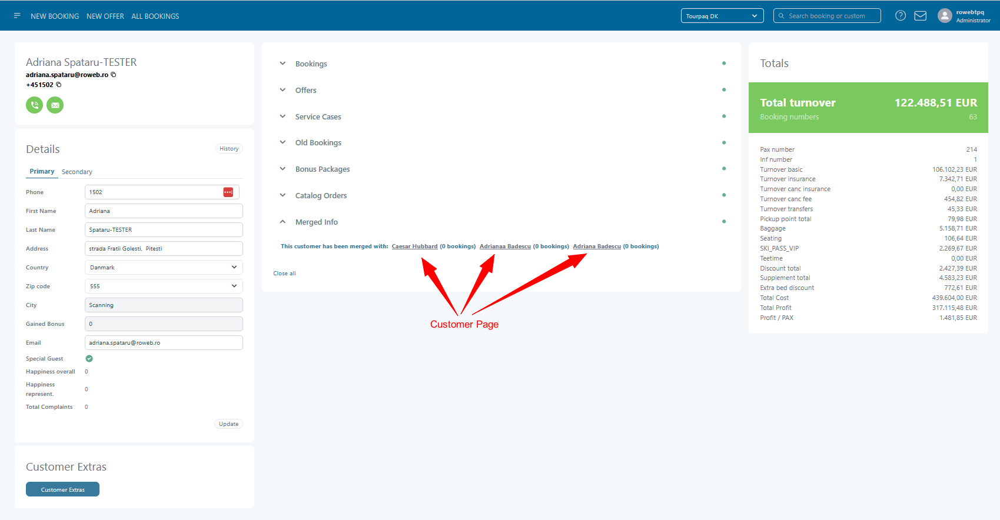

# Merge customers

The **Merge Customers** tool identifies and merges duplicate customer profiles across the platform. Duplicate entries may occur when bookings are created manually, imported from external sources, or submitted through different channels (web booking, sales agents, call center).

Merging customers ensures clean CRM data, correct bonus points, and consistent contact details across all bookings.

***

## **Overview**

At the top of the page, duplicates are automatically grouped based on three criteria:

1. **Grouped customers by email address**
2. **Grouped customers by telephone number**
3. **Grouped customers by ZIP and Address**

Users can switch between categories using the tabs above the list.\
The number of remaining groups is shown next to each tab (e.g. _34 remaining_).

Each group presents potential duplicates that can be reviewed and merged into a single main customer profile.

***

### Grouping Logic 

Customers are automatically grouped by one or more of the following matching criteria:

* 📞 **Phone Number**
* 📧 **Email Address**
* 🏠 **ZIP Code + Address**

Within each group:

* You may **act on the entire group**.
* Or you can create and manage **subgroups** (by selecting specific duplicates).

Once a customer is processed (merged, deleted, or accepted), it will no longer be proposed in future doublet matches—even if newly created duplicates share the same data.

## **Table Explanation**

Each row represents a customer record within a detected duplicate group.

#### **Columns**

<figure><figcaption></figcaption></figure>

| Column           | Description                                                                                                                             |
| ---------------- | --------------------------------------------------------------------------------------------------------------------------------------- |
| **Main**         | Radio button indicating which customer will be kept as the “main” profile when merging. Only one main record can be selected per group. |
| **Subgroup**     | Checkbox to include customers in the merge operation. All selected records will be merged into the chosen Main customer.                |
| **Cust ID**      | Unique customer ID in Tourpaq.                                                                                                          |
| **Booking No**   | Shows if the customer is attached to existing bookings (important when deciding what to merge).                                         |
| **Name**         | Registered customer name.                                                                                                               |
| **Email**        | Customer email address used for grouping and verification.                                                                              |
| **Day Phone**    | Primary phone number.                                                                                                                   |
| **Gained Bonus** | Shows accumulated bonus points associated with the customer profile.                                                                    |
| **P. Code**      | Postal code.                                                                                                                            |
| **Place**        | City or locality.                                                                                                                       |
| **Address**      | Full address.                                                                                                                           |
| **News**         | Indicates if the customer is subscribed to newsletters (`✓`) or not (`×`).                                                              |

The tool displays all duplicate rows clearly so the user can verify differences across email, phone, name spelling, address, and bonus points before merging.

***

## **Actions Toolbar**

Located in the top-right corner of the listing:

#### **Delete All**

Deletes _all selected customers_ in the group.\
Useful when all detected profiles are invalid test entries or data imports.

#### **Accept All**

Marks all selected customers as “accepted” duplicates without merging.\
They will be hidden from future duplicate detection.

#### **Merge All**

Merges all selected subgroup customers into the main customer selected in each group.

***

## **Merging Workflow**

#### **1. Identify duplicates**

The system pre-groups customers using email, phone, or address similarities.

#### **2. Select a Main customer**

Click the radio button under **Main** on the row you want to keep.

#### **3. Select customers to merge**

Use the checkboxes under **Subgroup** for every profile that should be merged into the Main.

#### **4. Apply an action**

Choose whether to:

* **Merge All** – combine the subgroup records into the main profile
* **Delete All** – remove invalid duplicate entries
* **Accept All** – acknowledge the duplicates without merging

***

## **What Happens When Customers Are Merged**

When merging:

* All customer information (email, address, phone, newsletter preferences) is consolidated under the **main** customer.
* All bookings linked to subgroup customers are automatically reassigned to the **main** customer.
* Bonus points from subgroups are combined and added to the main profile.
* Subgroup customer profiles are removed after merging.

This ensures a unified, clean customer database.

***

## **Pagination**

At the bottom of the list, users can navigate between pages of duplicate groups and adjust the number of lines displayed per page (10 / 25 / 50 / 100).

***

## **Summary**

The **Merge Customers** page helps administrators:

* Detect duplicate customer entries
* Clean CRM data across web bookings and manual entries
* Maintain consistent customer information
* Ensure correct bonus point accumulation
* Improve communication accuracy (email/SMS/newsletter)

***

### Special Case: ZIP Code + Address Grouping

* Instead of deleting duplicates, this method **links** all customers in the group.
* A **‘parent customer’** must be selected.
  * All **bonuses and rewards** are redirected to the parent.
  * Linked duplicates still retain **their bookings**.
* On the **parent customer page**, you can:
  * View links to the doublets.
* On the **doublet customer page**, a link to the parent is also available.

📌 **Important:** If any customers in the group have **future bookings**, one of them must become the **parent** during the merge.

<figure><figcaption></figcaption></figure>

### Performance Tips

* For large groups:
  * Perform **several subgroup operations** first.
  * Follow up with a **final group-level action**.
* You can manually **edit customer details** for more refined control before merging.

***

### Summary Table

| Action | Full Group                    | Subgroup                               |
| ------ | ----------------------------- | -------------------------------------- |
| Merge  | Merges all to 1, deletes rest | Merges selected to 1, deletes selected |
| Delete | Deletes entire group          | Deletes only selected                  |
| Accept | Keeps all, skips future match | Accepts selected, skips future match   |

***

### FAQ

<strong>What’s the difference between “Merge All”, “Accept All”, and “Delete All”?</strong>

* **Merge All**: combines the selected customers into the selected **Main** customer. Bookings and bonus points are consolidated to the Main, and the merged (subgroup) customer profiles are removed.
* **Accept All**: keeps the customer profiles as-is, but marks them as handled so they are **hidden from future duplicate detection**.
* **Delete All**: removes the selected customer profiles entirely.

<strong>Do I have to merge the entire group?</strong>

No. You can:

* select a **Main** customer
* choose only some customers in **Subgroup**

Then run **Merge All** to merge only the selected subgroup into the Main.

<strong>What happens to bookings when I merge customers?</strong>

All bookings connected to the selected subgroup customers are automatically reassigned to the **Main** customer during the merge.

<strong>What happens to bonus points when I merge customers?</strong>

Bonus points from the selected subgroup customers are **combined** and added to the **Main** customer.

<strong>Can I undo a merge?</strong>

There is no “undo” action in the merge workflow.


Before merging, double-check that you selected the correct **Main** customer and that the **Subgroup** selection only includes records you intend to consolidate.


If you merged the wrong records, you typically need to correct the data manually (and, if relevant in your setup, recreate missing customer information).

<strong>Why did a duplicate group disappear after I clicked Accept/Merge/Delete?</strong>

Once a customer is processed (merged, deleted, or accepted), Tourpaq treats it as **handled** and it will not be proposed again in future duplicate matches—even if new records share the same email/phone/address.

<strong>When should I use the ZIP Code + Address grouping instead of a normal merge?</strong>

Use **ZIP Code + Address** grouping when multiple customers should be connected to the same household/address, but you **do not** want to consolidate all bookings into a single profile.

In this scenario:

* you select a **parent customer**
* other customers become **linked doublets**
* bonuses/rewards are redirected to the parent, while linked customers keep their own bookings

<strong>Why do I have to choose a “parent customer” when there are future bookings?</strong>

For ZIP Code + Address grouping, Tourpaq requires a stable “main” reference for future handling.

If any customer in the group has **future bookings**, one of those customers must be chosen as the **parent**.

<strong>What should I do if a group is very large (performance/handling)?</strong>

For large groups, it is usually faster and safer to:

1. merge in **smaller subgroups** first
2. finish with a final group-level action

This helps you keep control and reduces the risk of selecting the wrong records.

<strong>Who typically has access to the Merge Customers tool?</strong>

Access is usually limited to users with customer-management permissions (often **Administrators**).

If you don’t see the menu item, it may be due to your role/permissions.

