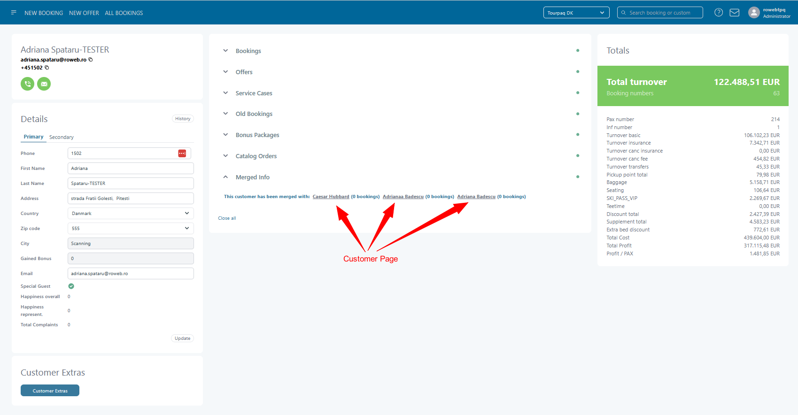

# Merge customers

The **Merge customers** tool helps you deduplicate customer profiles in Tourpaq Office CRM. Duplicates often come from manual entry, imports, or multiple sales channels (web booking, call center, agents).

Merging customers keeps your customer database clean and improves reporting quality. It also helps keep bonus points, bookings, and contact details consistent.

***

### Overview

At the top of the page, duplicates are automatically grouped based on three criteria:

1. **Email address**
2. **Phone number**
3. **ZIP code + address**

Users can switch between categories using the tabs above the list.\
The number of remaining groups is shown next to each tab (e.g. _34 remaining_).

Each group contains potential duplicates that you can review and merge into a single main customer profile.

***

### Grouping logic

Customers are automatically grouped by one or more of the following matching criteria:

* **Phone number**
* **Email address**
* **ZIP code + address**

Within each group:

* You may **act on the entire group**.
* Or you can create and manage **subgroups** (by selecting specific duplicates).

Once a customer is processed (merged, deleted, or accepted), it will no longer be proposed in future duplicate matches, even if newly created customers share the same data.

### Table explanation

Each row represents a customer record within a detected duplicate group.

#### **Columns**

<figure><figcaption>
Duplicate customer group table: choose the main profile and select which duplicates to merge.
</figcaption></figure>

| Column           | Description                                                                                                                             |
| ---------------- | --------------------------------------------------------------------------------------------------------------------------------------- |
| **Main**         | Radio button indicating which customer will be kept as the “main” profile when merging. Only one main record can be selected per group. |
| **Subgroup**     | Checkbox to include customers in the merge operation. All selected records will be merged into the chosen Main customer.                |
| **Cust ID**      | Unique customer ID in Tourpaq.                                                                                                          |
| **Booking No**   | Shows if the customer is attached to existing bookings (important when deciding what to merge).                                         |
| **Name**         | Registered customer name.                                                                                                               |
| **Email**        | Customer email address used for grouping and verification.                                                                              |
| **Day Phone**    | Primary phone number.                                                                                                                   |
| **Gained Bonus** | Shows accumulated bonus points associated with the customer profile.                                                                    |
| **P. Code**      | Postal code.                                                                                                                            |
| **Place**        | City or locality.                                                                                                                       |
| **Address**      | Full address.                                                                                                                           |
| **News**         | Indicates if the customer is subscribed to newsletters (`✓`) or not (`×`).                                                              |

The table helps you compare duplicates before merging (email, phone, spelling, address, newsletter status, and bonus points).

***

### Actions toolbar

Located in the top-right of the list:

#### **Delete All**

Deletes _all selected customers_ in the group.\
Useful when all detected profiles are invalid test entries or data imports.

#### **Accept All**

Marks all selected customers as “accepted” duplicates without merging.\
They will be hidden from future duplicate detection.

#### **Merge All**

Merges all selected subgroup customers into the main customer selected in each group.

***

### Merge workflow

#### **1. Identify duplicates**

The system pre-groups customers using email, phone, or address similarities.

#### **2. Select a Main customer**

Click the radio button under **Main** on the row you want to keep.

#### **3. Select customers to merge**

Use the checkboxes under **Subgroup** for every profile that should be merged into the Main.

#### **4. Apply an action**

Choose whether to:

* **Merge All** – combine the selected records into the main profile
* **Delete All** – remove invalid duplicate records
* **Accept All** – mark duplicates as handled without merging

***

### What happens when customers are merged

When merging:

* All customer information (email, address, phone, newsletter preferences) is consolidated under the **main** customer.
* All bookings linked to subgroup customers are automatically reassigned to the **main** customer.
* Bonus points from subgroups are combined and added to the main profile.
* Subgroup customer profiles are removed after merging.

This ensures a unified, clean customer database.

***

### Summary

The **Merge customers** page helps administrators:

* Detect duplicate customer entries
* Clean CRM data across web bookings and manual entries
* Maintain consistent customer information
* Ensure correct bonus point accumulation
* Improve communication accuracy (email/SMS/newsletter)

***

### Special case: ZIP code + address grouping

* Instead of deleting duplicates, this method **links** all customers in the group.
* A **parent customer** must be selected.
  * All **bonuses and rewards** are redirected to the parent.
  * Linked duplicates still retain **their bookings**.
* On the **parent customer page**, you can:
  * View links to the linked duplicates.
* On each linked duplicate customer page, a link to the parent is also available.

📌 **Important:** If any customers in the group have **future bookings**, one of them must become the **parent** during the merge.

<figure><figcaption>
ZIP code + address grouping: select a parent customer to link household profiles.
</figcaption></figure>

### Performance Tips

* For large groups:
  * Perform **several subgroup operations** first.
  * Follow up with a **final group-level action**.
* You can manually **edit customer details** for more refined control before merging.
