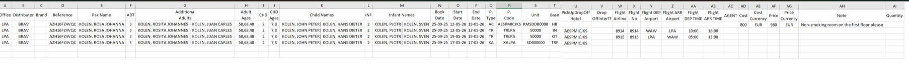

# MTS Globe CSV File Documentation

### Overview

<figure><figcaption></figcaption></figure>

This file contains booking-related information that is sent to MTS Globe for hotel reporting purposes. The report includes:

* Passenger information
* Booking references
* Travel dates
* Product information
* Flight details
* Pricing information
* Notes and operational details

The file format is CSV (Comma-Separated Values) and is designed to support automated processing by external supplier systems.

***

## Purpose

The purpose of this file is to:

* Share booking information with MTS Globe
* Report hotel reservations and related services
* Provide passenger and operational travel details
* Support supplier handling and operational workflows
* Synchronize booking information between Tourpaq and MTS Globe

***

## File Content Overview

The file contains one row per booking service or booking item.

A single booking reference may appear multiple times when:

* Multiple services exist
* Transfers are included
* Hotel and transport services are separated
* Additional booking components are reported individually

***

## Column Documentation

| Column              | Description                                 | Example                 | Purpose                            |
| ------------------- | ------------------------------------------- | ----------------------- | ---------------------------------- |
| Office              | Internal office code generating the booking | LPA                     | Identifies the operational office  |
| Distributor         | Distributor or supplier code                | BRAV                    | Identifies the booking distributor |
| Brand               | Brand associated with the booking           | BRAV                    | Used for brand segmentation        |
| Reference           | Booking reference number                    | AZH16FZ4VQC             | Unique booking identifier          |
| Pax Name            | Main passenger name                         | KOLEN, ROSA JOHANNA     | Primary booking passenger          |
| ADT                 | Number of adults                            | 3                       | Total adult passengers             |
| Additional Adults   | Additional adult passenger names            | KOLEN, ROSITA JOHANNES  | Additional travellers              |
| Adult\_Ages         | Ages of adult passengers                    | 58,68,48                | Passenger age information          |
| CHD                 | Number of children                          | 2                       | Total child passengers             |
| CHD Ages            | Ages of children                            | 7,8                     | Child age information              |
| Child Names         | Names of children                           | Example Child Name      | Child passenger details            |
| INF                 | Number of infants                           | 0                       | Total infant passengers            |
| Infant Names        | Infant passenger names                      | Example Infant          | Infant details                     |
| Book Date           | Booking creation date                       | 2025-09-20              | Date the booking was created       |
| Start Date          | Service or travel start date                | 2025-09-25              | Arrival or service start           |
| End Date            | Service or travel end date                  | 2025-10-02              | Departure or service end           |
| P.Type              | Product type                                | HOTEL / TRANSFER        | Identifies service category        |
| P.Code              | Product code                                | HTL001                  | Supplier product code              |
| Unit                | Room or service unit                        | DBL                     | Operational unit information       |
| Base                | Board basis or service basis                | HB                      | Accommodation basis                |
| PickUpDropOff Hotel | Pickup or dropoff hotel                     | Hotel Example           | Transfer hotel information         |
| DropOffInterTf      | Transfer indicator                          | YES / NO                | Operational transfer handling      |
| Flight Airline      | Airline code                                | FR                      | Passenger flight airline           |
| Flight No           | Flight number                               | FR1234                  | Flight identification              |
| Flight DEP Airport  | Departure airport                           | WAW                     | Passenger departure airport        |
| Flight ARR Airport  | Arrival airport                             | LPA                     | Passenger arrival airport          |
| Flight DEP TIME     | Flight departure time                       | 05:00                   | Scheduled departure time           |
| Flight ARR TIME     | Flight arrival time                         | 13:00                   | Scheduled arrival time             |
| AGENT               | External booking agent                      | Example Agent           | Agent or reseller                  |
| Cost                | Supplier cost amount                        | 800.00                  | Internal supplier cost             |
| Cost Currency       | Currency of supplier cost                   | EUR                     | Supplier cost currency             |
| Price               | Sales price amount                          | 980.00                  | Customer sales price               |
| Price Currency      | Currency of sales price                     | EUR                     | Sales currency                     |
| Note                | Operational booking note                    | Non-smoking room please | Supplier or operational comments   |
| Quantity            | Quantity of booked services                 | 1                       | Number of booked units             |

***

The MTS Globe CSV file is a structured booking export used for supplier communication and operational synchronization.

The structure supports automated FTP reporting and enables MTS Globe to process hotel and travel services efficiently.
