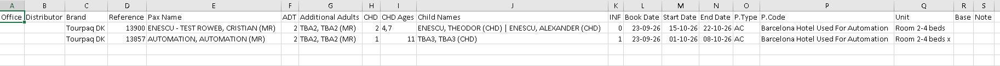
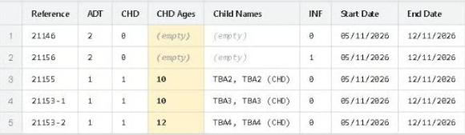
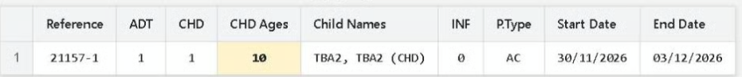
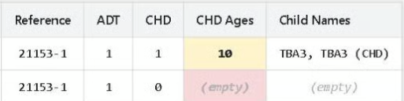

# MTS Globe CSV File Documentation

## Overview

<figure><figcaption></figcaption></figure>

This file contains booking-related information that is sent to MTS Globe for hotel reporting purposes. The report includes:

* Passenger information
* Booking references
* Travel dates
* Product information
* Flight details
* Pricing information
* Notes and operational details

The file format is CSV (Comma-Separated Values) and is designed to support automated processing by external supplier systems.

***

## Purpose

The purpose of this file is to:

* Share booking information with MTS Globe
* Report hotel reservations and related services
* Provide passenger and operational travel details
* Support supplier handling and operational workflows
* Synchronize booking information between Tourpaq and MTS Globe

***

## File Content Overview

The file contains one row per booking service or booking item.

A single booking reference may appear multiple times when:

* Multiple services exist
* Transfers are included
* Hotel and transport services are separated
* Additional booking components are reported individually

***

## Column Documentation

| Column            | Description                                                                                                                                                | Example                             | Purpose                                                                              |
| ----------------- | ---------------------------------------------------------------------------------------------------------------------------------------------------------- | ----------------------------------- | ------------------------------------------------------------------------------------ |
| Office            | Internal office code generating the booking                                                                                                                | LPA                                 | Identifies the operational office                                                    |
| Distributor       | Distributor or supplier code                                                                                                                               | TPQ                                 | Identifies the booking distributor                                                   |
| Brand             | Brand associated with the booking                                                                                                                          | Tourpaq DK                          | Used for brand segmentation                                                          |
| Reference         | Booking reference number                                                                                                                                   | 13900                               | Unique booking identifier                                                            |
| Pax Name          | Main passenger name                                                                                                                                        | KOLEN, ROSA JOHANNA                 | Primary booking passenger                                                            |
| ADT               | Number of adults                                                                                                                                           | 2                                   | Total adult passengers                                                               |
| Additional Adults | Additional adult passenger names                                                                                                                           | TBA2, TBA2                          | Additional travellers                                                                |
| CHD               | Number of children                                                                                                                                         | 2                                   | Total child passengers                                                               |
| CHD Ages          | Age of each child in the reported room, comma-separated. Always present in the file; populated only when the room contains children, otherwise left blank. | 4,7                                 | Each child age is calculated on the check-out date of the actual hotel room reported |
| Child Names       | Names of children                                                                                                                                          | Example Child Name                  | Child passenger details                                                              |
| INF               | Number of infants                                                                                                                                          | 0                                   | Total infant passengers                                                              |
| Book Date         | Booking creation date                                                                                                                                      | 2026-09-23                          | Date the booking was created                                                         |
| Start Date        | Service or travel start date                                                                                                                               | 2026-10-15                          | Arrival or service start                                                             |
| End Date          | Service or travel end date                                                                                                                                 | 2026-10-22                          | Departure or service end                                                             |
| P.Type            | Product type                                                                                                                                               | AC                                  | Identifies service category                                                          |
| P.Code            | Product code                                                                                                                                               | Barcelona Hotel Used For Automation | Supplier product code                                                                |
| Unit              | Room or service unit                                                                                                                                       | Room 2-4 beds                       | Operational unit information                                                         |
| Base              | Board basis or service basis                                                                                                                               | HB                                  | Accommodation basis                                                                  |
| Note              | Operational booking note                                                                                                                                   | Non-smoking room please             | Supplier or operational comments                                                     |

***


The CHD Ages field is populated only when the reported room contains children; when the room has no children, the field is left blank. Each child's age is calculated on the check-out date of the actual hotel room reported, not on the booking date or check-in date.


Examples:

| Scenario                                             | CHD Ages reported                                                 |
| ---------------------------------------------------- | ----------------------------------------------------------------- |
| Room with adults only, no children                   | (empty)                                                           |
| Adults with an infant, no children                   | (empty) — the infant is reported under INF / Infant Names instead |
| One adult and one child in the room                  | 10                                                                |
| Child's birthday falls during the stay (05–12 Nov)   | 10 (age already reached before check-out)                         |
| Child's birthday falls exactly on the check-out date | 12 (the age turned on the check-out day is reported)              |
| Hotel Only booking (no transport)                    | 10 (populated the same way as for transport + hotel bookings)     |
| Child cancelled from the room (amendment)            | (empty) — reverts to blank once no children remain in the room    |

<figure><figcaption>
 <em>The CHD Ages column is populated only for rows with children and left blank for adults-only or infant-only rows</em>
</figcaption></figure>

<figure><figcaption>
<em>A hotel-only booking shows CHD Ages populated the same way as for combined transport-and-hotel bookings.</em>
</figcaption></figure>

<figure><figcaption>
<em>CHD Ages before and after cancelation</em>
</figcaption></figure>

The MTS Globe CSV file is a structured booking export used for supplier communication and operational synchronization.

The structure supports automated FTP reporting and enables MTS Globe to process hotel and travel services efficiently.

