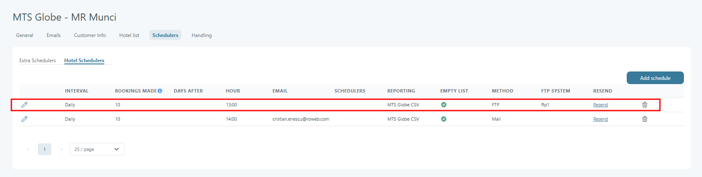
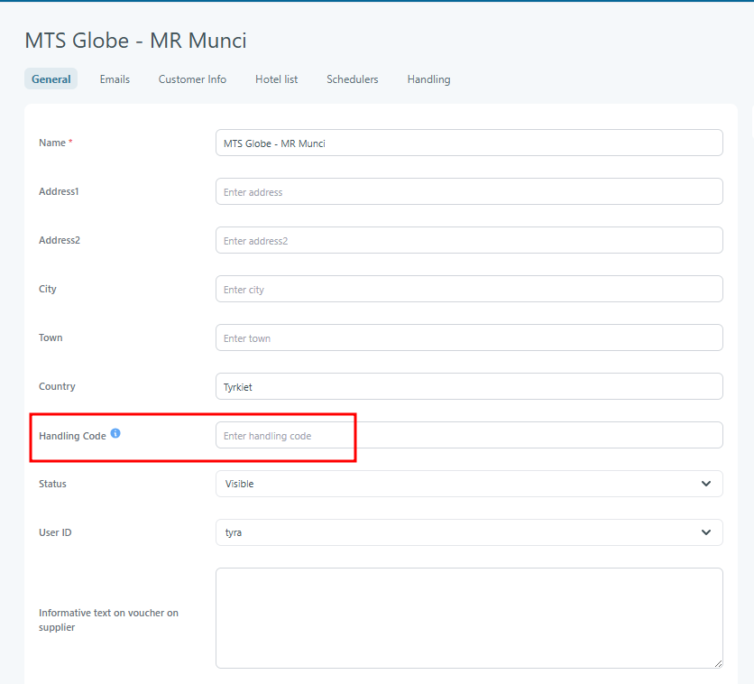
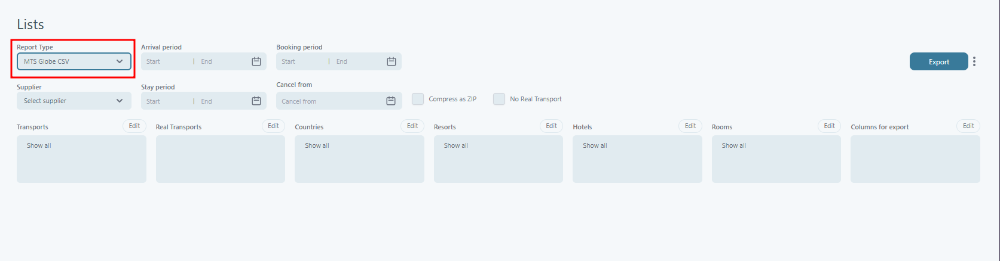

# Specification & Config

### Overview

The MTS Globe Hotel Reporting functionality enables Tourpaq to generate and deliver hotel booking reports to MTS Globe via FTP in CSV format.

The integration supports automated reporting for:

* New bookings
* Cancelled bookings
* Amended (modified) bookings

The reporting mechanism is schedule-driven and tracks previously reported bookings to identify newly created, updated, or cancelled reservations.

This functionality is only available for companies where the **MTS Globe Reporting** feature is enabled by a Super Administrator.

***

## Purpose

The purpose of the MTS Globe Hotel Reporting functionality is to:

* Provide automated hotel booking communication with MTS Globe
* Deliver booking data in the required CSV structure
* Support FTP-based supplier communication
* Allow resending of previously generated schedules
* Maintain synchronization between Tourpaq and MTS Globe booking data
* Support tracking of new, amended, and cancelled bookings

***

## Main Components

The implementation consists of the following areas:

1. Supplier Communication Configuration
2. Scheduler & Reporting Management
3. Company Feature Management
4. Supplier Handling Code
5. Export List Support
6. Reporting Logic & Booking Tracking

***

## 1. Supplier Communication Configuration

### Location

Users → Suppliers → Schedulers → Hotel Schedulers

### Purpose

Extend supplier communication to support FTP-based delivery for MTS Globe reporting.

***

#### Supported Method

* FTP
* Mail

<figure><figcaption></figcaption></figure>

When FTP is selected:

* The user can select one of the configured[ System FTP](../setup/system-setup-ftps.md) entries&#x20;

***

### FTP Configuration

When using FTP communication:

* The scheduler sends CSV files directly to the configured FTP destination
* Multiple files may be generated and sent simultaneously
* Each generated file shall appear individually in the scheduler history list

***

## 2. Scheduler & Reporting Management

### Purpose

Allow users to:

* View all generated reporting files
* Resend reporting schedules
* Track sent booking reports

***

### Scheduler File Visibility

All files sent through the scheduler shall be accessible under the:

* SCHEDULERS heading

For MTS Globe:

* Multiple files may be generated during one execution
* Each file must appear separately in the list

Examples:

* XXXX\_new\_date.csv
* XXXX\_canx\_date.csv
* XXXX\_amend\_date.csv

***

## RESEND Functionality

Purpose - Allow users to resend previously generated schedules.

Tooltip text:

> Resend the list (including changes for report formats that support this)

Resend Button - it is available in the RESEND column.

### Resend Behavior

When clicking the Resend button:

* Active schedules will be resent
* For MTS Globe:
  * New bookings are resent
  * Cancelled bookings are resent
  * Amended bookings are resent


For other reporting formats the current list shall be resent using existing behavior


***

## 3. Company Feature Management

* Control visibility of the MTS Globe functionality per company.Feature Group
* The feature shall be located under Apps and Integrations&#x20;
* The feature can only be enabled by: Super Administrator

***

## 4. Supplier Handling Code

The MTS Globe reporting format requires a supplier handling code.This code is included in the generated reporting files.

***

### Supplier General Changes

A new field is added to the Supplier General section.

<figure><figcaption></figcaption></figure>

Field Name - **Handling Code**

Validation - **Maximum length: 50 characters**

Info Tooltip - Tooltip text:

> The handling code is used in the reporting and is agreed on with the supplier. MTS Globe reporting needs this handling code.

***

## 5. Export List Support

* Location: Exports → Lists
* Allow users to manually generate MTS Globe booking exports.
* New Report Type: MTS Globe CSV

<figure><figcaption></figcaption></figure>

***

### Export Behavior

The export shall:

* Generate a CSV file
* Include current bookings matching the selected filters
* Follow the MTS Globe CSV specification for new bookings

***

## 6. Reporting Specifications

### Purpose

Track previously reported bookings in order to determine:

* New bookings
* Modified bookings
* Cancelled bookings

***

## Reporting Logic

The reporting system shall maintain a list of already reported bookings.

This list is used when the scheduler runs again.

***

### New Bookings

Bookings shall be added to the NEW file when:

* The booking was created since the previous reporting
* The booking was not previously reported

Output file example:

* XXXX\_new\_date.csv

***

### Amended Bookings

Bookings shall be added to the AMENDED file when:

* The booking was already reported
* The booking has been updated or modified

Output file example:

* XXXX\_amend\_date.csv

***

### Cancelled Bookings

Bookings shall be added to the CANCELLED file when:

* The booking was previously reported
* The booking was cancelled
* The booking no longer belongs to the hotel

Output file example:

* XXXX\_canx\_date.csv

***

### Important Rules

#### Rule 1

Cancelled bookings that were never previously reported:

* Shall NOT be reported as new
* Shall NOT be reported as cancelled

***

#### Rule 2

After each successful reporting execution:

* The current booking list becomes the new reference list
* Future comparisons use this updated list

***

## File Naming Convention

The following file naming structure shall be used:

| File Type          | Example               |
| ------------------ | --------------------- |
| New Bookings       | XXXX\_new\_date.csv   |
| Cancelled Bookings | XXXX\_canx\_date.csv  |
| Amended Bookings   | XXXX\_amend\_date.csv |

***

## Example Reporting Scenario

### Initial Scheduler Run

Current bookings:

* Booking A
* Booking B
* Booking C

Generated:

* XXXX\_new\_date.csv

Contents:

* Booking A
* Booking B
* Booking C

These bookings are now stored as reported.

***

### Second Scheduler Run

Changes:

* Booking D created
* Booking B modified
* Booking C cancelled

Generated files:

#### New File

XXXX\_new\_date.csv

Contains:

* Booking D

#### Amended File
