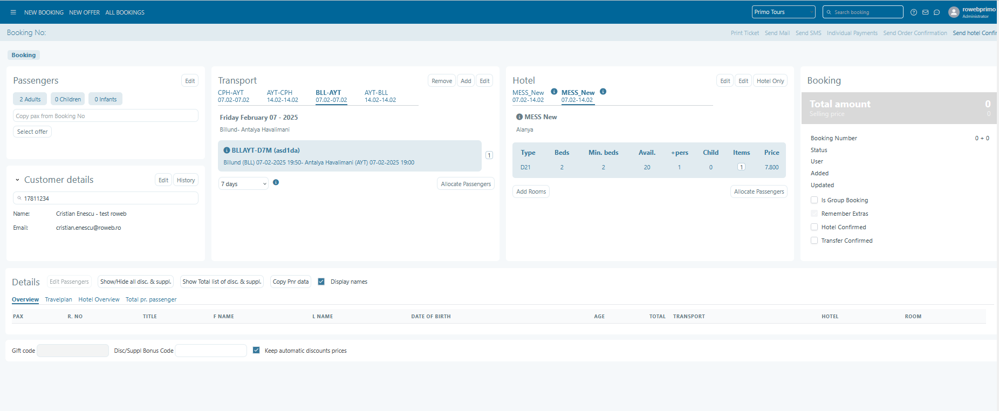
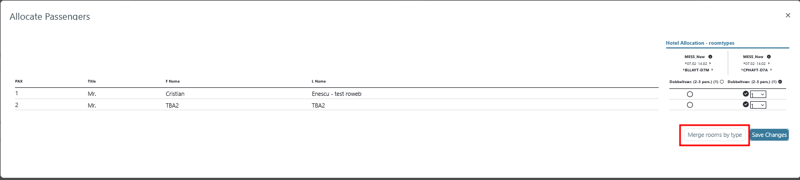

# Multiple transports one room bookings

In Tourpaq,in general the transport and hotel are bundled into a single product and a single price therefore is not possible to take two transport charters and to book a single room. So this feature can do just that by selecting two charters and merge the rooms with same type and same hotel.

In order to activate this, the "Multiple Transports" feature should be activated from SuperAdmin.

As an example, we'll choose two different transports with

* the same arrival
* on the same interval

and the **same** hotel with the **same** room type.

<figure><figcaption></figcaption></figure>

Next, on Allocate Passengers screen, the rooms will be merged by pressing the "Merge rooms by type" button.

<figure><figcaption></figcaption></figure>

Now, the room is successfully merged, and two passengers from two different transports are able to stay in the same room.

Note: _Only one room is taken from the allotment of the hotel_
