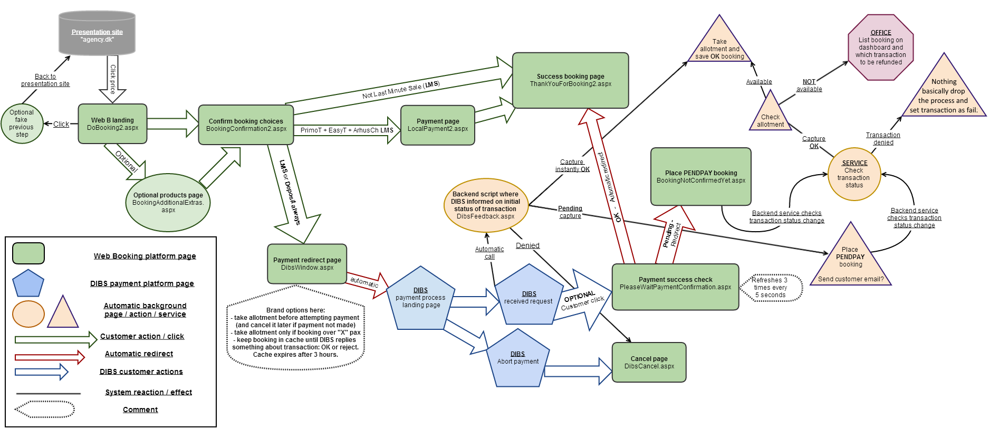
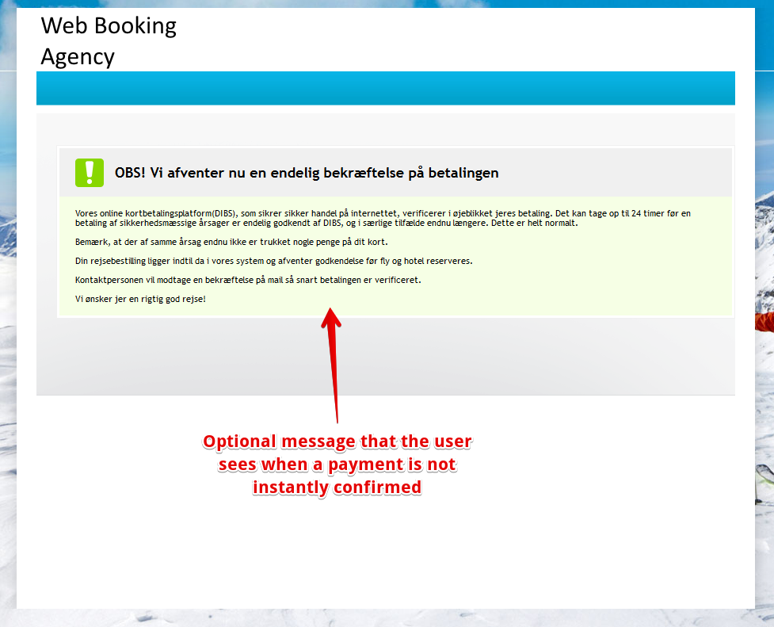

# Pending payments DIBS transaction late response

### Purpose 

The DIBS e-payment platform occasionally does not return an immediate and definitive transaction status (e.g., accepted, captured, or declined). For a small number of transactions, additional time—sometimes several hours—is required for transaction analysis and status updates. During this delay, without the implementation of this new behavior, there was a risk of losing booking information from the temporary cache.

#### **Presentation video**



### **Handling Pending Payments in Tourpaq**

To manage delayed payment confirmations from the DIBS e-payment platform, Tourpaq creates a temporary booking with the status **PENDPAY**. This booking does not block any hotel or transport allotment and serves solely as a placeholder to retain booking information until the payment is either accepted and captured or declined.

Once the transaction is confirmed and the payment successfully captured from the customer's credit card, a background service in Tourpaq:

1. **Checks the updated transaction status.**
2. **Verifies available allotments** (hotel and transport).
3. If allotment is available:
   * The booking is finalized with status **OK**.
   * The customer receives the _“Thank you for booking”_ confirmation email.
   * The standard booking flow resumes.
4. If no allotment is available:
   * A note is added to the _Refund money_ tab in the Tourpaq Dashboard, since the payment has been captured.
   * The brand administrator must manually refund the amount via the DIBS admin interface.
   * The administrator should also register an **out/credit transaction** with the same amount on the booking to remove the transaction from the system.

While canceling the **PENDPAY** booking is optional, it is recommended to maintain clarity in statistical reports.

<figure><figcaption></figcaption></figure>

Another option is to withdraw the money from the booking using a cash-out option, cancel the booking, and place another one. Then add the money to the new booking using a cash-in option with the cancelled booking number and transaction ID in the comment.

For this to work, allotments have to be added in the system if the agency can obtain them from the hotel/transport, or another hotel/transport is used in the booking. In this case, contacting the client and informing him/her of the options is highly recommended.

### **Web Booking and Payment Processing via DIBS**

In certain scenarios—such as **last-minute sales** or when an agency **requires a deposit before allowing direct bookings**—the DIBS payment platform becomes an integral part of the web booking process.

This integration involves:

* A **take-off page** in Tourpaq that sends all necessary transaction details to DIBS.
* A **landing page** that receives feedback from DIBS regarding the transaction outcome.

If the feedback from DIBS is **"capture"**, it indicates that the payment was successful and the amount has been charged to the customer's credit card.

However, in cases where the feedback is **delayed** (arriving minutes or even hours later) or **incomplete** (DIBS confirms receipt of the transaction request but has not yet provided a final status), Tourpaq will now create a **pending payment status** booking. This booking:

* Does **not block** hotel or transport allotment.
* Does **not reserve** seats in the transport seating layout or hotel room layout, if selected.

To ensure transparency, the web booking interface will display a **customizable message**—set per agency—to inform the customer that the booking is not yet confirmed. The message typically explains that the final confirmation depends on receiving a successful payment status from DIBS, and that, once confirmed, the customer will receive an automatic email confirming the booking.

<figure><figcaption></figcaption></figure>

Instead of sending the "Thank you for booking" email (it's not the case yet), Tourpaq can send an explanatory email, **"Pending payment notification,"** with more or less the same earlier details.

<figure><figcaption></figcaption></figure>

### **Tourpaq Service: Pending Payment Status Checker**

The **Pending Payment Status Checker** service continues the booking workflow initiated by the Web Booking module when a transaction remains incomplete. This service runs periodically—approximately every **2 hours**—and processes **incomplete payment transactions** in **chronological order**, checking their current status with the DIBS platform.

#### Handling Unresolved Transactions

Some transactions may remain in a **"pending" state indefinitely**. To prevent stale data accumulation, Tourpaq will automatically **mark such transactions as failed** if no update is received within **5 days** of their creation.

#### Processing Updated Transactions

When a transaction receives a definitive update from DIBS (either **captured** or **declined**), the service takes the appropriate action:

**1. If the transaction is captured:**

* The system checks if **hotel and transport allotment** is still available.
  * **If allotment is available**:
    * The system reserves the necessary allotment.
    * The booking is finalized with status **OK**.
    * The transaction is recorded as **successful**.
  * **If allotment is no longer available**:
    * A notice is placed in the **"Refund Money"** tab of the **Tourpaq Office Dashboard**, as the customer has been charged but the booking cannot be completed.
    * An automated email of type **"Captured money but no allotment"** may be sent to the customer, explaining that no rooms or seats were available at the time of payment confirmation and that they will likely be contacted for a refund shortly.

**2. If the transaction is declined:**

* The system marks the transaction and associated booking as **failed**, and no further action is taken.

#### Additional Notices

Other notice types may also appear in the **Refund Money** tab, each indicating different issues related to payment and allotment processing. For a detailed explanation of these, refer to the **Office** section of the documentation.

### **Office: Managing PENDPAY Bookings**

In the **Tourpaq Office**, all pending payment bookings (**PENDPAY**) can be viewed and edited from the **"View All Bookings"** page. However, note that these bookings are **excluded from turnover and profit calculations** until they are finalized.

#### ⚠️ Important Recommendations

* **Avoid making major changes** to PENDPAY bookings.
* You **may update customer or passenger names**, manage extras, or perform other minor edits.
* **Do not cancel a PENDPAY booking** before it appears in the **"Refund Money"** tab on the dashboard.

#### Behavior of PENDPAY Bookings

* If a payment is received through **alternative methods** (e.g., bank import, cash), the booking will **remain in PENDPAY status**, as **only a response from DIBS** can finalize the transaction and change the status to **OK**.
* If an immediate OK-status booking is required (e.g., due to cash or manual payment):
  * Manually create a **new booking**.
  * Link the received payment to the new booking.
  * The original PENDPAY booking must still wait for a final DIBS status update to be resolved correctly.

***

#### **Refund Money Tab: Overview of Situations**

The **Refund Money** tab on the dashboard highlights PENDPAY bookings that require administrative action. These include:

**1. Refund Money**

* The payment was **captured**, but the booking could not be completed (e.g., no allotment available).
* Actions:
  * The brand administrator must **refund the amount** using the **DIBS admin interface**.
  * Record a matching **out/credit transaction** on the booking to balance the payment.
  * Canceling the PENDPAY booking is **optional**, but **recommended** to maintain clean statistics.

**Alternative Option:**

* Withdraw the payment using a **cash-out transaction**.
* Cancel the PENDPAY booking.
* Create a **new OK-status booking**.
* Apply the payment using a **cash-in transaction** with comments referencing the original booking and transaction ID.

***

**2. Check Booking**

* The service **successfully completed the payment and finalized** the booking as **OK**.
* Actions:
  * Check the **internal comment** on the booking to verify if the customer selected specific **transport seating or hotel room layouts**.
  * Manually assign those selections to the booking if needed.
  * Review the overall **booking integrity**.

***

**3. Timeout**

* No status update was received from DIBS **within 5 days** of the transaction.
* The system considers this a **failed transaction**.
* Actions:
  * Manually **verify the status in the DIBS admin interface**.
  * If the transaction remains unconfirmed, the booking may be **canceled**.
  * If the payment is confirmed **after 5 days**:
    * Cancel the original booking.
    * Create a **new OK booking**.
    * Either:
      * Inform **Tourpaq Support** to reassign the original payment.
      * Or add a **fictive payment** to the new booking with a comment referencing the original DIBS transaction.

***

**4. Tourpaq Error**

* An error occurred in the Tourpaq system while processing the payment.
* Actions:
  * **Contact Tourpaq Support** and provide relevant booking details.
  * Wait for guidance or a fix before taking further action.

***

#### 📝 Additional Notes

* **Pending transactions older than 5 days are no longer checked** by the system. They are automatically marked as **declined**.
* A **PENDPAY booking cannot be manually set to OK** by an admin. Only the **Pending Payment Status Checker service** can update the booking’s status based on DIBS responses.
* If special handling is required, consider **creating a new booking** and managing the process there.
