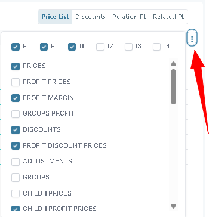
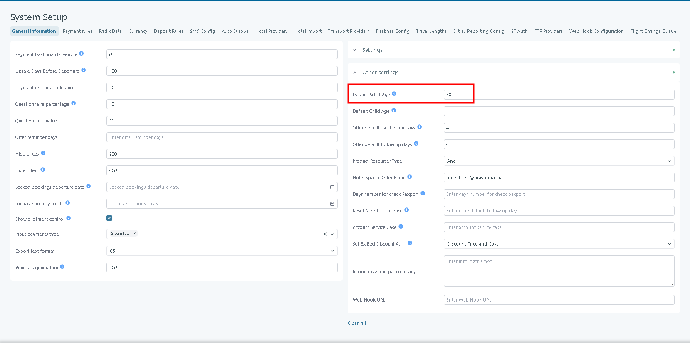
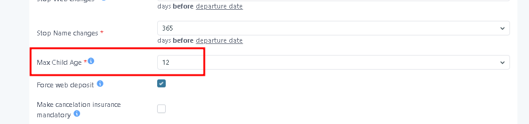
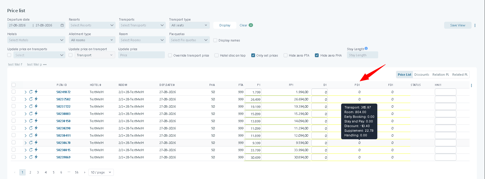
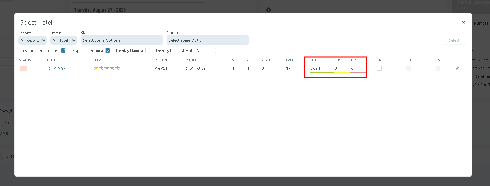
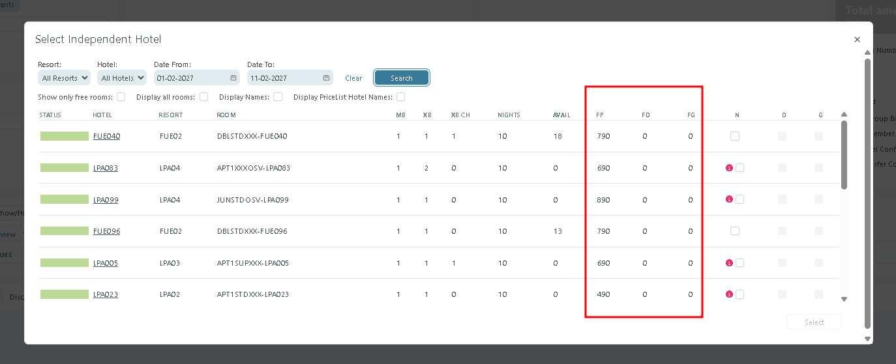

# Price List

## Overview

The **Price List** is where you create and maintain selling prices in **Tourpaq Office**.

Most packages combine a [Transport](../transport/transport/) with a hotel [Base room type](../base-room-types.md), plus rules like discounts, child rates, group pricing, and stay length (intervals). Each price list line is tied to a **departure date** and controls what can be sold.

You typically use this page to:

* Create/copy price lists for a transport + hotel + room combination
* Search and filter existing price lists by date range, resort, transport, hotel, and room
* Maintain prices per interval (P1–P4), discounts (D1–D4), and child prices (CH…)
* Review PLTA history, clear API cache, and recalculate free rooms/seats
* Update prices across related transports when transport price changes

## Purpose

A **Price List** is the foundation of how trips and offers are sold in Tourpaq.

Its purpose is to:

1. **Define the selling price of a trip**
   * Combines **Transport** (flight/bus/ship seats) + **Hotel** (room types, allotments) + other conditions (discounts, stay length, children rates, groups).
   * Ensures every departure date and room type has a price assigned.
2. **Control availability**
   * Price lists link prices with **allotments** (how many rooms/seats are available).
   * Without a price list, even if there are seats/rooms available, the package cannot be booked.
3. **Support different sales channels**
   * The same price list is used by:
     * **Agencies** (offers presented on agency sites).
     * **Web Booking (WB)** (online sales).
     * **Office** (internal bookings by staff).
4. **Enable flexibility**
   * Prices can be adjusted per:
     * Interval (P1, P2, P3, P4 = different stay lengths or price periods).
     * Age groups (child/adult discounts).
     * Trip type (one-way, round-trip).
     * Brand (same hotel/transport may have different prices depending on the brand).
5. **Provide historical and operational control**
   * Price lists track **changes over time** (history log).
   * Manual recalculations or adjustments can be made when allotments or transport costs change.

## How it Works

### Create/copy price list 

Creating a price list is straightforward. In the **Price List** tab, click **Create/Copy Price List** and follow the steps below:

1. Choose the **brand** for which you want to create the price list.
2. Select the **transport**.
3. Select the **transport’s fixed quota**.
4. Select the **hotel**.
5. Choose the **rooms**.
6. Click **Create new price list**.

<figure><figcaption></figcaption></figure>

If you create a price list without **Profit Margin (PM)** rules, the price list is created **without prices**. You must then enter prices manually, or calculate them using your internal rules.

The **Create new price list** action can show different warnings:

* If **no lines are created**, a warning message appears:
  * "The price lists were NOT created. Please check transport and hotel allotments and recreate the price lists"

<figure><figcaption></figcaption></figure>

* If **some lines are created** (but not all selected combinations), a warning message appears:
  * "The price lists were not created for ALL allotments. Press display to see the generated price list or check transport and hotel allotments and recreate the price list"

<figure><figcaption></figcaption></figure>

<figure><figcaption></figcaption></figure>

### Price List Search 

The **Price List Search** section allows users to filter, view, and bulk update pricing configurations across hotels, rooms, transports, and allotments.

This functionality is designed for high-volume price management, supporting granular filtering and batch operations.

#### Overview

Use this page to:

* Filter price list entries based on multiple criteria
* Perform bulk price updates
* Maintain pricing consistency across large datasets

<figure><figcaption></figcaption></figure>

#### Search Filters

The search panel provides multiple filters to narrow down the pricing scope.

* **Date From/To Fields**: Set the date range for price list queries (format DD-MM-YYYY)


When changing the **Brand**, the system preserves the selected **Date Interval** and **Arrival Interval** filters.



Prices outside the selected interval will not be affected by bulk operations.


* **Resorts Dropdown**: Select specific resorts to include in the price list.
* **Transports Dropdown**: Configure transport options with code format


Only transports associated with the selected resort are displayed.

Example: If resort BCN is selected, only transports linked to BCN will be available.


<figure><figcaption></figcaption></figure>

* **Transport Type Dropdown**: Filter by transport categories
* **Hotels Dropdown**: Select specific hotels. Allows selecting one or multiple hotels.
* **Allotment Type Dropdown**: Select the allotment type
* **Room Dropdown**: Select a specific room type


When **All hotels** is selected, it is possible to select multiple room types across hotels.

This enables bulk price updates across a broader selection.


<figure><figcaption></figcaption></figure>


Room availability depends on the selected hotels and date interval.


* **Fix Quotas Dropdown**: Select a transport fix quota


Only **Fix Quotas** within the selected date interval are available.


* **Display Names Checkbox**: Toggle to show hotel names in results
* **Display Checkbox**: Toggle to show the price list results
* **Clear Button**: Reset all filter selections (shows "1" indicator, possibly indicating active filters)
* **Stay Length Field**: Used to filter price lists for a specific stay length. It is possible to specify one stay, several stays or a range.

#### Price Display Options

* **Hotel Disc on Top Checkbox**: Show hotel discounts prominently
* **Only Set Prices Checkbox**: Display only confirmed/set prices
* **Hide Zero FTA Checkbox**: Exclude zero-value FTA (likely "Free to Agent") rates
* **Hide Zero PHA Checkbox**: Exclude zero-value PHA rates

#### View Management

* **Save View Button**: Preserve current filter configuration
* **Update View Button**: Modify existing saved view
* **Menu Icon (⋮)**: Additional options menu

#### Example: Running a Search

1. Open the **Price List Search** page.
2. In the **Date From / To** fields, enter _01-07-2025_ to _15-07-2025_ to search for the first half of July.
3. From the **Brand** drop-down, select TourpaqDK.
4. The **Transports** list is now filtered for TourpaqDK. Select the transport option _FLY-RO_.
5. In the **Hotels** drop-down, select _Hotel Marina_.
6. Choose **Double Room with Balcony** from the **Room** field.
7. Enter _7_ in the **Stay Length** field to filter for week-long stays.
8. Under **Price Display Options**, check **Only Set Prices** to display confirmed rates only.
9. Click **Display** to run the search.


The system displays all available TourpaqDK **→ FLY-RO transport → Hotel Marina → Double Room with Balcony → 7-night stays between 01–15 July 2025**, showing only confirmed prices.


### Save / Update View

The Price List page supports saving custom table views.\
This allows users to quickly reuse the same filters, column setup, and display configuration without reconfiguring the page each time.

#### Accessing the View Menu

The view actions are available from the options menu in the top-right corner of the page.

To open the menu:

1. Click the three-dot menu button.
2. Select one of the available actions:
   * **Save View**
   * **Update View**
   * **Export**

<figure><figcaption></figcaption></figure>

#### Save View

The **Save View** action creates a new reusable view based on the current page configuration.

The saved view stores:

* Selected filters
* Selected transports
* Hotel and room filters
* Table configuration
* Visible columns
* Other active display settings

After saving:

* The new view appears in the view tabs area above the table.
* Users can switch between saved views directly from the tabs.

Example:\
`Automaiton`, `all-cols-test`, and `JPN` are saved views.

#### Update View

The **Update View** action updates the currently selected saved view with the latest page configuration.

Use this when:

* Filters were changed
* Columns were adjusted
* Display settings were modified
* The existing saved view should reflect the new setup

Behavior:

* Only the currently active view is updated.
* The view name remains unchanged.
* The updated configuration becomes the default layout for that saved view.

#### Manage Views

<figure><figcaption></figcaption></figure>

Existing saved views can also be renamed or deleted.

To manage views:

1. In the views bar, click the three dots (`⋯`) button.
2. Select **Manage Views**.

In the dialog that opens:

* Rename a view by editing its name in the text field.
* Delete a single view using the trash can icon on its row.
* Use **Multiple delete** to remove several views at once.
* Click **Save** to apply the changes.

#### View Tabs

Saved views are displayed as tabs above the results table.

Behavior:

* Clicking a tab loads the saved configuration.
* The active view is highlighted.
* Users can quickly switch between different working layouts.

#### Typical Use Cases

Examples of saved views:

* Transport-specific pricing setups
* Market-specific layouts
* Hotel-specific configurations
* QA/testing views
* Operational pricing workflows

This feature helps reduce repetitive filtering and improves workflow efficiency for users working with large pricing datasets.

#### Transport and Hotel Selection Behavior

* **All Brands Selected:**
  * When **All Brands** is selected, all available transports will appear in the **Transport** drop-down list.
* **Specific Brand Selected:**
  * If a specific brand is chosen, only transports assigned to that brand will appear.
  * Transports are assigned to brands via **Transport → Brands Tab | Brands Tab → Edit Transport**.
  * Transports marked as **hidden** will not appear in the drop-down list. Transport visibility can be managed in **Transport → General Tab → General**.
  * If a specific resort is chosen, only transports associated with the selected resort are displayed.
* **Transport Selection Effects:**
  * Once a transport is selected, the **Fix Quota** field is automatically populated within the selected date interval.
  * The **Hotels** drop-down is filtered to display only hotels associated with the selected transport’s price list.
  * Hotels marked as **hidden** will not appear. Visibility can be configured in **Hotel → Hotel Tab → General Tab**.
* **Hotel Selection Effects:**
  * Selecting a hotel reveals two additional fields.
  * These fields provide tools to help save prices using algorithms described in:
    * **Price List → Also Update Prices on Transports**
    * **Price List → Update Prices Based on Transport**

### Display Price List 

After performing a search, the **Price List** results are displayed in a table format. For performance optimization:

* Prices are **not loaded all at once**.
* Clicking the **Display** button loads the **first 25 entries**.
* As you scroll down, the next 25 entries are loaded incrementally until the entire list is displayed.
* By default, most columns are **hidden** to improve performance and maintain clarity.

<figure><figcaption></figcaption></figure>

#### Column Overview

Column titles are abbreviated to keep the table tidy. Most fields include **tooltips** that display the full column name. Below is a full list of columns with explanations:

<table><thead><tr><th width="374">Column</th><th>Description</th></tr></thead><tbody><tr><td><strong>PLTA ID</strong></td><td>Price List Unique Identifier. Double-clicking the ID redirects to the <strong>Web Booking Page</strong> for the specific booking configuration.</td></tr><tr><td><strong>Hotel</strong></td><td>Hotel Code corresponding to the booking configuration.</td></tr><tr><td><strong>Room</strong></td><td>Room Code corresponding to the booking configuration.</td></tr><tr><td><strong>Dep. Date</strong></td><td>Departure date for the booking configuration.</td></tr><tr><td><strong>STAYS</strong></td><td>Length of stay for interval 1 of the transport.</td></tr><tr><td><strong>FHA</strong></td><td>Free Hotel Allotment – Number of rooms available for this departure. Default value represents a one-week trip (interval 1). Hover displays allotments for 1, 2, 3, or 4 weeks.</td></tr><tr><td><strong>FTA</strong></td><td>Free Transport Allotment – Number of transport seats available. Default represents a one-week round trip. Hover displays available seats for 1, 2, 3, or 4 weeks round trip, as well as one-way outbound and inbound trips.</td></tr><tr><td><strong>P1</strong></td><td>Price for Interval 1.</td></tr><tr><td><strong>P2</strong></td><td>Price for Interval 2.</td></tr><tr><td><strong>P3</strong></td><td>Price for Interval 3.</td></tr><tr><td><strong>P4</strong></td><td>Price for Interval 4.</td></tr><tr><td><strong>CH1</strong></td><td>Child Price Interval 1 – Price for a child occupying an extra bed. Calculated using an extra bed discount applied to the Grundprins (base price).</td></tr><tr><td><strong>Status</strong></td><td>Guarantee Availability of the PLTA (Transport + Hotel). Possible statuses: - <strong>GREEN</strong> – Both transport and hotel have guaranteed allotments. - <strong>YELLOW</strong> – One of transport or hotel lacks Guarantee Availability. - <strong>PINK</strong> – Neither transport nor hotel has Guarantee Availability.</td></tr><tr><td><strong>FP</strong></td><td>Final price. Price including discounts, supplements, and handling. Price per person, based on the number of adults from <strong>Ordinary beds</strong>.</td></tr><tr><td><strong>FD</strong></td><td>Final discount price. Price including discounts, supplements, and handling. Price per person, based on the number of adults from <strong>Ordinary beds</strong>.</td></tr><tr><td><strong>FG</strong></td><td>Final group price. Price including discounts, supplements, and handling. Price per person, based on the number of adults from <strong>Ordinary beds</strong>.</td></tr><tr><td><strong>FCH1P</strong></td><td>Final child 1 price. Price including discounts, supplements, and handling. Price per person.</td></tr><tr><td><strong>FCH1D</strong></td><td>Final child 1 discount price. Price including discounts, supplements, and handling. Price per person.</td></tr><tr><td><strong>FCH2P</strong></td><td>Final child 2 price. Price including discounts, supplements, and handling. Price per person.</td></tr><tr><td><strong>FCH2D</strong></td><td>Final child 2 discount price. Price including discounts, supplements, and handling. Price per person.</td></tr><tr><td><strong>FCH</strong></td><td>Final child price. Price including discounts, supplements, and handling. Price per person.</td></tr></tbody></table>

### Change Price Functionality 

<figure><figcaption></figcaption></figure>

The Change Price tool allows bulk modification of pricing values.

#### Operation Types

Supported operations:

* **+** Increase value
* **-** Decrease value
* **=** Replace value

#### Negative Value Support


When using the **"=" (Replace)** operation, the system accepts **negative values**.



Negative values will overwrite existing prices. Use carefully, especially in live environments.


**Use cases:**

* Applying corrections in PM1
* Setting negative pricing for adjustments or special scenarios

<figure><figcaption></figcaption></figure>

### Price List History 

Price list history is a way to see the evolution in time of prices.

<figure><figcaption></figcaption></figure>

At the beginning of each row, there are tree icons:

* View History - where you can see the evolution of prices like in Figure 3.
* Clear API Cache - by clicking the icon, you can clear the cache on the API for that particular prices
* Free Rooms Count|Recalculate Free room count - you can recalculate on demand both transport and hotel allotment for current prices

#### Column Filters 

The Price List column selector allows users to choose which price types and intervals are displayed.

<figure><figcaption></figcaption></figure>

**Column Filters** allow you to display specific portions of information from the Price List grid.

* **F** - Select **F** to display the Final Prices for the selected price groups. When F is selected, the corresponding Final Price columns are displayed.
* **P** - Select **P** to display the original Price List Prices.&#x20;
* Each **interval group** has a corresponding checkbox: **Interval 1 (P1), Interval 2 (P2), Interval 3 (P3), Interval 4 (P4)**.
* Example: If **ALL PRICES (P1, P2, P3, P4)** is checked and **Interval 1** is selected as the active filter, only the **P1** column will be displayed in the table.
* Columns **not grouped into intervals** are always shown by default.

### Saving the column configuration

The selected Price List columns are saved **per browser**.

When the Price List is opened again, it uses the column configuration from the previous session.

The system no longer automatically loads the left-most saved view when opening the Price List.

This means users can keep the configuration they normally use without having to select the required columns every time.

The saved configuration includes:

* F / Final Price selection
* P / Price List Price selection
* Price groups
* Interval selections

#### Example

A yield user who normally works with Final Prices for intervals 1 and 2 can configure:

**F → PRICES → DISCOUNTS → I1 → I2**

After saving the configuration, the same columns are displayed when the Price List is opened again in the same browser.

#### Discounts 

<figure><figcaption></figcaption></figure>

### Relation PL & Related PL 

These are covered in [Relational price list](../relational-price-list.md)

#### Also Update Prices on Transports 

The fields are displayed only if the hotel is selected in the search form.

This function is used to update the prices that share the same hotel but have different transports.

Example:

Let's take transport T0 and the Transport T1 and each one has a price list with the same hotel, H0, so we have price lists T0\_H0 and T1\_H0. The difference between the price in T0 and T1 is 100, so we set this value on the transport T1 in the column Transport Price (**TP**). When the price on the T0\_H0 is changed, we have the option to update the price on the T1\_H0 as well.

`T1_H0_Price = T0_H0_Price + T1_H0_Transport_Price`

If Override Transport Price is checked and the filed next to the check-box is filled, the column Transport Price, will be overwritten in the transport T1\_H0

A simple workflow could be:

* Select in the search form Brand, Transport, Fix Quota and Hotel, and click Display button
* Check Also update prices on transports and select one or more Transport in the list (The list of transports in this drop down list are transport that have price list with the same hotel)
* Check the Override Transport Price and fill the amount
* Change one or more prices on the grid and click the Save button.

After the save, you will notice that the price on the selected transport with the same hotel and room has been changed accordingly by the formula above.

### Update Prices Based on Transport 

This function allows prices to be **automatically recalculated when the Transport Price changes**.

* The fields are **displayed only when a hotel is selected** in the search form.
* **Purpose:** Update prices (P1, P2, D1, D2, etc.) based on changes in the selected transport.
* The **transport drop-down list** shows only transports that share the **same hotel and room**.
* Example: If **P1** was previously updated using the **Also Update Prices on Transports** tool, and the **Transport Price** is modified, **P1** will be recalculated accordingly based on the price list for that transport.

## How Final Prices are calculated

The Final Price is the **price per person for a booking**, including:

* Discounts
* Supplements
* Handling

It does not include extras.

The calculation is designed to reproduce the price that will appear on the web for the same package configuration.

### Adult price calculation

The calculation uses a standard booking configuration based on the room.

#### Number of passengers

The number of adult passengers is taken from the room's:

**Ordinary beds**

For example:

* Ordinary beds = 1 → calculation uses 1 adult
* Ordinary beds = 2 → calculation uses 2 adults
* Ordinary beds = 3 → calculation uses 3 adults

#### Adult age

The adult passengers use the age configured as:

**System Setup → Other Settings → Default Adult Age**

If **Default Adult Age** is not configured, the calculation uses age **99**.

<figure><figcaption></figcaption></figure>

#### Price per person

The total calculated booking price is divided by the number of ordinary beds:

**Final Price = Total booking price ÷ Number of ordinary beds**

The same approach is used for the Final P and Final D prices.

***

### Child price calculation

Child Final Prices are calculated using a booking configuration containing up to two children.

The adult configuration remains the same as for the adult calculation.

The child age used for the calculation is:

**Max Child Age ÷ 2**

This age is used to create the child booking scenario used for the Final Child Price calculation.

#### Example

If: **Max Child Age = 12**

then: **Child age used for the calculation = 12 ÷ 2 = 6**

The system uses a child passenger with age 6 when calculating the Final Child Price.

<figure><figcaption></figcaption></figure>

***

## Example: Supplement

Consider a double room with:

* Ordinary beds: 2
* Price List P1: 4,000 SEK
* Room supplement: 200 SEK
* No discounts
* No handling fee

The Price List P1 remains:

**P1 = 4,000 SEK**

The Final Price calculation includes the supplement.

The resulting Final Price is calculated from the booking price after the supplement is applied.

The important distinction is:

| Price      | Value                          |
| ---------- | ------------------------------ |
| P1         | 4,000 SEK                      |
| Supplement | +200 SEK                       |
| FP1        | Calculated final selling price |

The **P1 value is not changed** to 4,200 SEK.

Instead, **FP1** represents the calculated final selling price.

***

## Example: Discount

Consider a trip with:

* Price List P1: 5,000 SEK
* Discount: 500 SEK
* No supplements
* No handling fee

The Price List values remain:

**P1 = 5,000 SEK**

The discount is included when calculating the Final Discount Price.

The resulting Final Discount Price represents the selling price after the discount has been applied.

| Price    | Value                                   |
| -------- | --------------------------------------- |
| P1       | 5,000 SEK                               |
| Discount | -500 SEK                                |
| FD1      | Calculated final discount selling price |

Again, the original **P1 and D1 values are not modified**.

The Final Price columns provide the calculated selling price separately.

***

## Final Prices and profit calculation

Profit calculations in the Price List are based on the **Final Price**, rather than the original P/D/G values.

This allows yield users to see the forecasted profit based on the price that the customer will actually pay after applicable discounts, supplements, and handling.

The profit columns include:

| Column   | Description                                                                |
| -------- | -------------------------------------------------------------------------- |
| **PP**   | Profit forecast based on the final price. For one pax. Interval n          |
| **PD**   | Profit forecast based on the final discount price. For one pax. Interval n |
| **PG**   | Profit forecast based on the final group price. For one pax. Interval n    |
| **PCH1** | Profit forecast based on the final child 1 price. For one pax. Interval n  |
| **PCH2** | Profit forecast based on the final child 2 price. For one pax. Interval n  |

The child profit columns PCH1 and PCH2 are handled by the child price adjustment functionality.

The tooltip on the profit column heading explains that the forecast is based on the corresponding Final Price.

***

## PD tooltip

The tooltip displayed for a PD price explains the costs and adjustments included in the price.

The tooltip includes:

| Item            | Description                           |
| --------------- | ------------------------------------- |
| **Discounts**   | The sum of all eligible discounts     |
| **Supplements** | The sum of all eligible supplements   |
| **Handling**    | The sum of all eligible handling fees |

This makes it possible to understand why the Final Price differs from the original Price List Price.

<figure><figcaption></figcaption></figure>

***

## Booking window

The booking window uses Final Prices in the hotel selection dialogs.

This ensures that salespeople see the same price calculation that will be used for the booking.

The following dialogs use Final Prices:

#### Select Hotel

<figure><figcaption></figcaption></figure>

#### Select Independent Hotel

<figure><figcaption></figcaption></figure>

***

## Booking price including extras

Final Prices do not include extras.

When the complete booking price is required, including extras, the system provides access to the booking price calculated through the Elastic API.

The calculation is available for a **2-pax booking** and provides a quick way to verify the booking price without manually creating a test booking.

This is useful when a customer asks for the expected booking price and the package contains additional extras.

#### Example

A package can have:

* Final Price: 4,500 SEK
* Supplement: included in Final Price
* Discount: included in Final Price
* Handling: included in Final Price
* Extra: 300 SEK

The Final Price remains:

**4,500 SEK**

The complete booking price including the extra is:

**4,800 SEK**

The complete amount should be checked using the booking price calculation rather than the Final Price column.
