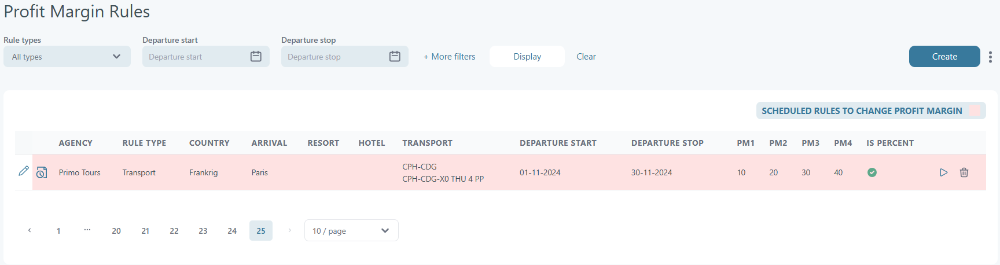
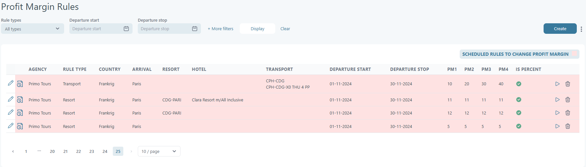

# Profit margin rules

Under **Price List → Profit Margin Rules**, users can define rules to set profit margin values in price lists.

There are two types of rules: **Transport Rules** and **Resort Rules**.

For **Transport Rules**, users must:

* Select the **brand** and one or more **transports**.
* Define **departure start** and **departure stop** intervals.
* Set the profit margin values (**PM1–PM4**). Negative profit margins can be set, but this requires the "Use negative value in profit margin" company feature. Please contact an administrator for assistance.

The system will then update all price lists created with the selected transports. For example, a rule setting **PM1–PM4** for the interval **01-11-2024 to 30-11-2024** will apply to all price lists using transports **CPH-CDG and** **CPH-CDG-X0 THU 4 PP**, covering all hotels at the corresponding destination for agency **Primo Tours**.

<figure><figcaption></figcaption></figure>

**Resort Rules** can be created in three ways:

1. **All Resorts Rule**\
   Applies to all price lists created with all hotels from all resorts available for the selected brand within the specified departure interval.
2. **Resort-Specific Rule**\
   Applies to all price lists created with all hotels from a selected resort for the chosen brand within the specified departure interval.
3. **Hotel-Specific Rule**\
   Applies to price lists created with selected hotels for the chosen brand.

**Profit Margin Calculation:**\
For a given brand and departure interval, the profit margin (**PM**) is calculated as:\
**PM = PMT + PMD + PMH**

Where:

* **PM**: The profit margin is set in the price list.
* **PMT**: Profit margin from the **Transport Rule**.
* **PMD**: Profit margin from the **Destination Rule**.
  * **PMD = PMA**: Profit margin from the **All Resorts Rule** (defined at the destination).
  * **PMD = PMR**: Profit margin from the **Resort-Specific Rule** (overrides **PMA**).
* **PMH**: Profit margin from the **Hotel-Specific Rule**.

Once added, rules are scheduled to update the profit margins.\
The same rule can be defined for different departure intervals.

**Example:** Profit margin rules are defined below:

<figure><figcaption></figcaption></figure>

<figure><figcaption></figcaption></figure>

The value in the price list will be the sum of profit margins from Transport, Resort, and Hotel.

<figure><figcaption></figcaption></figure>

<figure><figcaption></figcaption></figure>

Based on the profit margin value, prices are calculated.

* **Manual Changes**: Any manual changes in the price list will overwrite values set by the rules.
* **Rule Updates**: If a rule is later updated and scheduled, it will overwrite manually updated values in the price list.
* **Automatic Scheduling**: A Resort Rule can be scheduled automatically when new price lists are created for hotels in that resort.
