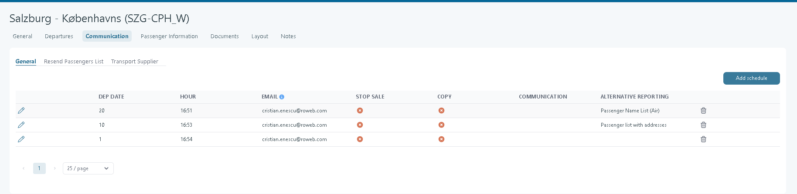
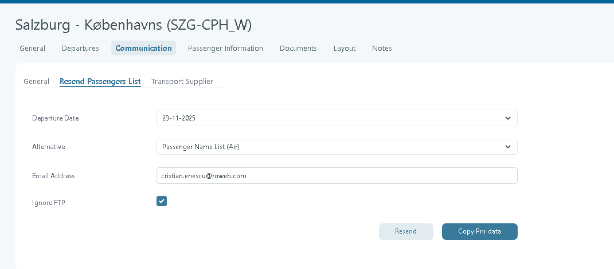

# Communication

## Overview

ransport Reporting is a way to send the passenger name list (**PNL**) to the airline. There are multiple methods to send the PNL.

The default reporting method is set in **Real** **Transport → General tab**. A tour operator code is required for some reporting types.

<figure><figcaption></figcaption></figure>

Another reporting method can be set up from the **Communication** tab.

By clicking **Add schedule**, you can define rules that send communication files to the specified email address.

**Defining separate rules for each departure date**

The rules shown in the image below will send communication files to the configured email address for all bookings on the selected transport, **20**, **10**, and **1** day(s) before departure date.

<figure><figcaption></figcaption></figure>

## Resend Passenger List

In some situations, passenger data must be resent to the transport supplier after the original reporting has already been generated and transmitted.

Tourpaq provides a manual resend function from the transport configuration.

#### Navigation

Go to:

```
Real Transport
→ Communication
→ Resend Passenger List
```

<figure><figcaption></figcaption></figure>

#### Purpose

The feature allows administrators to manually resend passenger reporting files for a selected departure date.

Typical use cases include:

* Missing supplier delivery.
* Corrections after configuration changes.
* Resending bookings after supplier request.
* Verification and troubleshooting of reporting output.

#### Fields

| Field          | Description                                                                          |
| -------------- | ------------------------------------------------------------------------------------ |
| Departure Date | Select the departure to be reported again.                                           |
| Alternative    | Select an alternative reporting                                                      |
| Email Address  | Send the generated file to a specific email recipient.                               |
| Ignore FTP     | Generates and sends the file without uploading it to the configured FTP destination. |

#### Actions

**Resend**

Generates a new passenger reporting file using the current reporting logic and selected departure.

The file is processed using the same Sunclass export format as standard reporting.

**Copy Pnr Data**

Copies the passenger reservation data used for reporting.

This function is primarily intended for support, troubleshooting, and validation of exported passenger information.

#### Notes

* Resending a passenger list does not alter booking data.
* The generated file follows the same header, passenger, and footer formats used by the automated Sunclass reporting service.
* Previously reported bookings remain tracked by the reporting system.
* The resend function can be used regardless of whether the original transmission was sent via FTP or email.

## Transport Supplier <a href="#transport-supplier" id="transport-supplier"></a>

The **Transport Supplier** tab provides an overview of previously generated transport reporting files and allows users to review reporting activity for a specific period.

#### Navigation

```
Real Transport
→ Communication
→ Transport Supplier
```

<figure><figcaption></figcaption></figure>

This tab shows the list of communication triggered by the rules from the Transport Supplier.

#### Purpose

The page is used to:

* View transport reporting activity.
* Search for previously generated reporting files.
* Verify that reports have been created and transmitted.
* Troubleshoot transport supplier communication.
* Review reporting methods used for specific departures.

#### Search Filters

| Field                 | Description                                     |
| --------------------- | ----------------------------------------------- |
| Start Date            | Beginning of the reporting period.              |
| End Date              | End of the reporting period.                    |
| Reporting Method      | Filter by one or more reporting methods.        |
| Alternative Reporting | Filter by alternative reporting configurations. |

#### Actions

**Display**

Retrieves all reporting records matching the selected filters.

**Clear**

Resets all filters and returns the search criteria to their default state.
