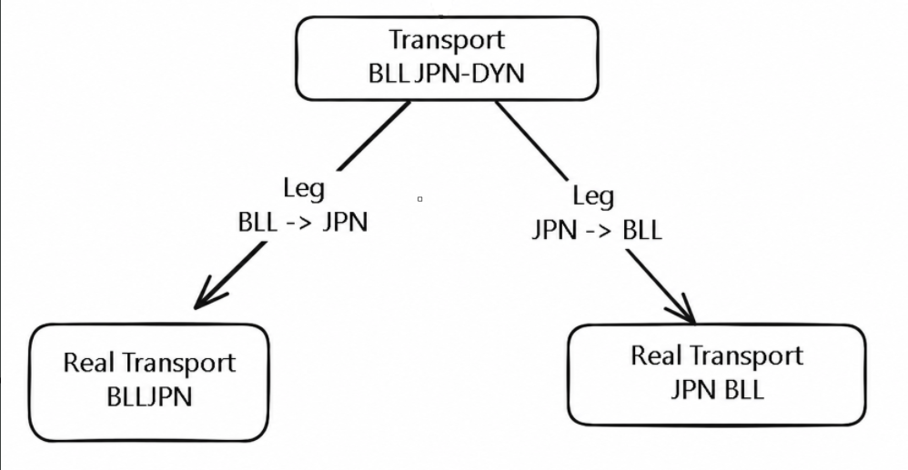
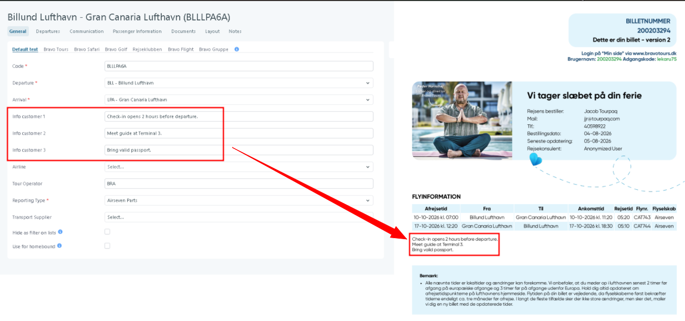

# Create New Real Transport

## Overview

The **New Real Transport** feature is used to create and manage transport entities that represent actual transportation services operated by suppliers.

This configuration allows administrators to define transport routes, assign suppliers, configure automatic seat allocation, and control how the transport is displayed and reported throughout the platform.

<figure><figcaption></figcaption></figure>

<figure><figcaption></figcaption></figure>

***

## Purpose

The Real Transport configuration enables you to:

* Create operational transport services.
* Define departure and arrival locations.
* Connect transports to suppliers and reporting structures.
* Configure automatic passenger seating.
* Control transport visibility in filters and lists.
* Support homebound transport selection.
* Provide additional customer information fields visible during booking and reporting.

***

## Prerequisites

Before creating a Real Transport, ensure that:

* Departure and Arrival locations already exist in the system.
* Transport suppliers have been configured.
* Required reporting types are available.
* Airlines

***

## How to Configure a Real Transport

Navigate to:

**Transport → Real Transport → Create**

The configuration screen contains two sections:

1. **General**
2. **Automatic Seating**

***

## General Section

**Code** \* - Defines the unique identifier for the transport.

***

**Departure** \* - Specifies the transport departure location.

* Select an existing departure location from the dropdown list. (**Example: Stockholm)**

***

**Arrival** \* - Specifies the transport destination.

* Select an existing arrival location. (**Example: Barcelona)**

***

I**nfo Customer 1 / 2 / 3 -** These fields allow administrators to store additional information that can be displayed to customers during booking and is shown on the ticket.

Typical uses include:

* Check-in instructions
* Meeting point information
* Terminal details
* Supplier notes

**Examples**

| Field           | Example Value                            |
| --------------- | ---------------------------------------- |
| Info Customer 1 | Check-in opens 2 hours before departure. |
| Info Customer 2 | Meet guide at Terminal 3.                |
| Info Customer 3 | Bring valid passport.                    |

<figure><figcaption></figcaption></figure>

***

**Airline -** Associates the transport with a specific airline.&#x20;

* Select an airline from the dropdown list.
* It is the default option and can be configured in the [**Departure**](departures/) tab (**Example:** Scandinavian Airlines (SAS))

***

**Tour Operator -** Specifies the responsible tour operator for the transport.

Enter the operator name if the transport belongs to a specific operator.(**Example: RWB Tours**)

***

**Reporting Type** \* - Select from the dropdown the reporting used for this transport

Select the appropriate reporting type from the dropdown list.

Examples may include:

* Passenger name List
* Pick up list (Bus)
* Train
* Paxport
* etc

***

**Parent -** this field it is used to link one real transport to another real transport.

If you use **parent-child transports**, the system can **share the same seat layout** between them:

* The child transport uses the **same layout selected for the parent** in the **Layout** tab.

For **Real Transport + Parent/Child transports**, the system ties together **allotments**, **seat layout**, and **seat cost** like this:

#### 1) Allotment handling (what gets booked) 

When a booking is created with a **child transport**, the seat usage is deducted from **both**:

* the **child transport allotment**, and
* the relevant **parent transport allotment(s)**

Outbound and homebound can come from different parents, and the docs explicitly note both legs are booked from the correct parent sets on the correct departure/return dates.

See: [Allotments](https://manual.tourpaq.com/transport/transport/allotments)

Also, for **child transports**, **Fix quota generation depends on the parents**—your child quota date range must fall within the parents’ date ranges.

See: [Transport creation](https://manual.tourpaq.com/transport/transport/transport-creation)

#### 2) Layout (what seats look like) 

If you use **shared layouts** (parent/child):

* Select the **same layout as the parent** in the child’s **Layout tab**
* Seats/occupancy stays synchronized both ways (child booking shows occupied on parent and vice-versa)
* Enable **Automatic Seating** for each child transport

See: [Transport Layouts](https://manual.tourpaq.com/transport-layouts)

For a specific **Real Transport departure**, assign the seating layout in the Real Transport **Layout tab** (per departure date).

See: [Layout](https://manual.tourpaq.com/real-transports/layout)

#### 3) Cost (how seat prices are calculated) 

* Seat **cost price per seat** is derived from **transport allotments** (guaranteed seats, pro rates, free/booked intervals) and **tax**, per the algorithm in the Transport Dashboard.
* If **Simple cost** is enabled, that detailed allotment-based explanation is bypassed.

See: [Transport Dashboard](https://manual.tourpaq.com/transport-dashboard)

If you set **Base Cost** on a **Real Transport** departure:

* it overrides **calculated seat cost in the Price List only**
* it **does not** change booking operational cost

See: [Add Base Cost on Real Transports](https://manual.tourpaq.com/real-transports/departures/add-base-cost-on-real-transports)

***

**Transport Supplier -** Defines the supplier responsible for operating the transport (**Example: saxaxa)**

***

**Hide as Filter on Lists -** Hide the real transport in the lists throught the system

* Enabled - The transport will **not** appear as a selectable filter.
* Disabled - The transport can be selected in filters throughout the system.

***

**Use for Homebound -** Check this when is it used for return home

* Enabled - The transport becomes available for homebound assignments.

***

## Automatic Seating Section

The **Automatic Seating** functionality automatically distributes passengers into available seats.

This feature reduces manual seat assignment and ensures that unseated passengers are allocated before departure.

***

**Use Automatic Seating -** Activates automatic seat distribution.

When enabled, the system automatically assigns seats to passengers who do not already have seats.

When disabled, seat assignment must be performed manually.

***

**Hour Before Departure -** How many hours before departure the system will automatically place the passengers into the airplane

Enter the number of hours before departure when the system should execute seat allocation.

**Example**

| Value | Result                                                      |
| ----- | ----------------------------------------------------------- |
| `24`  | Seats are automatically assigned 24 hours before departure. |
| `12`  | Seats are assigned 12 hours before departure.               |

***

**Email Address(es)** - Specifies recipients who should receive notifications related to automatic seating.

**Instructions**

Enter one or more email addresses.

Multiple email addresses can be separated by comma.

**Example:** operations@company.com, transport@company.com

***

## Example Configuration

| Field                 | Example                |
| --------------------- | ---------------------- |
| Code                  | STOBCN                 |
| Departure             | Stockholm              |
| Arrival               | Barcelona              |
| Airline               | SAS                    |
| Tour Operator         | RWB Tours              |
| Reporting Type        | PNL                    |
| Transport Supplier    | saxaxa                 |
| Use Automatic Seating | Enabled                |
| Hour Before Departure | 24                     |
| Email Address         | operations@company.com |

#### Result

* The flight is available in bookings.
* Passengers can be assigned to the transport.
* Unseated passengers automatically receive seats 24 hours before departure.
* The transport is included in manifests and supplier reports.
* Operational staff receive seating notifications by email.
