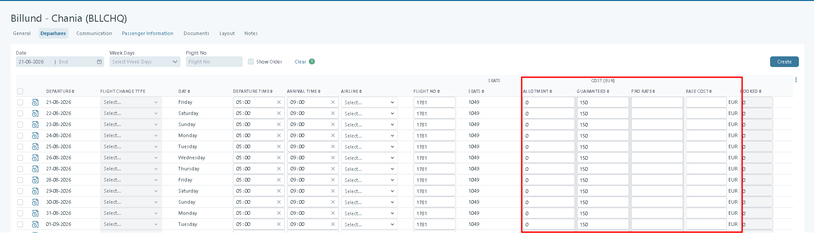

# Departures

### Overview

**Departures** (under _Real Transports_) shows every planned departure for a specific real transport.

Each row is one departure. It includes the date, times, airline, flight number, seats, prices, and status.

You can edit one row at a time. You can also update many rows at once.

### Purpose

Use this page to keep departures correct and up to date.

This helps your bookings match what the supplier will actually operate.

### Before you start

Make sure these are in place:

* You have confirmed times, seats, and prices with the supplier.

### View departures

1. Open **Transports → Real Transports → Departures**.
2. Review the list for the selected real transport.
3. Turn on **Show Older** if you also need past departures.

### Page layout

<figure><figcaption></figcaption></figure>

#### Filters and tools

Use these filters at the top of the page:

* **Date / End** – Choose the date range to display.
* **Week Days** – Filter by day of the week (you can pick more than one).
* **Flight No** – Search by flight number.
* **Show Older** – Include departures from the past.
* **Clear** – Reset all filters.
* **Run** – Apply the filters.

#### Buttons and actions

* **Create** – Opens a new line to create a departure manually.
* **Send Flight Change** – Sends updated flight details to connected systems. It also saves your edits.&#x20;


When a flight change is submitted, a **notification email** is sent to the guest.

* The email contains a **confirmation link** for the guest to acknowledge the change.

If the guest **does not confirm receipt**, the system will:

* **Resend the email** several times.
* Then, **send an SMS reminder** asking the guest to check their email and confirm the change.

Within the system, it is easy to identify guests who **have not yet confirmed** receipt.

If no confirmation is received after multiple attempts, the flight change is **forwarded to a service email**, allowing the team to take further action (such as calling the passenger).


* **Queue Flight Change** – Saves your edits and puts the change in a queue for later processing.

See [Flight Change](../../flight-change/)

### Select rows (row selector)

Located on the left of the table.

* You can select **one**, **many**, or **all** departures.
* The header shows **“N of M selected”**.
* **Select All** selects all rows in the current result set.

Row selection is required for:

* Updating many rows at once
* Running the **Change Value** tool
* Sending or queueing flight changes

### Change Value tool (update many rows)

Use **Change Value** when you need the same change on several departures.

#### Available options

* **Column**: Choose which column to update
* **Operation**: Add, subtract, or replace
* **Value**: Numerical or text, depending on the field
* Press **Run** to apply the change to all selected rows

#### Examples

* Add +10 to PR Seat
* Replace Airline with “Airseven”
* Subtract 5 minutes from Departure Time

Some columns do not support Change Value. Those fields must be edited per row.

### Table columns

These are the most common columns on this page.

| Column                 | Description                                                                                                                                                                                                                                                                                                                                                                                                                                                                                                                                                                               |
| ---------------------- | ----------------------------------------------------------------------------------------------------------------------------------------------------------------------------------------------------------------------------------------------------------------------------------------------------------------------------------------------------------------------------------------------------------------------------------------------------------------------------------------------------------------------------------------------------------------------------------------- |
| **Departure**          | The planned departure date                                                                                                                                                                                                                                                                                                                                                                                                                                                                                                                                                                |
| **Flight Change Type** | 
Displays the type of flight change for the given date based on what changed at the respective departure. Flight change types are configured in System Setup -> Flight Change Queue. (See <a href="../../flight-change/">Flight Change</a>)
                                                                                                                                                                                                                                                                                                                                      |
| **Day**                | Weekday of the departure                                                                                                                                                                                                                                                                                                                                                                                                                                                                                                                                                                  |
| **Departure Time**     | Planned time of departure                                                                                                                                                                                                                                                                                                                                                                                                                                                                                                                                                                 |
| **Arrival Time**       | Planned time of arrival                                                                                                                                                                                                                                                                                                                                                                                                                                                                                                                                                                   |
| **Airline**            | Airline operating the flight                                                                                                                                                                                                                                                                                                                                                                                                                                                                                                                                                              |
| **Stop Sale**          | If checked, then the departure is no longer available for sale. Existing bookings on the departure are not affected.                                                                                                                                                                                                                                                                                                                                                                                                                                                                      |
| **Days**               | If the arrival passed midnight, specify the number of days added                                                                                                                                                                                                                                                                                                                                                                                                                                                                                                                          |
| **Offset**             | Is used to adjust hotel check-in or hotel check-out. For an outbound, the offset determines the hotel check-in, and for a homebound, the check-out is adjusted. A positive value adjusts the check-in/out later, and a negative value adjusts the check-in/out earlier.                                                                                                                                                                                                                                                                                                                   |
| **Flight No**          | Flight number (editable)                                                                                                                                                                                                                                                                                                                                                                                                                                                                                                                                                                  |
| **Class**              | Flight class                                                                                                                                                                                                                                                                                                                                                                                                                                                                                                                                                                              |
| **Transport Supplier** | Supplier configuration                                                                                                                                                                                                                                                                                                                                                                                                                                                                                                                                                                    |
| **Seats**              | Total seats on the departure. Allotment seats = Seats − (Guaranteed + Pro Rate).                                                                                                                                                                                                                                                                                                                                                                                                                                                                                                          |
| **Allotment (seats)**  | Seats available as allotment seats                                                                                                                                                                                                                                                                                                                                                                                                                                                                                                                                                        |
| **Guaranteed (seats)** | Seats you have guaranteed with the supplier                                                                                                                                                                                                                                                                                                                                                                                                                                                                                                                                               |
| **Pro Rate (seats)**   | Seats handled as pro rate seats                                                                                                                                                                                                                                                                                                                                                                                                                                                                                                                                                           |
| **Allotment cost**     | Cost per allotment seat                                                                                                                                                                                                                                                                                                                                                                                                                                                                                                                                                                   |
| **Guaranteed cost**    | Cost per guaranteed seat                                                                                                                                                                                                                                                                                                                                                                                                                                                                                                                                                                  |
| **Pro Rate cost**      | Cost per pro rate seat                                                                                                                                                                                                                                                                                                                                                                                                                                                                                                                                                                    |
| **Tax**                | Tax amount per passenger                                                                                                                                                                                                                                                                                                                                                                                                                                                                                                                                                                  |
| **Base cost**          | 
If a base cost is specified, it will be used as the transport cost when calculating the price in the price list. The load factor will not impact the base cost. Note: The transport cost used in a booking is the actual cost of a seat (calculated based on the load factor, etc.).

If Base Cost is specified:
<ul><li>It overrides Guaranteed, Allotment, and Pro-rate seat costs in the Price List</li><li>The Load Factor does not affect this value</li></ul>
If Base Cost is empty:
<ul><li>The system uses the current transport cost calculation logic</li></ul> |
| **Load Factor (%)**    | Expected percentage of seats that will be filled                                                                                                                                                                                                                                                                                                                                                                                                                                                                                                                                          |
| **Booked**             | Number of booked passengers                                                                                                                                                                                                                                                                                                                                                                                                                                                                                                                                                               |
| **PNR**                | Booking reference (PNR), if used for this departure                                                                                                                                                                                                                                                                                                                                                                                                                                                                                                                                       |
| **Booked Attached**    | If enabled, the departure is linked to the parent transport                                                                                                                                                                                                                                                                                                                                                                                                                                                                                                                               |

You can edit most fields directly in the table. Some fields may be locked.

### Sorting

Columns marked as **sortable** can be clicked to reorder departures:

* Ascending
* Descending

Useful for:

* Grouping by airline
* Sorting by date
* Finding high load factor departures

### Create departures

1. Click **Create** to add a new departure.
2.  Fill in the fields below. Fields marked with `*` are required.

    * **Type** – Select **Daily** or **Weekly**.

    <figure><figcaption></figcaption></figure>

    * **Frequency**
      * If **Daily**: set **Every N days**.
      * If **Weekly**: set **Every N weeks**, then select the weekday(s).
    * **Period** – Set the date period you want to create departures for.
    * **Seats and pricing**
      * **Guaranteed seats** `*` – Number of guaranteed seats.
      * **Guaranteed seat cost** `*` – Cost per guaranteed seat.
      * **Allotment seats** – Number of allotment seats.
      * **Allotment seat cost** – Cost per allotment seat.
    * **Flight info**
      * **Airline** – Airline operating the flight.
      * **Flight no** `*` – Flight number.
      * **Transport Supplier** – The supplier responsible for the transport.
      * **Departure / Arrival Time** – Planned take-off and landing times.
      * **Add days** – Add days to the arrival date (for overnight flights).
      * **Class** – Travel class, if used.
      * **Departure time UTC** icon – Shows the UTC times and flight time.
3. Click **Save** to store the departure.

## Real Transport Cost Calculation

The Real Transport cost represents the cost allocated to each passenger based on the transport's guaranteed commitment and the number of passengers booked on the corresponding departure.

The cost is calculated separately for the **outbound** and **homebound** flights. The resulting costs are then combined to determine the total transport cost for the passenger's round trip.

### Cost configuration

The Real Transport departure contains the values used as the basis for the cost calculation.

In the **Departures** tab, the relevant cost fields are displayed in the **Cost** section:

<figure><figcaption></figcaption></figure>

| Field           | Description                                                                                                                      |
| --------------- | -------------------------------------------------------------------------------------------------------------------------------- |
| **Allotment**   | The number of seats allocated to the departure.                                                                                  |
| **Guaranteed**  | The guaranteed number of seats committed for the departure. This value is used to calculate the guaranteed transport commitment. |
| **Pro Rate**    | The pro-rata cost associated with the departure, when applicable.                                                                |
| **Base Cost**   | The base cost used for the transport cost calculation.                                                                           |
| **Load Factor** | The load factor applied to the transport cost, when configured.                                                                  |
| **Booked**      | The number of passengers booked on the departure.                                                                                |


The guaranteed commitment is calculated from the guaranteed seats and the applicable cost per guaranteed seat.


### How the passenger cost is calculated

There are **two methods for calculating the passenger cost**, depending on whether the flight has departed:

1. **Before departure**\
   The passenger cost is calculated based on the expected **Load Factor**. This provides an estimated cost per passenger based on the expected number of seats to be sold. The result is therefore an **approximate cost**, based on projected sales.
2. **After departure**\
   Once the flight has departed, the passenger cost is recalculated using the **actual number of seats sold**. The total flight cost is divided by the actual number of passengers booked. This represents the **actual passenger cost for the flight** and is no longer based on the expected Load Factor or sales projections.

***

### Examples

The passenger cost is calculated differently before and after the flight departure.

#### Example 1: Passenger cost before departure

Before departure, the passenger cost is based on the expected **Load Factor**.

Assume:

* Guaranteed seats: **174**
* Cost per guaranteed seat: **1,283.00**
* Total flight cost: **174 × 1,283.00 = 223,242.00**
* Expected Load Factor: **90%**
* Expected passengers: **174 × 90% = 156.6**, approximately **157 passengers**

The estimated passenger cost is:

**223,242.00 ÷ 157 = 1,422.56**

Therefore, before departure, the estimated passenger cost is approximately **1,422.56 per passenger**.

This is an **estimated cost**, because it is based on the expected Load Factor and the number of passengers expected to be sold.

#### Example 2: Passenger cost after departure

After the flight has departed, the calculation uses the **actual number of passengers booked** instead of the expected Load Factor.

Assume:

* Guaranteed seats: **174**
* Cost per guaranteed seat: **1,283.00**
* Total flight cost: **174 × 1,283.00 = 223,242.00**
* Actual passengers booked: **171**

The actual passenger cost is:

**223,242.00 ÷ 171 = 1,305.51**

Therefore, after departure, the actual passenger cost is **1,305.51 per passenger**.

#### Difference between the two calculations

|                            |     Before departure |          After departure |
| -------------------------- | -------------------: | -----------------------: |
| Calculation basis          | Expected Load Factor | Actual passengers booked |
| Expected/actual passengers |                  157 |                      171 |
| Total flight cost          |           223,242.00 |               223,242.00 |
| Passenger cost             |             1,422.56 |                 1,305.51 |
| Cost type                  |            Estimated |                   Actual |

The key difference is that **before departure, the calculation uses projected sales based on the Load Factor, while after departure, it uses the actual number of passengers booked**. Therefore, the post-departure calculation represents the actual cost per passenger for the flight.

***

### When is the cost updated on the booking?

The transport cost on the booking is based on the cost calculated for the relevant Real Transport departures and is updated when the cost is changed.

When the cost of a **Departure** is modified, the updated cost is not applied to the related bookings immediately.

A background service runs at a configurable interval, **30 minutes by default**, and recalculates:

* all **Pricelists** linked to the affected **Real Transport**
* all **Bookings** that use that **Real Transport**

The **30-minute interval is configurable per company**.

The total time required to complete the recalculation depends on the number of records that need to be processed. A large number of affected **Pricelists and Bookings** can increase the time required for the service to complete the update.

Therefore, the cost update on a booking may not be immediate. The booking is updated when the background recalculation service processes the affected records.
