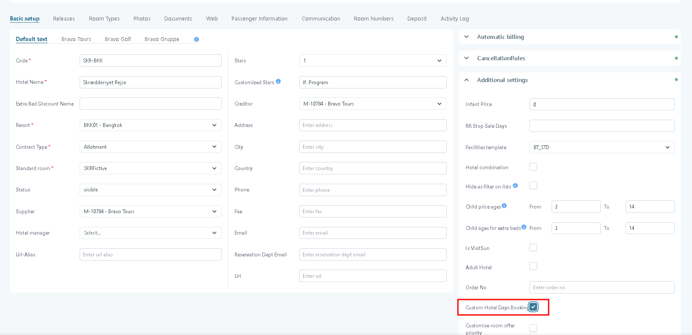
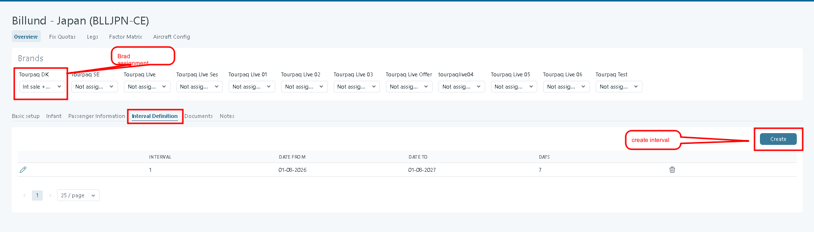
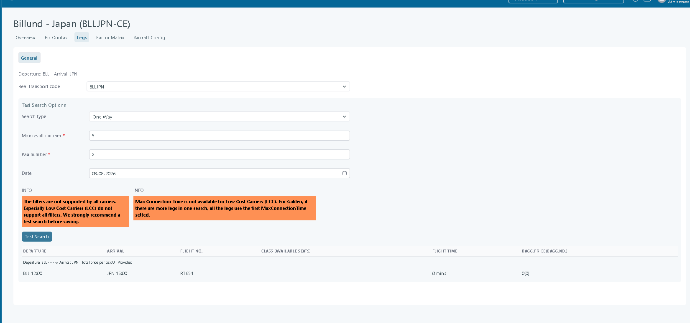

# Transport Definition

### Overview

When you create a transport, you can enable **Dynamic itineraries**. This lets the system combine **GDS flights** with **your own real transports**. This is done per departure, based on the **Legs** you define.

<figure><figcaption></figcaption></figure>

After the transport was created, the next step is to create an interval and assign the transport to a brand.

<figure><figcaption></figcaption></figure>

### Legs

Use **Legs** to define how the itinerary is built.

* A **leg** is one segment in the itinerary. It connects a departure city to an arrival city.

<figure><figcaption></figcaption></figure>

In the "Choose provider" menu, there is the possibility of making 3 different configurations depending on the type of provider chosen, as follows:

**Own Database -** If on the tabs of legs on the tabs of choose providers you have own database checked, in the general tab -> configure, only the test and real transport code fields will be displayed.

<figure><figcaption></figcaption></figure>

**External API** - If an External API is selected in the Choose provider tab (Amadeus, Paxport, Railhub, or Travelport), then all fields are displayed except the Real Transport code.

<figure><figcaption></figcaption></figure>

**Own Database + External API** - If we have both an external API and Own Database on the chosen provider, then all the fields will be displayed.

<figure><figcaption></figcaption></figure>

For each leg, you define **filters**. The filters apply to **GDS** **transports**.

* Click **Search** to preview which options match your filters.

<figure><figcaption></figcaption></figure>

### Field descriptions and instructions

#### Route information

* **Departure -** Fixed departure airport for this transport (read-only).
* **Arrival -** Fixed arrival airport for this transport (read-only).

#### Time information

* **Departure preferred time -** Optional target departure time.
* **Departure earliest time -** Earliest allowed departure time.
* **Departure latest time -** Latest allowed departure time.

#### Travel limitations

* **Maximum stops number -** Maximum number of stops allowed.
* **Maximum travel time (h) -** Maximum total journey duration in hours, including connections.
* **Maximum connection time (min) -** Maximum allowed layover time between legs, in minutes.

#### Cabin configuration

* **Permitted Cabins -** Cabins that are allowed (for example Economy, Business). Only selected cabins will be returned.
* **Preferred Cabins -** Cabins that should be prioritized when available, but not strictly enforced.

#### Connection points

* **Permitted connection points -** Cities or airports where connections are allowed.\
  Use **Add** to define CITY and/or AIRPORT.
* **Prohibited connection points -** Cities or airports where connections are not allowed. 

#### Carrier rules

* **Permitted carriers -** Airlines that are allowed for this transport.
* **Excluded carriers -** Airlines that must never be used.

#### Booking rules

* **Booking Classes** 

### Test Search Options

These fields are used **only for testing** and do not affect the saved configuration directly.

* **Search type -** Defines the test search direction, for example One Way.
* **Max result number -**&#x4D;aximum number of results returned by the test search.
* **Pax number -** Number of passengers used in the test search.
* **Date -** Travel date used for the test search.
* **Test Search Button -** Executes a live search using the current Fix Quotas configuration.

<figure><figcaption></figcaption></figure>


Always run a test search before saving, especially when using filters like carriers, cabins, or connection limits.


* Click **Save** to store your filters.
* Click **Update flight data** to fetch flight data using the saved filters. The selection logic is described in [Flight search](transport-definition.md#flight-search).


Use **Search** to validate your filters. Use **Update flight data** when you want the system to refresh the stored flight data.


### Flight Search 

Each night, the system checks for the **best available flight** per departure. This only applies to transports using **Dynamic itineraries**.

The system stores:

* timetables
* flight numbers
* airline information

If a transport can use both **real transport segments** and **GDS segments**, the system uses GDS segments when these rules match:

1. Guaranteed seats must be sold according to the load matrix.
2. The GDS **cost price** is lower.
3. The GDS **sales price** is lower than _Max price from GDS_.

Review the found flights under **Fix quota → View flights**.

<figure><figcaption></figcaption></figure>

### Load Factor

You can create **load factor matrices** and link them to a transport. Each transport can use one selected matrix.

### Related pages

* [Transport creation](../transport/transport/transport-creation/)
* [Real Transports](./)
