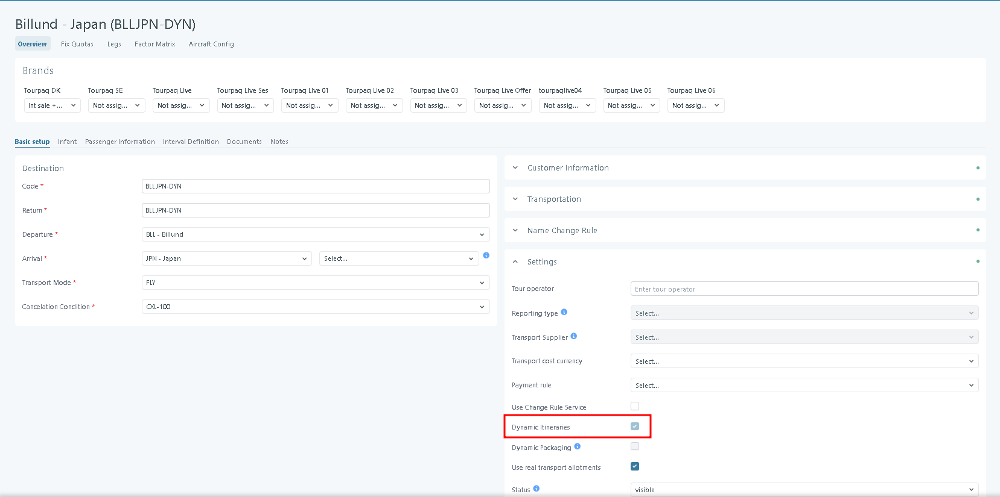
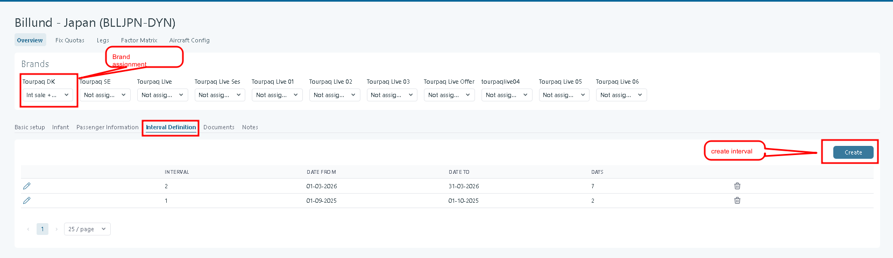
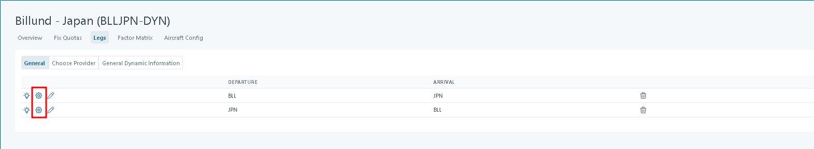
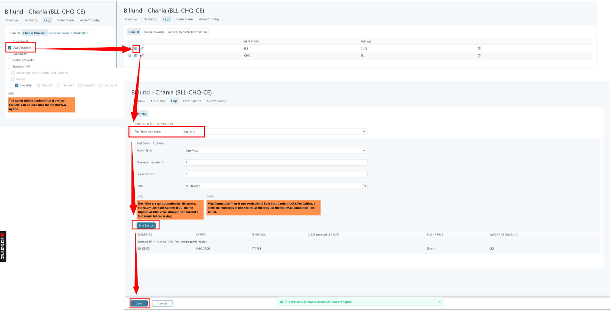
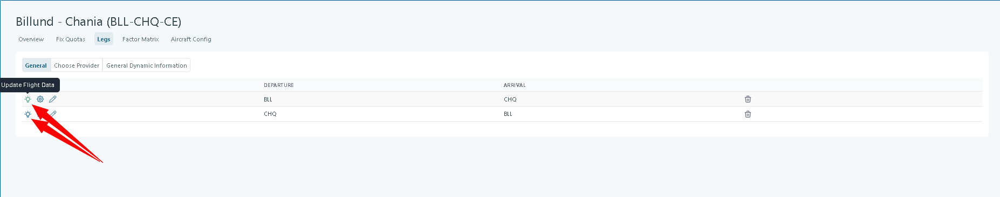
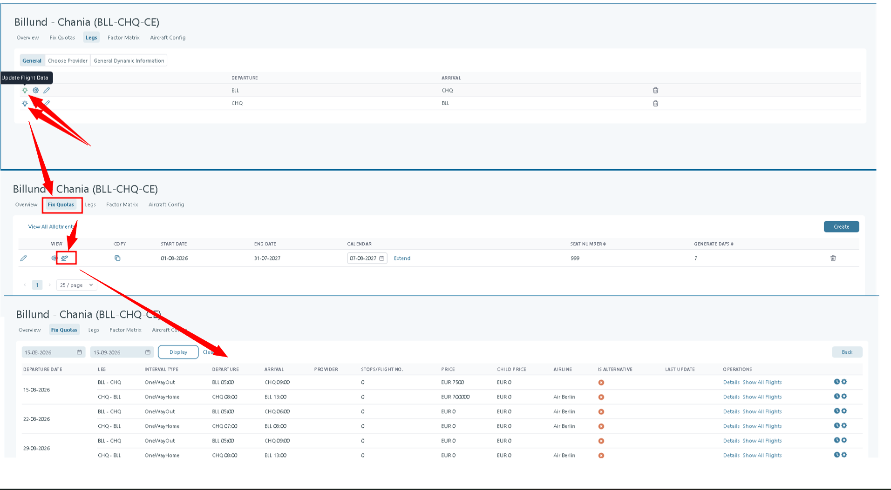

# Transport Definition

### Overview

For a Transport to be configured as a **Real Transport**, the **Dynamic Itineraries** option must be enabled on the **Settings** page. This lets the system combine **GDS flights** with **own real transports**. This is done per departure, based on the **Legs** define.

<figure><figcaption></figcaption></figure>

After the transport was created, the next step is to create an interval and assign the transport to a brand.

<figure><figcaption></figcaption></figure>

### Legs

Use **Legs** to define how the itinerary is built.

* A **leg** is one segment in the itinerary. It connects a departure city to an arrival city.

<figure><figcaption></figcaption></figure>

In the "Choose provider" menu, there is the possibility of making different configurations depending on the type of provider chosen, as follows:

**Own Database -** If **Own Database** is selected in the **Choose Providers** tab for the legs, in the general tab -> configure, only the test and real transport code fields will be displayed.

<figure><figcaption></figcaption></figure>

**External API** - If an External API is selected in the Choose provider tab (Amadeus, Paxport, Railhub, or Travelport), then all fields are displayed except the Real Transport code.

<figure><figcaption></figcaption></figure>

**Own Database + External API** - If we have both an external API and Own Database on the chosen provider, then all the fields will be displayed.

<figure><figcaption></figcaption></figure>

For each leg, you define **filters**. The filters apply to **Real Tansports**.

* Click **Search** to preview which options match your filters.

<figure><figcaption></figcaption></figure>

### Test Search Options

These fields are used **only for testing** and do not affect the saved configuration directly.

* **Search type -** Defines the test search direction, for example One Way.
* **Max result number -**&#x4D;aximum number of results returned by the test search.
* **Pax number -** Number of passengers used in the test search.
* **Date -** Travel date used for the test search.
* **Test Search Button -** Executes a live search using the current Fix Quotas configuration.

<figure><figcaption></figcaption></figure>


Always run a test search before saving, especially when using filters like carriers, cabins, or connection limits.


* Click **Save** to store your filters.
* Click **Update flight data** to fetch flight data using the saved filters. The selection logic is described in [Flight search](transport-definition.md#flight-search).

<figure><figcaption></figcaption></figure>


Use **Update flight data** when you want the system to refresh the stored flight data. A new search will be performed in **Real Transport** using the newly added filters. The **Transport** can then be linked to a newly created **Real Transport**.


<figure><figcaption></figcaption></figure>

### Related pages

* [Transport creation](../transport/transport/transport-creation/)
* [Real Transports](./)
