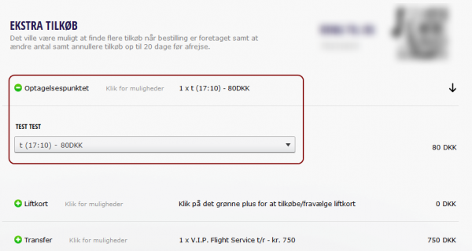

# Routes

Applies to Administrator

Routes in Tourpaq are used to manage those types of transports that follow a path to board passengers from various points on the way.

It can be used as an extension of the fly transport or as a part of the bus transport type.

### Route creation 

To create a Route, the user must go to the **Transport** tab in the **Dashboard** and select **Routes** from the dropdown.

<figure><figcaption></figcaption></figure>

The Route Dashboard allows the managing of the routes. They can be created, edited or deleted from there. A new route can be created by pressing the Create button on the right of the screen.

<figure><figcaption></figcaption></figure>

* Code: should be treated as any transport code with abreviations of the departure and arrival points
* Route name: the name of the route
* Departure: name of the departure point
* Arrival: name of the arrival point
* InfoCustomer: a short description for the customer
* Commission
* Account

### **Pickup points**

Pickup points are the components of a route path. From here passengers are picked up and returned at the end of the holiday. For this purpose it is very important that timetables are set for bus/transport for arriving in the pickup point, leaving the pickup point and the returning home moment. Also pickup points may have a fee assigned to them as well as a cost price. The pickup points can be set from Tourpaq Office side and also from the Web Booking side. The customer can change the pickup point data of the passengers from the Customer Center afterwards but not later than a number of days before departure. This time limit can be set under each brand using the field "Stop Web changes".

<figure><figcaption></figcaption></figure>

Pickup points are components of [Routes](https://docs.tourpaq.com/docs/documentation/routes) and are important in managing a transport which needs to board passengers and return them to various places along a path.

<figure><figcaption></figcaption></figure>

* Code: abreviation of the pickup point
* Description: description of the pick-up point
* Price: price of the transport for the guest from that pickup point
* Cost: cost of the company for that pickup point
* Price tag: price tag of the pickup point
* Meeting hour: can be set as the time when the bus arrives at the pickup point or the time when guests should be at the pickup point
* Departure hour: the time when the bus leaves the pickup point
* Return hour: the hour when the bus returns guests at the pickup point

### **Transport per route**

This is the place where routes are assigned to the transports.

<figure><figcaption></figcaption></figure>

Multiple transports can follow a specific route and all the bookings made for these transports can or must choose a pickup point for each passenger.

The check box "Pickup point required", when checked does not allow the booking to be saved if a pickup point is not selected for each passenger.&#x20;

<figure><figcaption></figcaption></figure>

### **Brands**

This is the place where you assign the visibility of one route to the various brands your company operates. As in all the other platform similar areas, you can assign the routes to be visible for sale only, for internet sale only or for both.

### Routes in booking 

In bookings made from office, routes appear as an extra category named Pickup P. with a dropdown that displays the pickup points.

<figure><figcaption></figcaption></figure>

### Routes in Ticket 

On the Ticket, Routes appear in the **Specifikation af resjebestilling** section, after the extras.

<figure><figcaption></figcaption></figure>

When the transport is a bus type one, the routes appear also in the **Rejseplan** section:

### Bus routes on destination 

This feature is for internal use only. The pickup points defined this way cannot be selected by guest and therefore will not appear in the booking process.

To activate this feature you have to check the Destination Route from Transport -> Routes.

<figure><figcaption></figcaption></figure>

Also after you haved updated the route with this change, in the Pickup points tab you will find a new column named Hotels. The main porpose for this new column is to define what hotels are included in a pickup point.

<figure><figcaption></figcaption></figure>
