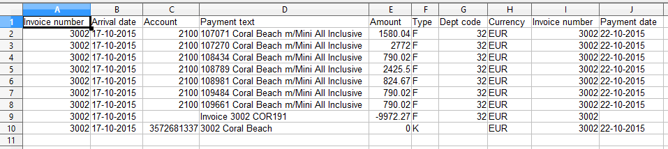
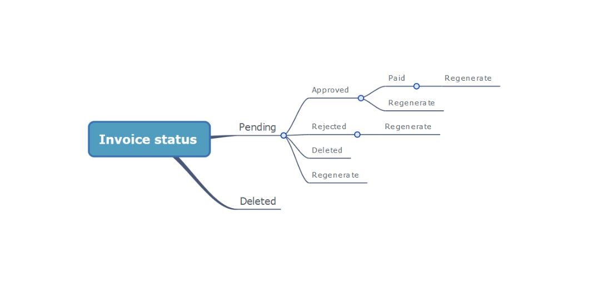

# Autobilling

The autobilling feature enables Tourpaq to generate invoices on behalf of creditors/suppliers. Invoice generation is done automatically based on a schedule defined for the hotels, extras, discounts, suppl,ements and handling and using the costs inserted in the system. The system can generate the following invoice types:

* Hotel deposit invoice
* Hotel early booking invoice
* Hotel invoice
* Extra invoice
* Extra early booking invoice
* Transfer invoice
* Discount/Supplement invoice
* Handling invoice

### Prerequisites​ 

**Invoice services​**

There are four services that must be activated in order for the autobilling feature to work.

**IGS (Invoice Generating Service)​**

* Runs every 30 minutes
* Any company wishing to use this service must contact Tourpaq Support

**EBL (Early Booking List)​**

* Runs once every 24 hours, usually at 12:00 AM, server time
* Any company wishing to use this service must contact Tourpaq Support

**HDI (Hotel Deposit Invoice)​**

* Runs every 30 minutes after the EBL has run, but it will stop at 00:00 AM, server time
* Runs only if EBL service is activated
* Any company wishing to use this service must contact Tourpaq Support
* Runs once every 24 hours, usually at 12:00 AM, server time
* Any company wishing to use this service must contact Tourpaq Support

**Creditors​**

Another requirement for the Autobilling feature is also the use of a creditor.

<figure><figcaption></figcaption></figure>

A creditor can be created in Tourpaq from _Users/Creditors_. All the following fields must be filled in order for the feature to work correctly:

* Creditor Name
* Email
* Swift Code
* Iban Number
* Account credit
* Creditor Number
* Currency
* Automatic check box - if checked, the system will generate invoices automatically.
* Approval interval (in days) - the time limit for the creditor to approve or reject the invoice
* Payment days - the time limit for the agency to pay the invoice after the creditor has approved it
* Invoice as PDF - invoice is sent in a PDF format

In the e-mail field, more than one e-mail address can be inserted, like in the print screen (e.g., [mail@domain.dk](mailto:mail@domain.dk); mail2@domain.com), allowing for more than one receiver of the e-mails.

**Destination settings** - selected agency details will appear on the Liquidation export list from the Guide user assigned to the resort and agency.

The schedules tabs provide an overview of all entities (hotels, hotel before arrival, extras, discounts, supplements and handling) that are invoiced on the current creditor. You can manage schedules and add new entities to a schedule from the ones that are assigned to the current creditor. To assign an entity (hotels, extras, discounts, supplements and handling) from the entity edit screen, select the creditor in the autobilling box. Here you can also set a schedule and fill in the account codes used in the accounting file.

<figure><figcaption></figcaption></figure>

Creditors don't work for products assigned to multiple brands when the brands have different currencies.

**E-mails​**

Another requirement in order for the invoice services to run is the setting of a special e-mail to be sent from Tourpaq to the creditors. This can be done from _Setup/E-mail center_. Two email types have to be created for this:

* Creditor Invoice
* Early Booking Rooming List

The system generates invoices for the bookings that have arrived since the last invoice. An e-mail is sent to the creditor with the invoice and the approve/reject link, and the invoice is attached.

**Viewing of invoices​**

Only administrators and financial users have access to this feature. Invoices are managed by **Finance**.

Actions that can be done:

* Status changes:
* Approved
* Rejected
* Paid
* Archived
* Download invoice in PDF or XML format
* Regenerate invoice

<figure><figcaption></figcaption></figure>

**Invoice status​**

All invoices have to go through different statuses before being finally paid. Here are the steps:

* Pending - invoice status after it has been generated
* Approved - invoice status after it has been approved by the creditor
* Paid - invoice status after it has been paid. Only approved invoices can be paid.

<figure><figcaption></figcaption></figure>

* Regenerated - invoices can be regenerated

<figure><figcaption></figcaption></figure>

* Archived - invoice status after it has been archived

<figure><figcaption></figcaption></figure>

**Invoice status changes​**

These are the status changes of the invoices.

<figure><figcaption></figcaption></figure>

regeneratedInvoices can be regenerated in the past.

Also, if a creditor is changed on a hotel, regenerating an invoice will take this into account.

### Autobilling Setup​ 

The Invoice Generating Service is the basic invoice service and allows the following costs to be invoiced:

**Hotel invoices​**

Autobilling for hotels is enabled in the hotel's main tab.

<figure><figcaption></figcaption></figure>

All fields are mandatory in order for the autobilling feature to work.

* Automatic billing check box - if checked it allows the hotel to be invoiced; unchecked, the invoices will be disabled
* Schedule - when the invoices are generated. It can be set to send invoices on a daily/weekly/monthly basis. It is recommended that the weekly feature be used.
* Account debit
* Creditor
* Account deposit
* Department code
* Schedule before arrival (allows for the invoices to be sent in advance according to the rules set: daily, weekly-weekdays, monthly-days of the month) Also, the room costs for the hotel and other costs have to be set.

**Hotel combinations** are also invoiced, but the settings are done on the hotels that make up the combination. Also, in the invoice, bookings made with a hotel combination will be shown as bookings made at the hotel under the combination.

When regenerating a hotel invoice, extras can appear on it if they have the same settings as the hotel in the Autobilling box. The only condition for this is to not have **"Add Own Schedule"** activated.

### Hotel Deposit​ 

It can be set in the _Hotel/Deposit_ tab.

<figure><figcaption></figcaption></figure>

A deposit needs the following fields to be set:

* Deposit date - the date on which the invoice is generated
* Payment type - it's an autofill field
* Amount - the amount paid
* Payback date - the date when the payment is made At the final payment, the deposit is deducted from the hotel invoice only if it's in the paid status.

Deposits are paid at a date agreed upon in the contract between companies/agencies and creditors

A new function has been added here: **Special deposit rule**. It is used to precalculate the deposit amount for more deposit dates. It requires allotments and costs of the rooms to be set in the hotel.

### Hotel Early Booking​ 

It can be set from the room cost in the hotel tab.

<figure><figcaption></figcaption></figure>

Mandatory fields:

* Send list date - sends an Early Rooming List email at the preset date
* Deposit date - the date at when an invoice is generated with the booked rooms and also when the percent has to be paid
* Deposit percent It is deducted from the following hotel invoices.

If there are problems with receiving the EBL by e-mail, use **Export/List** with //Rooming list// as a report type, and the filters should be taken from the **Hotel/Room cost and** Early booking cost-discount rules.

**Extra invoices**

Autobilling for extras can be enabled in the extra's main tab.

<figure><figcaption></figcaption></figure>

All fields are mandatory in order for the feature to work.

* Department code
* Account debit
* Add own schedule check box - if left unchecked, the extra invoice will be generated along with the hotel invoice; if checked, a separate invoice will be generated, containing only the extra
* Schedule - when the invoices are generated. It can be set to send invoices on a daily/weekly/monthly basis. It is recommended that the weekly feature be used.
* Select creditor
* Automatic billing check box - if checked it allows the extra to be invoiced; unchecked, the invoices will be disabled Also, the prices and costs have to be set. Note: most of the settings are similar to the hotel ones.

### Extra Early Booking 

Works just like the **Hotel Early Booking**

**Discount/Supplement invoices​**

Autobilling for discounts/supplements can be enabled from their main tab.

<figure><figcaption></figcaption></figure>

All fields are mandatory in order for the feature to work.

* Department code
* Account debit
* Add own schedule check box - if left unchecked, the discount/supplement invoice will be generated along with the hotel invoice; if checked, a separate invoice will be generated, containing only the discount/supplement
* Schedule - when the invoices are generated. It can be set to send invoices on a daily/weekly/monthly basis. It is recommended that the weekly feature be used.
* Creditor
* Automatic billing check box - if checked it allows the discount/supplement to be invoiced; unchecked, the invoices will be disabled Also, the prices and costs have to be set. Note: Most of the settings are similar to the extra ones.

**Transfer invoices​**

Autobilling for transfer can be enabled from _Transport/Transfer prices_.

All fields are mandatory in order for the feature to work.

* Department code
* Account debit
* Add own schedule check box - if left unchecked, the transfer invoice will be generated along with the hotel invoice; if checked, a separate invoice will be generated, containing only the transfer
* Schedule - when the invoices are generated. It can be set to send invoices on a daily/weekly/monthly basis. It is recommended that the weekly feature be used.
* Creditor
* Automatic billing check box - if checked it allows the transfer to be invoiced; unchecked, the invoices will be disabled. The prices and costs have to be set. Also, transfer can be used as an extra, too. Note: Most of the settings are similar to the extra ones.

**Handling invoices​**

Autobilling for handling can be enabled from _Users/Suppliers/Handling_

<figure><figcaption></figcaption></figure>

All fields are mandatory for the feature to work.

* Creditor
* Account debit
* Add own schedule check box - if left unchecked, the handling invoice will be generated along with the hotel invoice; if checked, a separate invoice will be generated, containing only the handling..
* Schedule - when the invoices are generated. It can be set to send invoices on a daily/weekly/monthly basis. It is recommended that the weekly feature be used. For the feature to work, costs are also required. They can set it in the same tab, but only if a hotel is assigned to the supplier.

If a supplier is removed from a hotel and the invoice is regenerated, the handling for that hotel will be removed from the invoice. Likewise, if the invoice contains only that hotel, the invoice will receive the deleted status.
