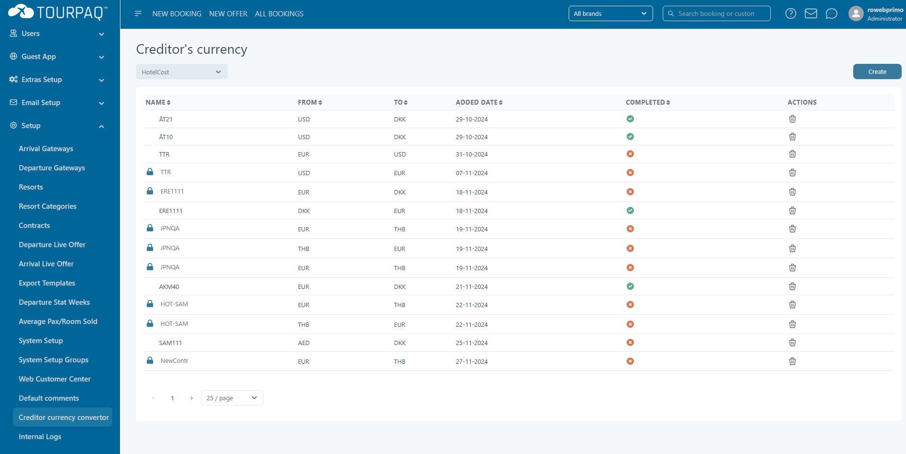
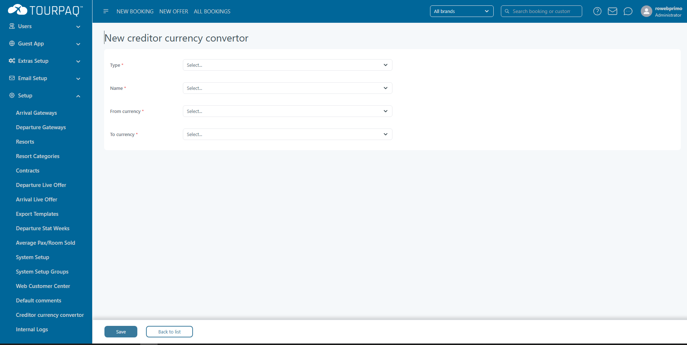
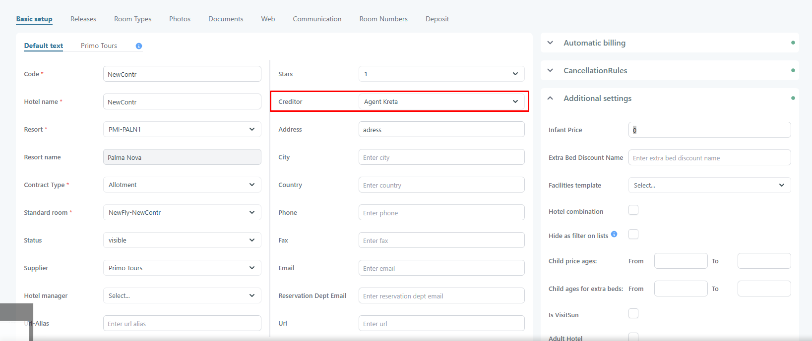
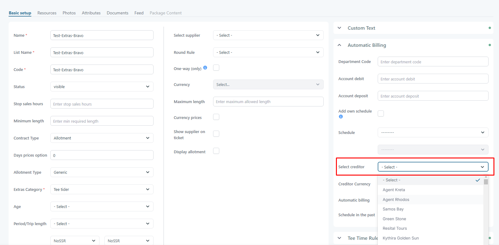
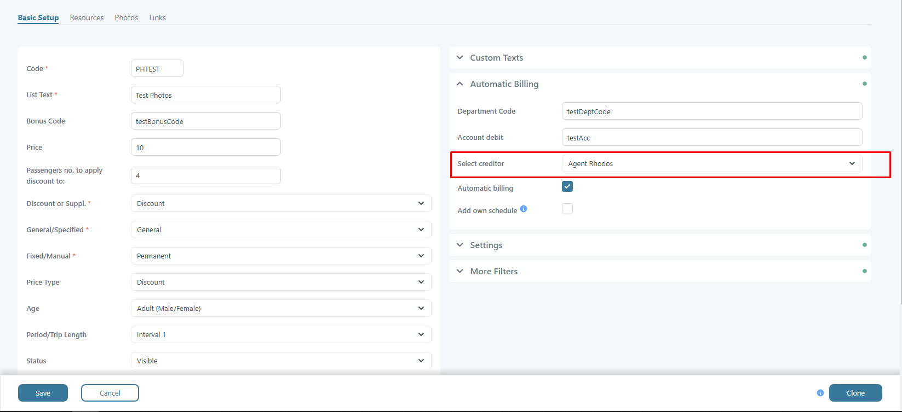

# Creditor Currency Converter

### Overview

The **Creditor Currency Converter** helps you handle supplier costs in multiple currencies.

It supports automatic recalculation when you change a creditor to one with a different currency.

Go to **Setup → Creditor Currency Converter**.

<figure><figcaption></figcaption></figure>

### How it works

When you change a creditor on:

* **Hotels**
* **Extras**
* **Discount supplements**

…and the new creditor uses a different currency, Tourpaq creates a new entry here.

The entry does **not** affect pricing until you activate it.

<figure><figcaption></figcaption></figure>

### Fields

These fields are required when you create a converter rule:

* **Type**
  * What the cost belongs to.
  * Options: **Hotel Cost**, **Product Cost**, **Discount Supplement Cost**
* **Name**
  * The name of the cost item you are converting.
* **From Currency**
  * The original currency.
* **To Currency**
  * The target currency.
* **Trigger Price Recalculation on Creditor Change**
  * If enabled, Tourpaq recalculates prices when a creditor change triggers conversion.

### Activate a converter rule



### Find the new entry

Change a creditor on a hotel/extra/discount supplement.

If the currency changes, a new entry is created here.



### Review the From/To currencies

Confirm the currencies match what you intended.



### Activate the rule

Enable the rule so conversion is applied.




Exchange rates are configured separately.

See [Price currency](price-currency.md) if you need to maintain currency rates.


### Hotel currency converter trigger 

<figure><figcaption></figcaption></figure>

### Extras currency converter trigger 

<figure><figcaption></figcaption></figure>

### Discount supplements currency converter trigger 

<figure><figcaption></figcaption></figure>

### Examples

1. **Hotel Supplier Currency Change:**
   * Original creditor currency: EUR
   * New creditor currency: DKK
   * A conversion rule is automatically added to the **Creditor Currency Converter** page (EUR → DKK).
2. **Extra Supplier Update:**
   * An extras supplier switches from SEK to EUR.
   * A new converter entry is created to handle **SEK → EUR** conversions for that extra type.
3. **Discount Supplement Example:**
   * A discount supplement creditor updates from USD to EUR.
   * A rule is created automatically for **USD → EUR** conversion.

<figure><figcaption></figcaption></figure>

### Best practices

* Price conversion rules must be **activated manually** before they apply.
* Always double-check conversion settings to ensure consistency across bookings and financial exports.
* Review auto-created entries after creditor changes.
* Clean up unused or outdated rules to avoid confusion.

### FAQ

<strong>Why was a new converter entry created?</strong>

Because you changed a creditor and the new creditor uses a different currency.

Tourpaq creates an entry so you can decide whether conversion should apply.

<strong>Why didn’t prices change after I changed the creditor?</strong>

Converter entries must be activated manually.

Activate the rule, then re-check the affected costs.

<strong>Should I activate every auto-created entry?</strong>

No.

Activate only entries that match your intended workflow and accounting rules.

<strong>Where do the exchange rates come from?</strong>

Rates are maintained in the currency setup.

See [Price currency](price-currency.md).

<strong>Can I delete outdated converter rules?</strong>

Yes, if they are no longer needed.

Remove old rules to keep the list clean, but confirm they are not used in active workflows first.

